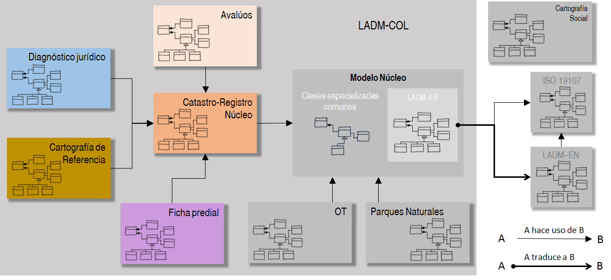
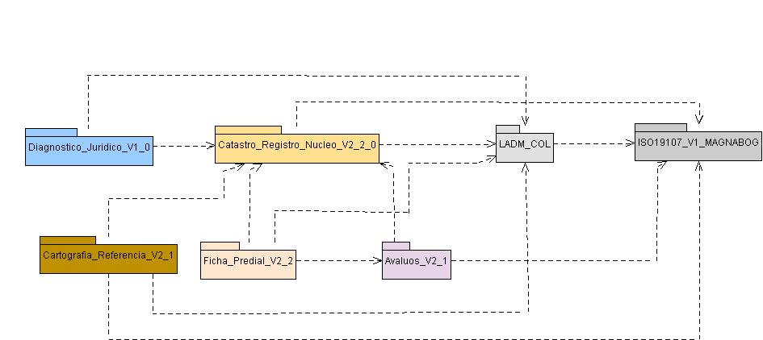
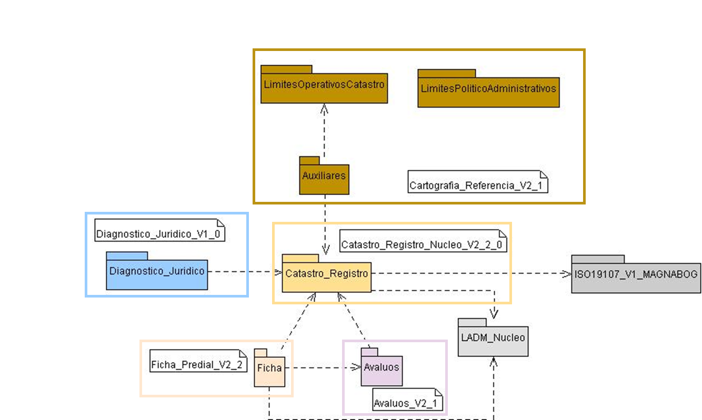
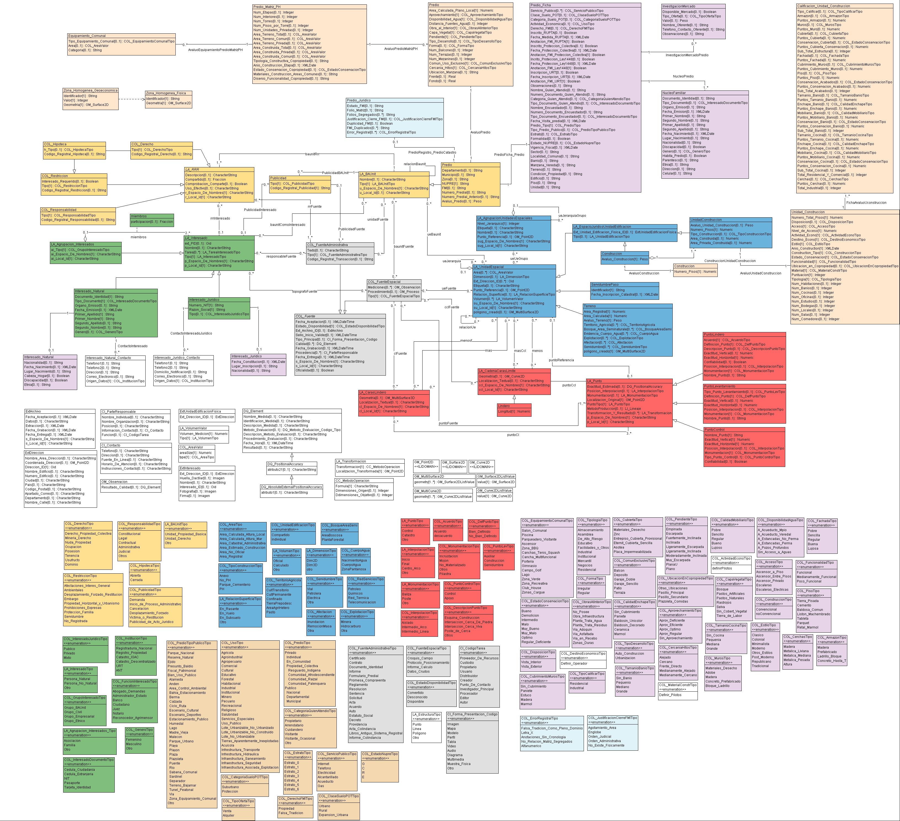

MODERNIZACIÓN DE LA ADMINISTRACIÓN DE TIERRAS EN COLOMBIA

Documentación del perfil colombiano de la norma ISO19152:2012 (LADM-COL)

Modelos Catastro Multipropósito:

-  *Catastro-Registro Núcleo*

-  *Ficha Predial*

-  *Diagnóstico Jurídico*

-  *Avalúos*

-  *Cartografia de Referencia*

**Versión 2.1**

|image0|\ 

Para los socios principales del Proyecto:

Atención: Kaspar Eggenberger kaspar.eggenberger@bsf-swissphoto.com

CC: Nicole von Reitzenstein: nicole.vonreitzenstein@seco.admin.ch

Natalia Mayorga: natalia.mayorga@eda.admin.ch

Autores: Equipo de la implementación técnica
lorenz.jenni@bsf-swissphoto.com

Fecha: 10 de noviembre de 2017

Índice de Contenido

`*Abreviaturas* 4 <#abreviaturas>`__

`*Resumen Ejecutivo* 5 <#resumen-ejecutivo>`__

`*1* *Introducción* 6 <#introducción>`__

`*2* *Antecedentes* 7 <#antecedentes>`__

`*2.1* *Evolución modelos del Catastro Multipropósito*
7 <#evolución-modelos-del-catastro-multipropósito>`__

`*2.2* *Bases jurídicas y normativas, otras referencias*
7 <#bases-jurídicas-y-normativas-otras-referencias>`__

`*3* *Modularidad del LADM-COL* 8 <#modularidad-del-ladm-col>`__

`*4* *Dependencias Módulo Catastro Multipropósito*
10 <#dependencias-módulo-catastro-multipropósito>`__

`*5* *Cambios en esta Versión* 12 <#_Toc498525021>`__

`*5.1* *Modelo Catastro – Registro Núcleo*
12 <#modelo-catastro-registro-núcleo>`__

`*5.2* *Modelo Cartografía de Referencia*
12 <#modelo-cartografía-de-referencia>`__

`*5.3* *Modelo Diagnóstico Jurídico*
12 <#modelo-diagnóstico-jurídico>`__

`*5.4* *Modelo Avalúos* 12 <#modelo-avalúos>`__

`*5.5* *Modelo Ficha Predial* 12 <#modelo-ficha-predial>`__

`*6* *Términos específicos y Semántica* 13 <#_Toc498525027>`__

`*6.1* *Modelo Catastro – Registro Núcleo*
13 <#modelo-catastro-registro-núcleo-1>`__

`*6.2* *Modelo Cartografía de Referencia*
14 <#modelo-cartografía-de-referencia-1>`__

`*6.3* *Modelo Diagnóstico Jurídico*
14 <#modelo-diagnóstico-jurídico-1>`__

`*6.4* *Modelo Avalúos* 14 <#modelo-avalúos-1>`__

`*6.5* *Modelo Ficha Predial* 14 <#modelo-ficha-predial-1>`__

`*7* *Catalogo de Objetos* 15 <#_Toc498525033>`__

`*7.1* *Modelo Catastro – Registro Núcleo*
15 <#modelo-catastro-registro-núcleo-2>`__

`*7.2* *Módulo Cartografía de Referencia*
61 <#módulo-cartografía-de-referencia>`__

`*7.3* *Módulo Diagnóstico Jurídico*
67 <#módulo-diagnóstico-jurídico>`__

`*7.4* *Módulo Avalúos* 67 <#módulo-avalúos>`__

`*7.5* *Módulo Ficha Predial* 87 <#módulo-ficha-predial>`__

`*8* *Estudio previo de Conformidad con la Norma ISO19152*
100 <#estudio-previo-de-conformidad-con-la-norma-iso19152>`__

`*9* *Referencias bibliográficas* 101 <#referencias-bibliográficas>`__

`*Anexos* 102 <#anexos>`__

`*A.* *Descripción Modelos en UML* 103 <#descripción-modelos-en-uml>`__

`*B.* *Descripción del modelo en UML/INTERLIS-Editor*
104 <#descripción-del-modelo-en-umlinterlis-editor>`__

`*C.* *Descrición Modelos en INTERLIS*
105 <#descrición-modelos-en-interlis>`__

`*E.* *Modelo LADM en la traducción al español*
107 <#modelo-ladm-en-la-traducción-al-español>`__

Versiones y Revisión del Documento

+-----------+----------------------------------------------------------------------------------+-----------------------------------------------+--------------+
| Versión   | Descripción Versión                                                              | Elaboración                                   | Fecha        |
+===========+==================================================================================+===============================================+==============+
| 1.1       | Versión inicial de trabajo                                                       | Víctor M. Bajo, Lorenz Jenni                  | 02.11.2017   |
+-----------+----------------------------------------------------------------------------------+-----------------------------------------------+--------------+
| 2.0       | Ajustes en base a la reunión mesa técnológica Proyecto CM DNP                    | Víctor M. Bajo, Andrés Guarín, Fabián Mejía   | 03.11.2017   |
+-----------+----------------------------------------------------------------------------------+-----------------------------------------------+--------------+
| 2.1       | Aplicación de cambios en la documentación conformes a los cambios en el modelo   | Víctor M. Bajo                                | 10.11.2017   |
+-----------+----------------------------------------------------------------------------------+-----------------------------------------------+--------------+

+----------------+---------------------+-----------+--------------+
| Revisado por   | Aprobación AI       | Versión   | Fecha        |
+================+=====================+===========+==============+
| Lorenz Jenni   |                     | 2.0       | 08.11.2017   |
+----------------+---------------------+-----------+--------------+
| Lorenz Jenni   | |image1|            | 2.1       | 10.11.2017   |
|                |                     |           |              |
|                | Kapar Eggenberger   |           |              |
+----------------+---------------------+-----------+--------------+

Abreviaturas
============

+------------+----------------------------------------------------------------------------------------------------+
| AI         | Agencia de Implementación del Proyecto Modernización de la Administración de Tierras en Colombia   |
+============+====================================================================================================+
| ANT        | Agencia Nacional de Tierras                                                                        |
+------------+----------------------------------------------------------------------------------------------------+
| BD         | Base de Datos (alfanumérica)                                                                       |
+------------+----------------------------------------------------------------------------------------------------+
| CIAF       | Centro de Investigación y Desarrollo en Información Geográfica                                     |
+------------+----------------------------------------------------------------------------------------------------+
| DNP        | Departamento Nacional de Planeación                                                                |
+------------+----------------------------------------------------------------------------------------------------+
| ICDE       | Infraestructura Colombiana de Datos Espaciales                                                     |
+------------+----------------------------------------------------------------------------------------------------+
| IGAC       | Instituto Geográfico Agustín Codazzi                                                               |
+------------+----------------------------------------------------------------------------------------------------+
| ISO        | International Organization for Standardization                                                     |
+------------+----------------------------------------------------------------------------------------------------+
| ITF        | *INTERLIS Transfer File* (INTERLIS-1)                                                              |
+------------+----------------------------------------------------------------------------------------------------+
| LADM       | *Land Administration Domain Model*                                                                 |
+------------+----------------------------------------------------------------------------------------------------+
| LADM-COL   | Perfil colombiano del LADM                                                                         |
+------------+----------------------------------------------------------------------------------------------------+
| SECO       | Secretaria de Estado para Asuntos Económicos de Suiza                                              |
+------------+----------------------------------------------------------------------------------------------------+
| SNR        | Superintendencia de Notariado y Registro                                                           |
+------------+----------------------------------------------------------------------------------------------------+
| URT        | Unidad Administrativa Especial de Gestión de Restitución de Tierras Despojadas                     |
+------------+----------------------------------------------------------------------------------------------------+
| UML        | *Unified Markup Language*                                                                          |
+------------+----------------------------------------------------------------------------------------------------+
| XML        | *Extended Markup Language*                                                                         |
+------------+----------------------------------------------------------------------------------------------------+
| XTF        | *INTERLIS Transfer File* en formato XLM (INTERLIS-2.3)                                             |
+------------+----------------------------------------------------------------------------------------------------+

Resumen Ejecutivo
=================

El Proyecto de Modernización de la Administración de Tierras en
Colombia, financiado por el Gobierno de Suiza y ejecutado por la
Cooperación Económica y Desarrollo (SECO) de la Embajada de Suiza en
Colombia e implementado por la Agencia de Implementación (AI), tiene
como objetivo apoyar a las entidades reguladoras y gestoras de Colombia
en la modernización de la Administración de Tierras, haciéndose énfasis
en el fortalecimiento de la ICDE y en dar asistencia en el proceso de
descentralización en la gestión de los datos correspondientes.

Una de las tareas de apoyo del Proyecto viene siendo, desde finales de
2015, la asistencia técnica en la adopción de la norma ISO 19152:2012
(LADM), a través de la definición de un perfil colombiano de la misma,
denominado LADM-COL. Este perfil ha estructurado alrededor de varios
modelos para la gestión de la información vinculada a las diferentes
áreas temáticas de la Administración de Tierras, responsabilidad de
distintas entidades públicas, como Catastro y Registro, Ordenamiento
Territorial o Parques Naturales, entre otras. Los modelos son
construidos alrededor de la norma ISO del LADM, así como con algunas
clases específicas del denominado modelo núcleo del LADM-COL.

El desarrollo del modelo núcleo de intercambio para el Catastro-Registro
y de los demás modelos especializados del Catastro Multipropósito
enmarcados en el LADM-COL, son el resultado de un proceso de casí dos
años de trabajo conjunto de las entidades principales involucradas en la
gestión de la información de Administración de Tierras y asociadas al
Proyecto, como es el caso del IGAC, la SNR, la ANT, la URT y el DNP, e
incluyendo también la participación de los catastros descentralizados.

La documentación técnica de la versión 2.2 de dicho modelo núcleo de
intercambio y de los demás modelos con su respectiva versión, acordada
entre las entidades participantes de la Mesa Tecnológica del Proyecto de
Pilotos del Catastro Multipropósito del DNP, es parte de este documento,
junto con los anexos técnicos.

Bogotá, 8 de noviembre de 2017

Lorenz Jenni, equipo técnico de implementación del Proyecto

lorenz.jenni@bsf-swissphoto.com

Introducción
============

Con el Plan Nacional de Desarrollo [1], y el Documento de Políticas
Públicas (CONPES) para un nuevo Catastro Multipropósito [2], el Gobierno
colombiano ha establecido el marco para el futuro catastro nacional. En
ese marco destacan las necesidades de nuevos estándares para garantizar
la interoperabilidad de los datos, mencionando explícitamente la
adopción de la norma ISO 19152:2012 (LADM, por sus siglas en ingles).

LADM es un modelo conceptual de la realidad que concreta una ontología y
establece una semántica para la administración del territorio [3]. Nace
en el contexto de la visión de Catastro 2014 y establece la
Independencia Legal de las áreas temáticas de los datos asociados al
territorio, como uno de sus principios fundamentales [4]. Por otra
parte, el objetivo general de modelizar datos es la normalización de la
estructura de datos de un derterminado tema, lo que garantiza
uniformidad e interoperabilidad y por ende contribuye a la calidad de
los datos.

El Proyecto de Modernización de la Administración de Tierras, con
financiación de la Cooperación Económica y Desarrollo de Suiza (SECO),
ha venido apoyando a las entidades nacionales en la definición de un
perfil colombiano de la norma ISO 19152:2012. El LADM-COL consiste en
distintos modelos de datos, según temática y cumpliendo la Independencia
Legal anteriormente mencionada [4]. Los modelos para el Catastro
Multipropósito forman parte del primer módulo del LADM-COL y son un
trabajo conjunto de todas las entidades vinculados al desarrollo de este
nuevo catastro.

Los modelos de datos son formalmente descritos con el lenguaje de
esquema conceptual INTERLIS, un estandar independiente de plataformas y
software que permite la implementación directa de modelos en un esquema
de base de datos, además de incluir un formato de intercambio conforme
al modelo dado. De esta manera no existe ninguna dependencia de un
particular productor de software y sistema y se evita introducir
estucturas de datos propietarios y específicos de un software [5].

El presente documento consiste en la documentación técnica de los
modelos **Catastro-Registro Núcleo** (de intercambio), **Ficha
Predial**, **Diagnóstico Jurídico** y **Avalúos** y se dirige a los
profesionales de todas las entidades, gestores y operadores del nuevo
Catastro Multipropósito encargados o contratados de la aplicación de
estos modelos con el fin de generar, validar y gestionar los datos
respectivos o de desarrollar los sistemas tecnológicos vinculados
(Sistema de Información Territorial).

La documentación deberá convertirse en una parte integrada de las
Especificaciones Técnicas de Producto del Catastro Multipropósito,
conforme a la norma ISO 19131 y a la guía de implementación respectiva
emtitida por la ICDE [6].

1. .. rubric:: Antecedentes
      :name: antecedentes

2. .. rubric:: Evolución modelos del Catastro Multipropósito
      :name: evolución-modelos-del-catastro-multipropósito

El presente documento es el primero en el que se documenta de forma
completa el catalogo de objetos de los modelos de datos que conforman el
módulo del Catastro Multipropósito del perfil colombiano de la norma ISO
19152:2012 (referido a la versión 2.2).

Sin embargo, ha habido documentación previa sobre las distintas
versiones del/de los modelo/s:

-  ***Versión 0.9 del Perfil Colombiano de la ISO19152 - Modelo de Datos para el Dominio de la Administración de Tierras***
       En el que se presenta la metodología de trabajo, el enfoque de modelado y los
       resultados obtenidos para la primera versión en UML del modelo de
       datos del LADM-COL orientado al catastro y registro [8].

-  ***Documento Conceptualización y Especificaciones para la operacióndel Catastro Multipropósito Verión 2.1.1.*** 
       En el capitulo 1.7 se describe la estructura básica del modelo y los principios de
       modelado que se tuvieron en cuenta para la generación de esta
       versión del perfil nacional. El anexo 11 del documento incluye el
       diagrama de clases UML de la versión [7].

-  ***Entrega de la Versión 2.1.6 de los modelos de Catastro Multipropósito***
       con diagramas de clases en UML y los diferentes modelos (Catastro-Registro, Avalúos, Ficha) que
       conforman el módulo de Catastro Multipropósito, descritos en el
       lenguaje INTERLIS y generados en colaboración entre las entidades
       que conforman la Mesa Tecnológica del Proyecto de los pilotos del
       Catastro Multipropósito ejecutado del DNP, con asistencia técnica
       del Proyecto Modernización de la Administración de Tierras en
       Colombia.

Bases jurídicas y normativas, otras referencias
-----------------------------------------------

Las leyes y normas de distinto rango en los que se basa el modelo son:

-  Departamento Nacional de Planeación. 2016. Política para la Adopción
       e Implementación de un Catastro Multipropósito Rural-Urbano
       (CONPES 3859) [2].

-  IGAC/SNR. 2016. Conceptualización y especificaciones para la
       operación del Catastro Multiproposito Versión 2.1.1 y sus
       diversos anexos (versión oficial por aplicar en el marco de los
       pilotos del DNP) [7]

Otras referencias de esta documentación son:

-  Norma ISO 19152:2012, traducción al español por AENOR [1]

-  INTERLIS 2-Reference Manual en
       `*www.interlis.ch* <http://www.interlis.ch>`__ [9]

-  INTERLIS 2-Manual de Referencia en español en
   `*https://www.proadmintierra.info/interlis* <https://www.proadmintierra.info/interlis>`__
   [9]

Modularidad del LADM-COL
========================

La modularización del perfil colombiano de la norma ISO 19152:2012
consiste en la generación de distintos modelos de la realidad de la
administración de tierras, siguiendo una serie de criterios que dan como
resultado distintos conjuntos de clases especializadas para gestionar la
información de cada una de las entidades que administran los datos
específicos de su área temática. Dado que algunas de estas clases son
comunes, se extraen estas en un mínimo común que forma el denominado
“núcleo” del perfil.

Los criterios indicados se basan en el principio de independencia legal,
marcado dentro del paradigma “Catastro 2014” [4]. La Administración de
Tierras está constituida por distintas temáticas que se ocupan de los
distintos objetos territoriales legales especializados, gestionados por
las entidades del Estado a los que estas leyes dan potestad. Con esto se
garantiza que cada temática pueda gestionarse en base a la legislación
propia, de forma aislada a las necesidades legales de las demás. Así, la
independencia legal conlleva a que cada proceso de adjudicación o cada
realidad legal deba ocupar una capa distinta de la realidad. Dado que la
norma ISO 19152:2012 no describe la forma de gestionar estas capas de
manera separada, se sugiere, por tanto, que la forma de conseguirlo será
mediante la separación de los modelos, de acuerdo con las clases que
cada una de ellas necesita, partiendo del mismo concepto y haciendo uso
de las clases comunes. Se considera también un pilar fundamental de este
concepto, la interoperabilidad adecuada que permita compartir
información especializada y descubrir las interactuaciones de las
distintas capas de información con las diferentes realidades del
derecho, tanto público como privado, que completan la visión física,
económica y legal del territorio.

|image2|

Fig. 1. Los modelos (en color) del módulo Catastro Multipropósito del
LADM-COL

Las premisas para la modularización del LADM-COL son las siguientes:

-  El entorno ontológico y semántico es el establecido por la ISO
   19152:2012 y el modelo base empleado es el propio LADM.

-  Puede utilizarse una traducción del modelo anterior, siempre que
   pueda mantenerse la trazabilidad, término a término, de esta
   traducción y garantizar la equivalencia terminológica para el caso en
   el que el modelo del perfil nacional deba interactuar con perfiles de
   otros países.

-  No se repetirán definiciones ni de elementos de la realidad (clases)
   ni de descriptores de la misma (enumeraciones). Si hiciesen falta
   elementos definidos en lugares distintos a donde van a ser usados,
   deben poder ser reutilizados desde la definición original.

-  Cada parte de la Administración de Tierras capaz de administrar
   objetos territoriales legales propios y de acuerdo con el principio
   de independencia legal de Catastro 2014 (Kaufmann y Steudler, 1998),
   debe ser capaz de hacerlo sin contar con definiciones que le sean
   ajenas.

-  Se considera modelo núcleo al mínimo de elementos necesarios para
   definir la realidad del territorio en Colombia, que sean comunes a
   todas las temáticas de la administración de tierras que generan sus
   propios objetos territoriales legales. Cuando se habla de elementos
   comunes, se habla de clases, conjuntos de clases o dominios comunes
   reutilizables por distintas entidades, no de objetos concretos.

-  El conjunto de elementos no comunes y específicos de cada temática se
   denomina extensión temática del núcleo.

Aunque el perfil colombiano sigue en desarrollo, cabe indicar que el
núcleo del modelo queda definido por los siguientes elementos:

A. LADM-ES, entendido como la traducción al español del modelo LADM de
   la ISO 19152:2012 que establece la terminología básica común a todo
   el entorno de administración de tierras.

De estos dos modelos, hay que eliminar aquellas clases que se decida no
utilizar en el perfil de Colombia, si el nivel de conformidad buscado lo
permite.

A. La especialización de las partes interesadas. Aunque no es objeto de
   LADM mantener un registro de personas, en el caso de Colombia se hace
   necesario porque no existe un servicio desde el registro público de
   personas del que se puedan obtener estos datos. Las clases
   especializadas en LADM-COL que registran todos estos datos, son
   requeridas por todas las entidades, por lo que se definen en el
   núcleo del perfil.

Dependencias Módulo Catastro Multipropósito
===========================================

Las dependencias de los distintos modelos del módulo Catastro
Multipropósito son las siguientes (Fig. 2):

|image3|

Fig. 2. Dependencia de modelos del Modulo Catastro Multipropósito
LADM-COL

-  Modelo *Catastro Registro núcleo* (Versión 2.2)

   -  Depende del núcleo:

      -  Traducción al español LADM-ES. Este modelo depende a su vez del
             modelo LADM de la ISO 19152:2012.

      -  Definición de las partes interesadas, incluyendo clases,
             atributos y dominios de valores

   -  Depende del modelo de la norma ISO 19107 para la definición del
          esquema espacial

-  Modelo *Diagnóstico Jurídico* (Versión 1.0)

   -  Depende del topic *Catastro\_Registro* del modelo *Catastro Registro núcleo*

-  Modelo *Avalúos*

   -  Depende del topic *Catastro\_Registro* del modelo *Catastro Registro núcleo*

-  Modelo *Ficha Predial*

   -  Depende del modelo *Avalúos*

   -  Depende del topic *Catastro\_Registro* del modelo *Catastro Registro núcleo*

|image4|

Fig. 3. Diagrama UML de dependencia entre paquetes (topics)

1. Cambios en esta Versión

A continuación, se incluye los cambios con versiones anteriores de los
modelos.

Modelo Catastro – Registro Núcleo
---------------------------------

Documentación de cambios a partir de la versión 2.2

Modelo Cartografía de Referencia
--------------------------------

Documentación de cambios a partir de la versión 2.1

Modelo Diagnóstico Jurídico
---------------------------

Documentación de cambios a partir de la versión 1.0

Modelo Avalúos
--------------

Documentación de cambios a partir de la versión 2.1

Modelo Ficha Predial
--------------------

Documentación de cambios a partir de la versión 2.2

1. Términos específicos y Semántica

A continuación, se incluyen definiciones de términos específicas y
definiciones semánticas de cada uno de los modelos tratados en el
documento.

1. .. rubric:: Modelo Catastro – Registro Núcleo
      :name: modelo-catastro-registro-núcleo-1

   1. .. rubric:: Dominios especiales
         :name: dominios-especiales

      1. .. rubric:: CharacterString
            :name: characterstring

Dominio creado específicamente para tener este tipo de dato y ser usado
explícitamente en los modelos. Se ha definido mediante INTERLIS de la
siguiente manera:

CharacterString = TEXT\*255;

Es decir, se define como un tipo de dato de INTERLIS al que se le añade
una longitud máxima.

Currency
^^^^^^^^

Se declara, pero no se esta usando en este modelo.

Integer
^^^^^^^

Define de forma explícita el tipo de dato “integer” (entero), por
necesidad de ser usado explícitamente en los modelos, como el conjunto
de valores entre -2.000.000.000 y 2.000.000.000.

Peso
^^^^

Define el dominio de la unidad monetaria colombiana, con valores entre 0
y 999.999.999.999 y los referencia a la unidad de medida COP (ver
6.1.2.4).

Real
^^^^

De forma similar al dominio “Integer”, se crea el dominio “Real” para
indicar los valores que puede tomar y que pueda ser usado de forma
explícita en la definición de tipos de datos de modelo. El dominio queda
definido entre 0,000 y 999.999.999,999

1. .. rubric:: Definiciones de unidades
      :name: definiciones-de-unidades

   1. .. rubric:: Area
         :name: area

Definición como unidad de la medición de área. Se ha definido mediante
INTERLIS de la siguiente manera:

UNIT

Area (ABSTRACT) = (INTERLIS.LENGTH \* INTERLIS.LENGTH);

cm
^^

Definición como unidad de la medida en cm. Se ha definido mendiante
INTERLIS de la siguiente manera:

UNIT

Centrimetro [cm] = 1 / 100 [INTERLIS.m];

m\ :sup:`2`
^^^^^^^^^^^

Definición como unidad de la medición en m\ :sup:`2`, como
especialización de la medida de área. Se ha definido mediante INTERLIS
de la siguiente manera:

UNIT

MetroCuadrado [m2] EXTENDS Area = (INTERLIS.m \* INTERLIS.m);

COP
^^^

Definición como unidad de moneda nacional de Colombia, como
especialización de la “money” de INTERLIS. Se ha definido mediante
INTERLIS de la siguiente manera:

UNIT

PesoColombiano [COP] EXTENDS INTERLIS.MONEY;

1. .. rubric:: Definición de Reglas
      :name: definición-de-reglas

   1. .. rubric:: No overlaps
         :name: no-overlaps

Definición de una regla topológica para determinar si se producen
superposiciones de superficies. Se ha definifo mediante INTERLIS de la
siguiente manera:

FUNCTION no\_overlaps(Objects: OBJECTS OF ANYCLASS; SurfaceAttr :
ATTRIBUTE OF @ Objects RESTRICTION ( SURFACE )): BOOLEAN;

1. .. rubric:: Modelo Cartografía de Referencia
      :name: modelo-cartografía-de-referencia-1

2. .. rubric:: Modelo Diagnóstico Jurídico
      :name: modelo-diagnóstico-jurídico-1

3. .. rubric:: Modelo Avalúos
      :name: modelo-avalúos-1

4. .. rubric:: Modelo Ficha Predial
      :name: modelo-ficha-predial-1

5. Catalogo de Objetos

El catalogo de objetos es generado como archivo HTML directamente a
partir del UML/INTERLIS-Editor, y colocado en este capitulo. La
descripción de cada clase y atributo forma parte integral del archivo
del modelo en INTERLIS. De esta manera se garantiza la integridad de la
documentación desde el modelo conceptual hasta la implementación a nivel
del modelo físico.

1. .. rubric:: Modelo Catastro – Registro Núcleo
      :name: modelo-catastro-registro-núcleo-2

   1. .. rubric:: Clases (alcance: modelo)
         :name: clases-alcance-modelo

      1. .. rubric:: COL\_AreaValor
            :name: col_areavalor

+--------------+----------------+----------------------------+----------------+
| Atributo     | Cardinalidad   | Tipo de dato               | Descricpción   |
+==============+================+============================+================+
| Area\_Size   | 1              | 0.0..99999999999999.9[m]   |                |
+--------------+----------------+----------------------------+----------------+
| Tipo         | 1              | COL\_AreaTipo              |                |
+--------------+----------------+----------------------------+----------------+

1. .. rubric:: Dominio (alcance: modelo)
      :name: dominio-alcance-modelo

   1. .. rubric:: COL\_AcuerdoTipo
         :name: col_acuerdotipo

Valores para indicar el nivel de acuerdo.

+--------------+------------------------------------------------------------+
| Valor        | Descripción                                                |
+==============+============================================================+
| Acuerdo      | Existe un acuerdo sobre la posición del punto lindero      |
+--------------+------------------------------------------------------------+
| desacuerdo   | Existe un desacuerdo sobre la posición del punto lindero   |
+--------------+------------------------------------------------------------+

COL\_Afectacion
^^^^^^^^^^^^^^^

Valores válidos para indicar el tipo de amenaza natural al que está
sometido.

+----------------+--------------------+
| Valor          | Descripción        |
+================+====================+
| Inundacion     |                    |
+----------------+--------------------+
| RemocionMasa   | Remocion en Masa   |
+----------------+--------------------+
| Otra           |                    |
+----------------+--------------------+

COL\_AreaTipo
^^^^^^^^^^^^^

+-----------------------------------+---------------+
| Valor                             | Descripción   |
+===================================+===============+
| Area\_Calculada\_Altura\_Local    |               |
+-----------------------------------+---------------+
| Area\_Calculada\_Altura\_Mar      |               |
+-----------------------------------+---------------+
| Area\_Catastral\_Administrativa   |               |
+-----------------------------------+---------------+
| Area\_Estimada\_Construccion      |               |
+-----------------------------------+---------------+
| Area\_No\_Oficial                 |               |
+-----------------------------------+---------------+
| Area\_Registral                   |               |
+-----------------------------------+---------------+

COL\_BosqueAreaSemi
^^^^^^^^^^^^^^^^^^^

Conjunto de valores válidos para indicar la naturaleza de un área
boscosa.

+------------------+-----------------------+
| Valor            | Descripción           |
+==================+=======================+
| AreaBoscosa      | Área Boscosa          |
+------------------+-----------------------+
| PlantaForestal   | Plantación Forestal   |
+------------------+-----------------------+

COL\_BuildingUnitTipo
^^^^^^^^^^^^^^^^^^^^^

Conjunto de valores válidos para indicar los tipos de unidad de
edificación.

+--------------+---------------+
| Valor        | Descripción   |
+==============+===============+
| Compartido   |               |
+--------------+---------------+
| individual   |               |
+--------------+---------------+

COL\_CuerpoAgua
^^^^^^^^^^^^^^^

Conjunto de valores válidos para indicar de qué tipo de cuerpo de agua
se trata.

+------------------+---------------------------------------+
| Valor            | Descripción                           |
+==================+=======================================+
| NacimientoAgua   |                                       |
+------------------+---------------------------------------+
| CuerpoAgua       | Cuerpo de agua natural o artificial   |
+------------------+---------------------------------------+
| ZonaPantanosa    |                                       |
+------------------+---------------------------------------+

COL\_DefPuntoTipo
^^^^^^^^^^^^^^^^^

Conjunto de valores válidos para indicar si se trata o no de un punto
bien definido.

+----------------------+----------------------------------------------------------+
| Valor                | Descripción                                              |
+======================+==========================================================+
| Bien\_Definido       | Por describir EETT levantamiento predial planimentrico   |
+----------------------+----------------------------------------------------------+
| No\_Bien\_Definido   | Por describir EETT levantamiento predial planimentrico   |
+----------------------+----------------------------------------------------------+

COL\_DerechoTipo
^^^^^^^^^^^^^^^^

Conjunto de valores válidos para indicar los tipos de derecho que se
pueden ejercer sobre un predio por un interesado.

+---------------------------------+----------------------------------+
| Valor                           | Descripción                      |
+=================================+==================================+
| Derecho\_Propiedad\_Colectiva   |                                  |
+---------------------------------+----------------------------------+
| Mineria\_Derecho                |                                  |
+---------------------------------+----------------------------------+
| Nuda\_Propiedad                 |                                  |
+---------------------------------+----------------------------------+
| Ocupacion                       |                                  |
+---------------------------------+----------------------------------+
| Posesion                        |                                  |
+---------------------------------+----------------------------------+
| Tenencia                        |                                  |
+---------------------------------+----------------------------------+
| Usufructo                       |                                  |
+---------------------------------+----------------------------------+
| Dominio                         | Derecho de dominio o propiedad   |
+---------------------------------+----------------------------------+

COL\_DescripcionPuntoTipo
^^^^^^^^^^^^^^^^^^^^^^^^^

Conjunto de valores válidos para indicar que define un punto de un
lindero.

+-----------------------------------+----------------------------------+
| Valor                             | Descripción                      |
+===================================+==================================+
| Esquina\_Construccion             |                                  |
+-----------------------------------+----------------------------------+
| Interseccion\_Cerca\_De\_Piedra   |                                  |
+-----------------------------------+----------------------------------+
| Interseccion\_Cerca\_Viva         |                                  |
+-----------------------------------+----------------------------------+
| Poste\_de\_Cerca                  |                                  |
+-----------------------------------+----------------------------------+
| Otros                             | !! por definir durante pilotos   |
+-----------------------------------+----------------------------------+

COL\_EstadoDisponibilidadTipo
^^^^^^^^^^^^^^^^^^^^^^^^^^^^^

Por documentar

+---------------+---------------+
| Valor         | Descripción   |
+===============+===============+
| Convertido    |               |
+---------------+---------------+
| Desconocido   |               |
+---------------+---------------+
| Disponible    |               |
+---------------+---------------+

COL\_EstadoNupreTipo
^^^^^^^^^^^^^^^^^^^^

Conjunto de valores válidos para indicar el estado del NUPRE.

+---------+---------------------------------------------------------------------------------------------------------------------------------------------------------------------------------------------------------------------------------------------------------------------------------------------------------------------------------------------------------------------------------------------------------------------------------------------------------------------------------------------------------------------------------------------+
| Valor   | Descripción                                                                                                                                                                                                                                                                                                                                                                                                                                                                                                                                 |
+=========+=============================================================================================================================================================================================================================================================================================================================================================================================================================================================================================================================================+
| G       | El código ha sido asignado por el gestor catastral y refiere a un único predio de acuerdo al proceso de conformación o mantenimiento catastral multipropósito.                                                                                                                                                                                                                                                                                                                                                                              |
+---------+---------------------------------------------------------------------------------------------------------------------------------------------------------------------------------------------------------------------------------------------------------------------------------------------------------------------------------------------------------------------------------------------------------------------------------------------------------------------------------------------------------------------------------------------+
| C       | El código ha sido asignado por el gestor catastral y refiere a un único predio de acuerdo al proceso de conformación o mantenimiento catastral multipropósito.                                                                                                                                                                                                                                                                                                                                                                              |
+---------+---------------------------------------------------------------------------------------------------------------------------------------------------------------------------------------------------------------------------------------------------------------------------------------------------------------------------------------------------------------------------------------------------------------------------------------------------------------------------------------------------------------------------------------------+
| R       | El código ha sido anotado o inscrito en el sistema de registro de instrumentos públicos, en este estado el ciudadano podrá solicitar el Certificado Predial Registral, que contiene la información jurídica del Registro de Instrumentos Públicos y la información física y económica del Sistema Único de Información Catastral Multipropósito esta información goza con pleno mérito probatorio, cuya expedición está a cargo de la Superintendencia de Notariado y Registro y cuya vigencia se limita a su fecha y hora de expedición.   |
|         |                                                                                                                                                                                                                                                                                                                                                                                                                                                                                                                                             |
|         | El NUPRE del certificado Predial Registral es obligatorio para las actuaciones o modificaciones que se realicen sobre el predio por vía de actuación privada o pública y para todas las transacciones inmobiliarias, y permite prescindir de la transcripción de linderos en todos los documentos públicos que contengan actos jurídicos.                                                                                                                                                                                                   |
+---------+---------------------------------------------------------------------------------------------------------------------------------------------------------------------------------------------------------------------------------------------------------------------------------------------------------------------------------------------------------------------------------------------------------------------------------------------------------------------------------------------------------------------------------------------+
| E       | El código ha sido anotado o inscrito en el sistema de registro de instrumentos públicos, en este estado el ciudadano podrá solicitar el Certificado Predial Registral, que contiene la información jurídica del Registro de Instrumentos Públicos y la información física y económica del Sistema Único de Información Catastral Multipropósito esta información goza con pleno mérito probatorio, cuya expedición está a cargo de la Superintendencia de Notariado y Registro y cuya vigencia se limita a su fecha y hora de expedición.   |
|         |                                                                                                                                                                                                                                                                                                                                                                                                                                                                                                                                             |
|         | El NUPRE del certificado Predial Registral es obligatorio para las actuaciones o modificaciones que se realicen sobre el predio por vía de actuación privada o pública y para todas las transacciones inmobiliarias, y permite prescindir de la transcripción de linderos en todos los documentos públicos que contengan actos jurídicos.                                                                                                                                                                                                   |
+---------+---------------------------------------------------------------------------------------------------------------------------------------------------------------------------------------------------------------------------------------------------------------------------------------------------------------------------------------------------------------------------------------------------------------------------------------------------------------------------------------------------------------------------------------------+

COL\_EstratoTipo
^^^^^^^^^^^^^^^^

Conjunto de valores válidos para indicar el estrato social donde se
encuentra el predio.

+--------------+---------------+
| Valor        | Descripción   |
+==============+===============+
| Estrato\_0   |               |
+--------------+---------------+
| Estrato\_1   |               |
+--------------+---------------+
| Estrato\_2   |               |
+--------------+---------------+
| Estrato\_3   |               |
+--------------+---------------+
| Estrato\_4   |               |
+--------------+---------------+
| Estrato\_5   |               |
+--------------+---------------+
| Estrato\_6   |               |
+--------------+---------------+

COL\_EstructuraTipo
^^^^^^^^^^^^^^^^^^^

Conjunto de valores válidos para determinar las posibilidades de la
construcción de una estructura de referencia.

+---------------------------+---------------+
| Valor                     | Descripción   |
+===========================+===============+
| Croquis                   |               |
+---------------------------+---------------+
| Linea\_no\_Estructurada   |               |
+---------------------------+---------------+
| Texto                     |               |
+---------------------------+---------------+
| Topologico                |               |
+---------------------------+---------------+

COL\_FuenteAdministrativaTipo
^^^^^^^^^^^^^^^^^^^^^^^^^^^^^

Conjunto de valores válidos de fuentes de administrativas que pueden
encontrarse.

+------------------------+---------------+
| Valor                  | Descripción   |
+========================+===============+
| Certificado            |               |
+------------------------+---------------+
| Contrato               |               |
+------------------------+---------------+
| Documento\_Identidad   |               |
+------------------------+---------------+
| Informe                |               |
+------------------------+---------------+
| Formulario\_Predial    |               |
+------------------------+---------------+
| Promesa\_Compraventa   |               |
+------------------------+---------------+
| Reglamento             |               |
+------------------------+---------------+
| Resolucion             |               |
+------------------------+---------------+
| Sentencia              |               |
+------------------------+---------------+
| Solicitud              |               |
+------------------------+---------------+
| Acta                   |               |
+------------------------+---------------+
| Acuerdo                |               |
+------------------------+---------------+
| Auto                   |               |
+------------------------+---------------+
| Estatuto\_Social       |               |
+------------------------+---------------+
| Decreto                |               |
+------------------------+---------------+
| Providencia            |               |
+------------------------+---------------+
| Acta\_Colindancia      |               |
+------------------------+---------------+
| Informe\_Colindancia   |               |
+------------------------+---------------+

COL\_FuenteEspacialTipo
^^^^^^^^^^^^^^^^^^^^^^^

Conjunto de valores válidos de fuentes de espaciales que pueden
encontrarse.

+------------------------------+---------------+
| Valor                        | Descripción   |
+==============================+===============+
| Croquis\_Campo               |               |
+------------------------------+---------------+
| Protocolo\_Posicionamiento   |               |
+------------------------------+---------------+
| Informe\_Calculo             |               |
+------------------------------+---------------+
| Datos\_Crudos                |               |
+------------------------------+---------------+

COL\_Genero
^^^^^^^^^^^

Conjunto de valores válidos para el género de una persona física.

+-------------+---------------+
| Valor       | Descripción   |
+=============+===============+
| Femenino    |               |
+-------------+---------------+
| Masculino   |               |
+-------------+---------------+
| Otro        |               |
+-------------+---------------+

COL\_GrupoInteresadoTipo
^^^^^^^^^^^^^^^^^^^^^^^^

Conjunto de valores válidos para indicar el tipo de agrupación de
interesados.

+----------------------+---------------+
| Valor                | Descripción   |
+======================+===============+
| Grupo\_BAUnit        |               |
+----------------------+---------------+
| Grupo\_Civil         |               |
+----------------------+---------------+
| Grupo\_Empresarial   |               |
+----------------------+---------------+
| Grupo\_Etnico        |               |
+----------------------+---------------+

COL\_HipotecaTipo
^^^^^^^^^^^^^^^^^

Conjunto de valores válidos para indicar el tipo de la hipoteca.

+-----------+---------------+
| Valor     | Descripción   |
+===========+===============+
| Abierta   |               |
+-----------+---------------+
| Cerrada   |               |
+-----------+---------------+

COL\_InstitucionTipo
^^^^^^^^^^^^^^^^^^^^

Conjunto de valores válidos par indicar el origen de datos de una
persona física o jurídica.

+-----------------------------+---------------+
| Valor                       | Descripción   |
+=============================+===============+
| Registraduria\_Nacional     |               |
+-----------------------------+---------------+
| Registro\_Propiedad         |               |
+-----------------------------+---------------+
| Catastro\_IGAC              |               |
+-----------------------------+---------------+
| Catastro\_Descentralizado   |               |
+-----------------------------+---------------+
| URT                         |               |
+-----------------------------+---------------+
| ANT                         |               |
+-----------------------------+---------------+

COL\_InteresadoDocumentoTipo
^^^^^^^^^^^^^^^^^^^^^^^^^^^^

Conjunto de valores válidos para indicar el tipo de documento que puede
registrarse de una persona.

+-----------------------+---------------+
| Valor                 | Descripción   |
+=======================+===============+
| Cedula\_Ciudadania    |               |
+-----------------------+---------------+
| Cedula\_Extranjeria   |               |
+-----------------------+---------------+
| NIT                   |               |
+-----------------------+---------------+
| Pasaporte             |               |
+-----------------------+---------------+
| Tarjeta\_Identidad    |               |
+-----------------------+---------------+

COL\_InteresadoJuridicoTipo
^^^^^^^^^^^^^^^^^^^^^^^^^^^

Conjunto de valores válidos para indicar la naturaleza de un interesado
jurídico.

+-----------+---------------+
| Valor     | Descripción   |
+===========+===============+
| Publico   |               |
+-----------+---------------+
| Privado   |               |
+-----------+---------------+
| Mixto     |               |
+-----------+---------------+

COL\_InterpolacionTipo
^^^^^^^^^^^^^^^^^^^^^^

Si ha sido situado por interpolación, de qué manera se ha hecho.

+---------------------+---------------+
| Valor               | Descripción   |
+=====================+===============+
| Aislado             |               |
+---------------------+---------------+
| Intermedio\_Arco    |               |
+---------------------+---------------+
| Intermedio\_Linea   |               |
+---------------------+---------------+

COL\_LevelContentTipo
^^^^^^^^^^^^^^^^^^^^^

+----------------------------------+---------------+
| Valor                            | Descripción   |
+==================================+===============+
| Construccion\_Convencional       |               |
+----------------------------------+---------------+
| Construccion\_No\_Convencional   |               |
+----------------------------------+---------------+
| Consuetudinario                  |               |
+----------------------------------+---------------+
| Formal                           |               |
+----------------------------------+---------------+
| Informal                         |               |
+----------------------------------+---------------+
| Responsabilidad                  |               |
+----------------------------------+---------------+
| Restriccion\_Derecho\_Publico    |               |
+----------------------------------+---------------+
| Restriction\_Derecho\_Privado    |               |
+----------------------------------+---------------+

COL\_MonumentacionTipo
^^^^^^^^^^^^^^^^^^^^^^

Conjunto de valores válidos para indicar el tipo de de monumento
geodésico.

+---------------------+---------------+
| Valor               | Descripción   |
+=====================+===============+
| Incrustacion        |               |
+---------------------+---------------+
| Mojon               |               |
+---------------------+---------------+
| No\_Materializado   |               |
+---------------------+---------------+
| Otros               |               |
+---------------------+---------------+
| Pilastra            |               |
+---------------------+---------------+

COL\_PublicidadTipo
^^^^^^^^^^^^^^^^^^^

Dominio con la descripción de la tipologia de los codigos registrales
que se inscriben y que publicitan alguna caracteristica especial del
predio

+---------------------------------------+---------------+
| Valor                                 | Descripción   |
+=======================================+===============+
| Demanda                               |               |
+---------------------------------------+---------------+
| Inicio\_de\_Proceso\_Administrativo   |               |
+---------------------------------------+---------------+
| Cancelacion                           |               |
+---------------------------------------+---------------+
| Desplazamiento\_Forzado               |               |
+---------------------------------------+---------------+
| Victima\_o\_Restitucion               |               |
+---------------------------------------+---------------+
| Publicidad\_de\_Acto\_Juridico        |               |
+---------------------------------------+---------------+

COL\_PuntoControlTipo
^^^^^^^^^^^^^^^^^^^^^

Conjunto de valores para indicar si se trata de un punto de control de
referencia (un punto principal) o de apoyo (uso para levantamientos
locales con estación total).

+-----------+---------------+
| Valor     | Descripción   |
+===========+===============+
| Control   |               |
+-----------+---------------+
| Apoyo     |               |
+-----------+---------------+

COL\_PuntoLevTipo
^^^^^^^^^^^^^^^^^

Punto de leventamiento planimetrico que se identifican en el marco de la
identificación de las construcciones, los linderos o puntos auxiliares
levantado para el apoyo en la mediciión

+----------------+---------------+
| Valor          | Descripción   |
+================+===============+
| Auxiliar       |               |
+----------------+---------------+
| Construccion   |               |
+----------------+---------------+
| Servidumbre    |               |
+----------------+---------------+

COL\_ResponsabilidadTipo
^^^^^^^^^^^^^^^^^^^^^^^^

Conjunto de valores válidos para indicar la responsabilidad a la que se
está sujeto.

+------------------+---------------+
| Valor            | Descripción   |
+==================+===============+
| Constitucional   |               |
+------------------+---------------+
| Legal            |               |
+------------------+---------------+
| Contractual      |               |
+------------------+---------------+
| Administrativa   |               |
+------------------+---------------+
| Judicial         |               |
+------------------+---------------+
| Otros            |               |
+------------------+---------------+

COL\_RestriccionTipo
^^^^^^^^^^^^^^^^^^^^

Conjunto de valores válidos para indicar las restricciones a las que se
puede ver sometido un predio.

+----------------------------------------+---------------+
| Valor                                  | Descripción   |
+========================================+===============+
| Afectaciones\_Interes\_General         |               |
+----------------------------------------+---------------+
| Ambientales                            |               |
+----------------------------------------+---------------+
| Desplazamiento\_Forzado\_Restitucion   |               |
+----------------------------------------+---------------+
| Embargo                                |               |
+----------------------------------------+---------------+
| Propiedad\_Horizontal\_y\_Urbanismo    |               |
+----------------------------------------+---------------+
| Prohibiciones\_Expresas                |               |
+----------------------------------------+---------------+
| Proteccion\_Familia                    |               |
+----------------------------------------+---------------+
| Servidumbre                            |               |
+----------------------------------------+---------------+
| No\_Registrada                         |               |
+----------------------------------------+---------------+

COL\_RolInteresadoTipo
^^^^^^^^^^^^^^^^^^^^^^

Conjunto de valores válidos para indicar de qué tipo de interesado se
trata el que esté involucrado en una relación.

+---------------------------+---------------+
| Valor                     | Descripción   |
+===========================+===============+
| Abogado\_Demandas         |               |
+---------------------------+---------------+
| Administrador\_Estado     |               |
+---------------------------+---------------+
| Banco                     |               |
+---------------------------+---------------+
| Ciudadano                 |               |
+---------------------------+---------------+
| Juez                      |               |
+---------------------------+---------------+
| Notario                   |               |
+---------------------------+---------------+
| Reconocedor\_Agrimensor   |               |
+---------------------------+---------------+

COL\_ServidumbreTipo
^^^^^^^^^^^^^^^^^^^^

Conjunto de valores válidos para caracterizar una servidumbre.

+-------------+---------------+
| Valor       | Descripción   |
+=============+===============+
| Vial        |               |
+-------------+---------------+
| Petrolera   |               |
+-------------+---------------+
| Electrica   |               |
+-------------+---------------+
| Otra        |               |
+-------------+---------------+

COL\_TerritorioAgricola
^^^^^^^^^^^^^^^^^^^^^^^

Conjunto de valores válidos para indicar el tipo de terreno agrícola del
que se trata una unidad espacial.

+-------------------+------------------------------------+
| Valor             | Descripción                        |
+===================+====================================+
| CultTransitorio   |                                    |
+-------------------+------------------------------------+
| CultPermanente    |                                    |
+-------------------+------------------------------------+
| Confinado         |                                    |
+-------------------+------------------------------------+
| TierraPrepodesc   | Tierra en preparacion o descanso   |
+-------------------+------------------------------------+
| AreaAgriHetero    |                                    |
+-------------------+------------------------------------+
| Pasto             |                                    |
+-------------------+------------------------------------+

COL\_TipoConstruccionTipo
^^^^^^^^^^^^^^^^^^^^^^^^^

Conjunto de valores válidos del tipo de construcción de un espacio
jurídico de la unidad de edificación.

+----------------------+---------------+
| Valor                | Descripción   |
+======================+===============+
| Anexo                |               |
+----------------------+---------------+
| No\_PH               |               |
+----------------------+---------------+
| Parque\_Cementerio   |               |
+----------------------+---------------+
| PH                   |               |
+----------------------+---------------+

COL\_ZonaTipo 
^^^^^^^^^^^^^^

Conjunto de valores válidos para la definición del tipo de una zona.

+----------------------+---------------+
| Valor                | Descripción   |
+======================+===============+
| Perimetro\_Urbano    |               |
+----------------------+---------------+
| Rural                |               |
+----------------------+---------------+
| Corregimiento        |               |
+----------------------+---------------+
| Caserios             |               |
+----------------------+---------------+
| Inspecion\_Policia   |               |
+----------------------+---------------+

COL\_RedServiciosTipo
^^^^^^^^^^^^^^^^^^^^^

Conjunto de valores válidos para indicar el servicio que da una red.

+--------------------+---------------+
| Valor              | Descripción   |
+====================+===============+
| Petroleo           |               |
+--------------------+---------------+
| Quimicos           |               |
+--------------------+---------------+
| Red\_Termica       |               |
+--------------------+---------------+
| Telecomunicacion   |               |
+--------------------+---------------+

COL\_ViaTipo
^^^^^^^^^^^^

Conjunto de valores válidos para indicar de qué tipo es una vía.

+----------------------+---------------+
| Valor                | Descripción   |
+======================+===============+
| Arteria              |               |
+----------------------+---------------+
| Autopista            |               |
+----------------------+---------------+
| Carreteable          |               |
+----------------------+---------------+
| Cicloruta            |               |
+----------------------+---------------+
| Colectora            |               |
+----------------------+---------------+
| Departamental        |               |
+----------------------+---------------+
| Ferrea               |               |
+----------------------+---------------+
| Local                |               |
+----------------------+---------------+
| Metro\_o\_Metrovia   |               |
+----------------------+---------------+
| Nacional             |               |
+----------------------+---------------+
| Ordinaria            |               |
+----------------------+---------------+
| Peatonal             |               |
+----------------------+---------------+
| Principal            |               |
+----------------------+---------------+
| Privada              |               |
+----------------------+---------------+
| Secundaria           |               |
+----------------------+---------------+
| Troncal              |               |
+----------------------+---------------+

1. .. rubric:: Tema Catastro y Registro
      :name: tema-catastro-y-registro

   1. .. rubric:: Clases y atributos
         :name: clases-y-atributos

      1. .. rubric:: CC\_MetodoOperacion
            :name: cc_metodooperacion

Estructura que proviene de la traducción de la clase CC\_OperationMethod
de la ISO 19111. Indica el método utilizado, mediante un algoritmo o un
procedimiento, para realizar operaciones con coordenadas.

+--------------------------+----------------+-------------------+-----------------------------------------------------------------------------------------------------------------------------------------------------------------------------------------------------------------------------------------------------------------------------------------------------------+
| Atributo                 | Cardinalidad   | Tipo de dato      | Descricpción                                                                                                                                                                                                                                                                                              |
+==========================+================+===================+===========================================================================================================================================================================================================================================================================================================+
| Formula                  | 1              | CharacterString   | Fórmulas o procedimientos utilizados por este método de operación de coordenadas. Esto puede ser una referencia a una publicación. Tenga en cuenta que el método de operación puede no ser analítico, en cuyo caso este atributo hace referencia o contiene el procedimiento, no una fórmula analítica.   |
+--------------------------+----------------+-------------------+-----------------------------------------------------------------------------------------------------------------------------------------------------------------------------------------------------------------------------------------------------------------------------------------------------------+
| Dimensiones\_Origen      | 0..1           | Integer           | Número de dimensiones en la fuente CRS de este método de operación de coordenadas.                                                                                                                                                                                                                        |
+--------------------------+----------------+-------------------+-----------------------------------------------------------------------------------------------------------------------------------------------------------------------------------------------------------------------------------------------------------------------------------------------------------+
| Ddimensiones\_Objetivo   | 0..1           | Integer           | Número de dimensiones en el CRS de destino de este método de operación de coordenadas.                                                                                                                                                                                                                    |
+--------------------------+----------------+-------------------+-----------------------------------------------------------------------------------------------------------------------------------------------------------------------------------------------------------------------------------------------------------------------------------------------------------+

CI\_Contacto
''''''''''''

Clase traducida CI\_Contact de la ISO 19115. Almacena la información
requerida para permitir el contacto con la persona responsable y la
organización. Falta atributo ContactType

+---------------------------+----------------+-------------------+-----------------------------------------------------------------------------------------------------------------+
| Atributo                  | Cardinalidad   | Tipo de dato      | Descricpción                                                                                                    |
+===========================+================+===================+=================================================================================================================+
| Telefono                  | 0..1           | CharacterString   | Números de teléfono en los que la organización o el individuo pueden ser contactados.                           |
+---------------------------+----------------+-------------------+-----------------------------------------------------------------------------------------------------------------+
| Direccion                 | 0..1           | CharacterString   | Dirección física y de correo electrónico en la que se puede contactar a la organización o al individuo.         |
+---------------------------+----------------+-------------------+-----------------------------------------------------------------------------------------------------------------+
| Fuente\_En\_Linea         | 0..1           | CharacterString   | Información en línea que se puede usar para contactar al individuo o a la organización.                         |
+---------------------------+----------------+-------------------+-----------------------------------------------------------------------------------------------------------------+
| Horario\_De\_Atencion     | 0..1           | CharacterString   | Período de tiempo, incluida la zona horaria, en el que la organización o el individuo pueden ser contactados.   |
+---------------------------+----------------+-------------------+-----------------------------------------------------------------------------------------------------------------+
| Instrucciones\_Contacto   | 0..1           | CharacterString   | Instrucciones complementarias sobre cómo o cuándo contactar al individuo o a la organización.                   |
+---------------------------+----------------+-------------------+-----------------------------------------------------------------------------------------------------------------+

CI\_ParteResponsable
''''''''''''''''''''

Clase traducida CI\_ResponsibleParty de la ISO 19115:2003.
Identificación de los responsables del recurso y el papel de la parte en
el recurso. En la ISO 19115:2013 desaparece

+-------------------------+----------------+-------------------+-------------------------------------------------------------------------------------------------------------+
| Atributo                | Cardinalidad   | Tipo de dato      | Descricpción                                                                                                |
+=========================+================+===================+=============================================================================================================+
| Nombre\_Individual      | 0..1           | CharacterString   | Nombre individual del responsable. Se proporciona si la organización o la posición no son proporcionados.   |
+-------------------------+----------------+-------------------+-------------------------------------------------------------------------------------------------------------+
| Nombre\_Organizacion    | 0..1           | CharacterString   | Nombre de la organización responsable. Se proporciona si el nombre individual o la posición no se provén.   |
+-------------------------+----------------+-------------------+-------------------------------------------------------------------------------------------------------------+
| Posicion                | 0..1           | CharacterString   | Posición de la persona responsable. Se proporcionará si NombreIndividual o Organizacion no son              |
|                         |                |                   |                                                                                                             |
|                         |                |                   | proporcionados.                                                                                             |
+-------------------------+----------------+-------------------+-------------------------------------------------------------------------------------------------------------+
| Informacion\_Contacto   | 0..1           |                   | Ver clase CI\_Contacto.                                                                                     |
+-------------------------+----------------+-------------------+-------------------------------------------------------------------------------------------------------------+
| Funcion                 | 0..1           | CI\_CodigoTarea   | Función realizada por la parte responsable.                                                                 |
+-------------------------+----------------+-------------------+-------------------------------------------------------------------------------------------------------------+

COL\_Derecho
''''''''''''

Clase que registra las instancias de los derechos que un interesado
ejerce sobre un predio. Es una especialización de la clase LA\_RRR del
propio modelo.

+------------------------------+----------------+--------------------+----------------------------------------------------------------------------+
| Atributo                     | Cardinalidad   | Tipo de dato       | Descricpción                                                               |
+==============================+================+====================+============================================================================+
| Tipo                         | 1              | COL\_DerechoTipo   | Derecho que se ejerce.                                                     |
+------------------------------+----------------+--------------------+----------------------------------------------------------------------------+
| Codigo\_Registral\_Derecho   | 0..1           | String             | Código con el que el derecho se registra en el Registro de la Propiedad.   |
+------------------------------+----------------+--------------------+----------------------------------------------------------------------------+
| hipoteca                     | 0..n           | COL\_Hipoteca      |                                                                            |
+------------------------------+----------------+--------------------+----------------------------------------------------------------------------+

COL\_Fuente
'''''''''''

Clase abstracta. Esta clase es la personalización en el modelo del
perfil colombiano de la clase de LADM LA\_Source.

+---------------------------+----------------+-----------------------------------+----------------------------------------------------------------------------------------------------------------------------------------------------------------------------------------------------------------------------+
| Atributo                  | Cardinalidad   | Tipo de dato                      | Descricpción                                                                                                                                                                                                               |
+===========================+================+===================================+============================================================================================================================================================================================================================+
| Fecha\_Aceptacion         | 0..1           | XMLDateTime                       |                                                                                                                                                                                                                            |
+---------------------------+----------------+-----------------------------------+----------------------------------------------------------------------------------------------------------------------------------------------------------------------------------------------------------------------------+
| Estado\_Disponibilidad    | 1              | COL\_EstadoDisponibilidadTipo     | Indica si la fuente está o no disponible y en qué condiciones. También puede indicar porqué ha dejado de estar disponible, si ha ocurrido.                                                                                 |
+---------------------------+----------------+-----------------------------------+----------------------------------------------------------------------------------------------------------------------------------------------------------------------------------------------------------------------------+
| Ext\_Archivo\_ID          | 0..1           |                                   | Identificador del archivo fuente controlado por una clase externa.                                                                                                                                                         |
+---------------------------+----------------+-----------------------------------+----------------------------------------------------------------------------------------------------------------------------------------------------------------------------------------------------------------------------+
| Sello\_Inicio\_Validez    | 0..1           | XMLDateTime                       | Fecha de inicio de validez de la fuente.                                                                                                                                                                                   |
+---------------------------+----------------+-----------------------------------+----------------------------------------------------------------------------------------------------------------------------------------------------------------------------------------------------------------------------+
| Tipo\_Principal           | 0..1           | CI\_Forma\_Presentacion\_Codigo   | Tipo de formato en el que es presentada la fuente, de acuerdo con el registro de metadatos.                                                                                                                                |
+---------------------------+----------------+-----------------------------------+----------------------------------------------------------------------------------------------------------------------------------------------------------------------------------------------------------------------------+
| Calidad                   | 0..n           |                                   | Descripción de la calidad del documento de acuerdo a los metadatos del objeto DQ\_Element, clase de la norma ISO 19157 que se refiere a aspectos de la información de calidad cuantitativa de la instancia referenciada.   |
+---------------------------+----------------+-----------------------------------+----------------------------------------------------------------------------------------------------------------------------------------------------------------------------------------------------------------------------+
| Fecha\_Grabacion          | 0..1           | XMLDateTime                       | Fecha en la que es almacenado el documento fuente.                                                                                                                                                                         |
+---------------------------+----------------+-----------------------------------+----------------------------------------------------------------------------------------------------------------------------------------------------------------------------------------------------------------------------+
| Procedencia               | 0..n           |                                   | Parte responsable de la aceptación, con todos los metadatos gestionados por la clase CI\_ParteResponsable, que hace referencia a la norma ISO 19115:2003.                                                                  |
+---------------------------+----------------+-----------------------------------+----------------------------------------------------------------------------------------------------------------------------------------------------------------------------------------------------------------------------+
| Fecha\_Entrega            | 0..1           | XMLDateTime                       | Fecha en la que se entrega la fuente.                                                                                                                                                                                      |
+---------------------------+----------------+-----------------------------------+----------------------------------------------------------------------------------------------------------------------------------------------------------------------------------------------------------------------------+
| s\_Espacio\_De\_Nombres   | 1              | CharacterString                   | Identificación inéquivoca de la fuente en el sistema.                                                                                                                                                                      |
+---------------------------+----------------+-----------------------------------+----------------------------------------------------------------------------------------------------------------------------------------------------------------------------------------------------------------------------+
| s\_Local\_Id              | 1              | CharacterString                   | Identificador de la fuente en el sistema local.                                                                                                                                                                            |
+---------------------------+----------------+-----------------------------------+----------------------------------------------------------------------------------------------------------------------------------------------------------------------------------------------------------------------------+
| Oficialidad               | 0..1           | Boolean                           | Indica si se trata de un documento oficial o no.                                                                                                                                                                           |
+---------------------------+----------------+-----------------------------------+----------------------------------------------------------------------------------------------------------------------------------------------------------------------------------------------------------------------------+

COL\_FuenteAdministrativa
'''''''''''''''''''''''''

Especialización de la clase COL\_Fuente para almacenar aquellas fuentes
constituidas por documentos (documento hipotecario, documentos
notariales, documentos históricos, etc.) que documentan la relación
entre instancias de interesados y de predios.

+----------------------------------+----------------+---------------------------------+--------------------------------------------------------+
| Atributo                         | Cardinalidad   | Tipo de dato                    | Descricpción                                           |
+==================================+================+=================================+========================================================+
| Texto                            | 0..1           | CharacterString                 | Descripción del documento.                             |
+----------------------------------+----------------+---------------------------------+--------------------------------------------------------+
| Tipo                             | 1              | COL\_FuenteAdministrativaTipo   | Tipo de documento de fuente administrativa.            |
+----------------------------------+----------------+---------------------------------+--------------------------------------------------------+
| Codigo\_Registral\_Transaccion   | 0..1           | String                          | Código registral de la transacción que se documenta.   |
+----------------------------------+----------------+---------------------------------+--------------------------------------------------------+
| notario                          | 0..n           | LA\_Interesado                  |                                                        |
+----------------------------------+----------------+---------------------------------+--------------------------------------------------------+
| publicidad                       | 0..1           | Publicidad                      |                                                        |
+----------------------------------+----------------+---------------------------------+--------------------------------------------------------+
| relacionrequeridaBaunit          | 0..n           | LA\_RelacionNecesariaBAUnits    |                                                        |
+----------------------------------+----------------+---------------------------------+--------------------------------------------------------+
| rrr                              | 0..n           | LA\_RRR                         |                                                        |
+----------------------------------+----------------+---------------------------------+--------------------------------------------------------+
| unidad                           | 0..n           | LA\_BAUnit                      |                                                        |
+----------------------------------+----------------+---------------------------------+--------------------------------------------------------+

COL\_FuenteEspacial
'''''''''''''''''''

Especialización de la clase COL\_Fuente para almacenar las fuentes
constituidas por datos espaciales (entidades geográficas, imágenes de
satélite, vuelos fotogramétricos, listados de coordenadas, mapas, planos
antiguos o modernos, descripción de localizaciones, etc.) que documentan
técnicamente la relación entre instancias de interesados y de predios

+-----------------------+----------------+-------------------------------------------+----------------+
| Atributo              | Cardinalidad   | Tipo de dato                              | Descricpción   |
+=======================+================+===========================================+================+
| Mediciones            | 0..n           |                                           |                |
+-----------------------+----------------+-------------------------------------------+----------------+
| Procedimiento         | 0..1           |                                           |                |
+-----------------------+----------------+-------------------------------------------+----------------+
| Tipo                  | 1              | COL\_FuenteEspacialTipo                   |                |
+-----------------------+----------------+-------------------------------------------+----------------+
| ccl                   | 0..n           | LA\_CadenaCarasLimite                     |                |
+-----------------------+----------------+-------------------------------------------+----------------+
| cl                    | 0..n           | LA\_CarasLindero                          |                |
+-----------------------+----------------+-------------------------------------------+----------------+
| punto                 | 1..n           | LA\_Punto                                 |                |
+-----------------------+----------------+-------------------------------------------+----------------+
| relacionrequeridaUe   | 0..n           | LA\_RelacionNecesariaUnidadesEspaciales   |                |
+-----------------------+----------------+-------------------------------------------+----------------+
| topografo             | 0..n           | LA\_Interesado                            |                |
+-----------------------+----------------+-------------------------------------------+----------------+
| ue                    | 0..n           | LA\_UnidadEspacial                        |                |
+-----------------------+----------------+-------------------------------------------+----------------+
| unidad                | 0..n           | LA\_BAUnit                                |                |
+-----------------------+----------------+-------------------------------------------+----------------+

COL\_Hipoteca
'''''''''''''

Clase que representa un tipo de restricción heredando de
COL\_Restricción, asociada a un derecho y que permite gestionar las
hipotecas constituídas sobre un bien inmueble, considerando las
cuestiones legales nacionales.

+-------------------------------+----------------+---------------------+---------------------------------------------------------------------------------------------------------------------------+
| Atributo                      | Cardinalidad   | Tipo de dato        | Descricpción                                                                                                              |
+===============================+================+=====================+===========================================================================================================================+
| h\_Tipo                       | 0..1           | COL\_HipotecaTipo   | Tipo de hipoteca constituida, conforme a la legislación colombiana.                                                       |
+-------------------------------+----------------+---------------------+---------------------------------------------------------------------------------------------------------------------------+
| Codigo\_Registral\_Hipoteca   | 0..1           | String              | Código con el que la hipoteca se registra en el Registro de la Propiedad Inmobiliaria en el momento de ser constituida.   |
+-------------------------------+----------------+---------------------+---------------------------------------------------------------------------------------------------------------------------+
| derecho                       | 0..n           | COL\_Derecho        |                                                                                                                           |
+-------------------------------+----------------+---------------------+---------------------------------------------------------------------------------------------------------------------------+

COL\_Responsabilidad
''''''''''''''''''''

Clase de tipo LA\_RRR que registra las responsabilidades que las
instancias de los interesados tienen sobre los predios.

+--------------------------------------+----------------+----------------------------+------------------------------------------------------------------------------------+
| Atributo                             | Cardinalidad   | Tipo de dato               | Descricpción                                                                       |
+======================================+================+============================+====================================================================================+
| Tipo                                 | 1              | COL\_ResponsabilidadTipo   | Definición del tipo de responsabilidad que se tiene.                               |
+--------------------------------------+----------------+----------------------------+------------------------------------------------------------------------------------+
| Codigo\_Registral\_Responsabilidad   | 0..1           | String                     | Código con el que la responsabilidad se registra en el Registro de la Propiedad.   |
+--------------------------------------+----------------+----------------------------+------------------------------------------------------------------------------------+

COL\_Restriccion
''''''''''''''''

Restricciones a las que está sometido un predio y que inciden sobre los
derechos que pueden ejercerse sobre él.

+----------------------------------+----------------+------------------------+------------------------------------------------------------------------------------+
| Atributo                         | Cardinalidad   | Tipo de dato           | Descricpción                                                                       |
+==================================+================+========================+====================================================================================+
| Interesado\_Requerido            | 0..1           | Boolean                | Indica si es preciso o no que un interesado esté asociado a la restricción.        |
+----------------------------------+----------------+------------------------+------------------------------------------------------------------------------------+
| Tipo                             | 1              | COL\_RestriccionTipo   | Define el tipo de restricción.                                                     |
+----------------------------------+----------------+------------------------+------------------------------------------------------------------------------------+
| Codigo\_Registral\_Restriccion   | 0..1           | String                 | Código con el que la responsabilidad se registra en el Registro de la Propiedad.   |
+----------------------------------+----------------+------------------------+------------------------------------------------------------------------------------+

Construccion
''''''''''''

Es un tipo de espacio jurídico de la unidad de edificación del modelo
LADM que almacena datos específicos del avalúo resultante del mismo.

+------------------------+----------------+----------------------+-------------------------------------------------------------------------------------+
| Atributo               | Cardinalidad   | Tipo de dato         | Descricpción                                                                        |
+========================+================+======================+=====================================================================================+
| Avaluo\_Construccion   | 1              | Peso                 | Rsultado del cálculo de su avalúo mediante la metodología legalmente establecida.   |
+------------------------+----------------+----------------------+-------------------------------------------------------------------------------------+
| ACons                  | 1              | Construccion         |                                                                                     |
+------------------------+----------------+----------------------+-------------------------------------------------------------------------------------+
| unidadconstruccion     | 1..n           | UnidadConstruccion   |                                                                                     |
+------------------------+----------------+----------------------+-------------------------------------------------------------------------------------+

DQ\_AbsoluteExternalPositionalAccuracy
''''''''''''''''''''''''''''''''''''''

DEFINIR y DOCUMENTAR.

+-------------+----------------+-------------------+----------------+
| Atributo    | Cardinalidad   | Tipo de dato      | Descricpción   |
+=============+================+===================+================+
| atributo1   | 0..1           | CharacterString   | DEFINIR        |
+-------------+----------------+-------------------+----------------+

DQ\_Element
'''''''''''

Clase traducida a partir de DQ\_Element de la norma ISO 19157. Contiene
los aspectos de la información de calidad cuantitativa. REVISAR MODELADO

+-----------------------------------+----------------+----------------------------------------+-----------------------------------------------------------------------------------------------------------------------------------------------------------------------------------------+
| Atributo                          | Cardinalidad   | Tipo de dato                           | Descricpción                                                                                                                                                                            |
+===================================+================+========================================+=========================================================================================================================================================================================+
| Nombre\_Medida                    | 0..1           | CharacterString                        | Nombre de la prueba aplicada a los datos. Proviene de la agregación de la clase DQ\_MeasureReference a DQ\_Element.                                                                     |
+-----------------------------------+----------------+----------------------------------------+-----------------------------------------------------------------------------------------------------------------------------------------------------------------------------------------+
| Identificacion\_Medida            | 0..1           | CharacterString                        | Identificador de la medida, valor que identifica de manera única la medida dentro de un espacio de nombres. Proviene de la agregación de la clase DQ\_MeasureReference a DQ\_Element.   |
+-----------------------------------+----------------+----------------------------------------+-----------------------------------------------------------------------------------------------------------------------------------------------------------------------------------------+
| Descripcion\_Medida               | 0..1           | CharacterString                        | Descripción. Proviene de la agregación de la clase DQ\_MeasureReference a DQ\_Element.                                                                                                  |
+-----------------------------------+----------------+----------------------------------------+-----------------------------------------------------------------------------------------------------------------------------------------------------------------------------------------+
| Metodo\_Evaluacion                | 0..1           | DQ\_Metodo\_Evaluacion\_Codigo\_Tipo   | Método utilizado para evaluar la calidad de los datos. Proviene de la agregación de la clase DQ\_EvaluationMethod a DQ\_Element.                                                        |
+-----------------------------------+----------------+----------------------------------------+-----------------------------------------------------------------------------------------------------------------------------------------------------------------------------------------+
| Descripcion\_Metodo\_Evaluacion   | 0..1           | CharacterString                        | Descripción del método de evaluación. Proviene de la agregación de la clase DQ\_EvaluationMethod a DQ\_Element.                                                                         |
+-----------------------------------+----------------+----------------------------------------+-----------------------------------------------------------------------------------------------------------------------------------------------------------------------------------------+
| Procedimiento\_Evaluacion         | 0..1           | CharacterString                        | Referencia a la información del procedimiento. Proviene de la agregación de la clase DQ\_MeasureReference a DQ\_Element.                                                                |
+-----------------------------------+----------------+----------------------------------------+-----------------------------------------------------------------------------------------------------------------------------------------------------------------------------------------+
| Fecha\_Hora                       | 0..1           | XMLDateTime                            | Fecha y hora en la que se generan los resultados. Proviene de la agregación de la clase DQ\_Result a DQ\_Element.                                                                       |
+-----------------------------------+----------------+----------------------------------------+-----------------------------------------------------------------------------------------------------------------------------------------------------------------------------------------+
| Resultado                         | 0..1           | CharacterString                        | Alcance del resultado de la prueba de calidad. Proviene de la agregación de la clase DQ\_Result a DQ\_Element.                                                                          |
+-----------------------------------+----------------+----------------------------------------+-----------------------------------------------------------------------------------------------------------------------------------------------------------------------------------------+

DQ\_PositionalAccuracy
''''''''''''''''''''''

DOCUMENTAR Y MODELAR.

+--------------+----------------+-------------------+----------------+
| Atributo     | Cardinalidad   | Tipo de dato      | Descricpción   |
+==============+================+===================+================+
| atributo21   | 0..1           | CharacterString   | MODELAR.       |
+--------------+----------------+-------------------+----------------+

ExtArchivo
''''''''''

Referencia a clase externa desde donde se gestiona el repositorio de
archivos.

+---------------------------+----------------+-------------------+------------------------------------------------------------+
| Atributo                  | Cardinalidad   | Tipo de dato      | Descricpción                                               |
+===========================+================+===================+============================================================+
| Fecha\_Aceptacion         | 0..1           | XMLDate           | Fecha en la que ha sido aceptado el documento.             |
+---------------------------+----------------+-------------------+------------------------------------------------------------+
| Datos                     | 0..1           | CharacterString   | Datos que contiene el documento.                           |
+---------------------------+----------------+-------------------+------------------------------------------------------------+
| Extraccion                | 0..1           | XMLDate           | Última fecha de extracción del documento.                  |
+---------------------------+----------------+-------------------+------------------------------------------------------------+
| Fecha\_Grabacion          | 0..1           | XMLDate           | Fecha en la que el documento es aceptado en el sistema.    |
+---------------------------+----------------+-------------------+------------------------------------------------------------+
| Fecha\_Entrega            | 0..1           | XMLDate           | Fecha en la que fue entregado el documento.                |
+---------------------------+----------------+-------------------+------------------------------------------------------------+
| s\_Espacio\_De\_Nombres   | 1              | CharacterString   | Definición del identificador único global del documento.   |
+---------------------------+----------------+-------------------+------------------------------------------------------------+
| s\_Local\_Id              | 1              | CharacterString   | Identificador local del documento.                         |
+---------------------------+----------------+-------------------+------------------------------------------------------------+

ExtDireccion
''''''''''''

Referencia a una clase externa para gestionar direcciones.

+---------------------------+----------------+-------------------+-------------------------------------------------------------------------------+
| Atributo                  | Cardinalidad   | Tipo de dato      | Descricpción                                                                  |
+===========================+================+===================+===============================================================================+
| Nombre\_Area\_Direccion   | 0..1           | CharacterString   | Nombre del área en la que se encuentra la dirección.                          |
+---------------------------+----------------+-------------------+-------------------------------------------------------------------------------+
| Coordenada\_Direccion     | 0..1           | GM\_Point2D       | Par de valores georreferenciados (x,y) en la que se encuentra la dirección.   |
+---------------------------+----------------+-------------------+-------------------------------------------------------------------------------+
| Direccion\_ID             | 1              |                   | Identificador local de la dirección.                                          |
+---------------------------+----------------+-------------------+-------------------------------------------------------------------------------+
| Nombre\_Edificio          | 0..1           | CharacterString   | Nombre del edificio.                                                          |
+---------------------------+----------------+-------------------+-------------------------------------------------------------------------------+
| Numero\_Edificio          | 0..1           | CharacterString   | Número de edificio.                                                           |
+---------------------------+----------------+-------------------+-------------------------------------------------------------------------------+
| Ciudad                    | 0..1           | CharacterString   |                                                                               |
+---------------------------+----------------+-------------------+-------------------------------------------------------------------------------+
| Pais                      | 0..1           | CharacterString   |                                                                               |
+---------------------------+----------------+-------------------+-------------------------------------------------------------------------------+
| Codigo\_Postal            | 0..1           | CharacterString   |                                                                               |
+---------------------------+----------------+-------------------+-------------------------------------------------------------------------------+
| Apartado\_Correo          | 0..1           | CharacterString   |                                                                               |
+---------------------------+----------------+-------------------+-------------------------------------------------------------------------------+
| Departamento              | 0..1           | CharacterString   |                                                                               |
+---------------------------+----------------+-------------------+-------------------------------------------------------------------------------+
| Nombre\_Calle             | 0..1           | CharacterString   | Nombre de la calle.                                                           |
+---------------------------+----------------+-------------------+-------------------------------------------------------------------------------+

ExtInteresado
'''''''''''''

Referencia a una clase externa para gestionar direcciones.

+----------------------+----------------+-------------------+-----------------------------------------+
| Atributo             | Cardinalidad   | Tipo de dato      | Descricpción                            |
+======================+================+===================+=========================================+
| Ext\_Direccion\_ID   | 0..1           |                   | Identificador externo del interesado.   |
+----------------------+----------------+-------------------+-----------------------------------------+
| Huella\_Dactilar     | 0..1           |                   |                                         |
+----------------------+----------------+-------------------+-----------------------------------------+
| Nombre               | 0..1           | CharacterString   |                                         |
+----------------------+----------------+-------------------+-----------------------------------------+
| Interesado\_ID       | 0..1           |                   | Identificador local del interesado.     |
+----------------------+----------------+-------------------+-----------------------------------------+
| Fotografia           | 0..1           |                   |                                         |
+----------------------+----------------+-------------------+-----------------------------------------+
| Firma                | 0..1           |                   |                                         |
+----------------------+----------------+-------------------+-----------------------------------------+

ExtRedServiciosFisica
'''''''''''''''''''''

Referencia a una clase externa para gestionar las redes físicas de
servicios.

+--------------------------------------+----------------+----------------+--------------------------------------------------------------------------------+
| Atributo                             | Cardinalidad   | Tipo de dato   | Descricpción                                                                   |
+======================================+================+================+================================================================================+
| Orientada                            | 0..1           | Boolean        | Indica si la red de servicios tiene un gradiente o no.                         |
+--------------------------------------+----------------+----------------+--------------------------------------------------------------------------------+
| Ext\_Interesado\_Administrador\_ID   | 0..1           |                | Identificador de referencia a un interesado externo que es el administrador.   |
+--------------------------------------+----------------+----------------+--------------------------------------------------------------------------------+

ExtUnidadEdificacionFisica
''''''''''''''''''''''''''

Control externo de la unidad de edificación física.

+----------------------+----------------+----------------+----------------+
| Atributo             | Cardinalidad   | Tipo de dato   | Descricpción   |
+======================+================+================+================+
| Ext\_Direccion\_ID   | 0..1           |                |                |
+----------------------+----------------+----------------+----------------+

Fraccion
''''''''

Estructura para la definición de un tipo de dato personalizado que
permite indicar una fracción o quebrado cona serie específica de
condiciones.

+---------------+----------------+----------------+--------------------------------------------------------------------------------------------+
| Atributo      | Cardinalidad   | Tipo de dato   | Descricpción                                                                               |
+===============+================+================+============================================================================================+
| Denominador   | 1              | Integer        | Parte inferior de la fracción. Debe ser mayor que 0. Debe ser mayor que el numerador.      |
+---------------+----------------+----------------+--------------------------------------------------------------------------------------------+
| Numerador     | 1              | Integer        | Parte superior de la fracción. Debe ser mayor que 0. Debe sder menor que el denominador.   |
+---------------+----------------+----------------+--------------------------------------------------------------------------------------------+

Imagen
''''''

Referencia a una imagen mediante su url.

+------------+----------------+-------------------+---------------------+
| Atributo   | Cardinalidad   | Tipo de dato      | Descricpción        |
+============+================+===================+=====================+
| uri        | 0..1           | CharacterString   | url de la imagen.   |
+------------+----------------+-------------------+---------------------+

Interesado\_Juridico
''''''''''''''''''''

Persona jurídica que tiene derechos o sobre la que recaen restricciones
o responsabilidades referidas a uno o más predios.

+---------------------------+----------------+----------------------------------+---------------------------------------------------------------+
| Atributo                  | Cardinalidad   | Tipo de dato                     | Descricpción                                                  |
+===========================+================+==================================+===============================================================+
| Numero\_NIT               | 1              | String                           | Número de identificación.                                     |
+---------------------------+----------------+----------------------------------+---------------------------------------------------------------+
| Razon\_Social             | 1              | String                           | Nombrecon el que está inscrito.                               |
+---------------------------+----------------+----------------------------------+---------------------------------------------------------------+
| Tipo                      | 0..1           | COL\_InteresadoJuridicoTipo      | Caracter del tipo de derecho sobre el que está constituído.   |
+---------------------------+----------------+----------------------------------+---------------------------------------------------------------+
| InteresadoJuridicoFicha   | 0..1           | Interesado\_Juridico             |                                                               |
+---------------------------+----------------+----------------------------------+---------------------------------------------------------------+
| contacto                  | 0..n           | Interesado\_Juridico\_Contacto   |                                                               |
+---------------------------+----------------+----------------------------------+---------------------------------------------------------------+

Interesado\_Juridico\_Contacto
''''''''''''''''''''''''''''''

Forma de contactar con el interesado jurídico.

+---------------------------+----------------+------------------------+----------------------------------------------------------------------------+
| Atributo                  | Cardinalidad   | Tipo de dato           | Descricpción                                                               |
+===========================+================+========================+============================================================================+
| Telefono1                 | 0..1           | String                 |                                                                            |
+---------------------------+----------------+------------------------+----------------------------------------------------------------------------+
| Telefono2                 | 0..1           | String                 |                                                                            |
+---------------------------+----------------+------------------------+----------------------------------------------------------------------------+
| Domicilio\_Notificacion   | 0..1           | String                 | Domicilio en el que recibir ntitficaciones.                                |
+---------------------------+----------------+------------------------+----------------------------------------------------------------------------+
| Correo\_Electronico       | 0..1           | String                 |                                                                            |
+---------------------------+----------------+------------------------+----------------------------------------------------------------------------+
| Origen\_Datos             | 1              | COL\_InstitucionTipo   | Origen desde el que se han conseguido los datos del interesado jurídico.   |
+---------------------------+----------------+------------------------+----------------------------------------------------------------------------+
| Interesado\_Juridico      | 1              | Interesado\_Juridico   |                                                                            |
+---------------------------+----------------+------------------------+----------------------------------------------------------------------------+

Interesado\_Natural
'''''''''''''''''''

Persona natural que tiene derechos o sobre la que recaen restricciones o
responsabilidades referidas a uno o más predios.

+--------------------------+----------------+---------------------------------+------------------------------------------------+
| Atributo                 | Cardinalidad   | Tipo de dato                    | Descricpción                                   |
+==========================+================+=================================+================================================+
| Documento\_Identidad     | 1              | String                          | Docuemento de identidad personal.              |
+--------------------------+----------------+---------------------------------+------------------------------------------------+
| Tipo\_Documento          | 1              | COL\_InteresadoDocumentoTipo    | Tipo de documento del que se trata.            |
+--------------------------+----------------+---------------------------------+------------------------------------------------+
| Organo\_Emisor           | 0..1           | String                          | Quien ha emitido el documento de identidad.    |
+--------------------------+----------------+---------------------------------+------------------------------------------------+
| Fecha\_Emision           | 0..1           | XMLDate                         | Fecha de emisión del documento de identidad.   |
+--------------------------+----------------+---------------------------------+------------------------------------------------+
| Primer\_Apellido         | 1              | String                          | Primer apellido de la persona física.          |
+--------------------------+----------------+---------------------------------+------------------------------------------------+
| Primer\_Nombre           | 1              | String                          | Primer nombre de la persona física.            |
+--------------------------+----------------+---------------------------------+------------------------------------------------+
| Segundo\_Apellido        | 0..1           | String                          | Segundo apellido de la persona física.         |
+--------------------------+----------------+---------------------------------+------------------------------------------------+
| Segundo\_Nombre          | 0..1           | String                          | Segundo nombre de la persona física.           |
+--------------------------+----------------+---------------------------------+------------------------------------------------+
| Genero                   | 0..1           | COL\_Genero                     |                                                |
+--------------------------+----------------+---------------------------------+------------------------------------------------+
| InteresadoNaturalFicha   | 0..1           | Interesado\_Natural             |                                                |
+--------------------------+----------------+---------------------------------+------------------------------------------------+
| contacto                 | 0..n           | Interesado\_Natural\_Contacto   |                                                |
+--------------------------+----------------+---------------------------------+------------------------------------------------+

Interesado\_Natural\_Contacto
'''''''''''''''''''''''''''''

Datos de contacto de la persona física.

+-----------------------+----------------+------------------------+--------------------------------------------------+
| Atributo              | Cardinalidad   | Tipo de dato           | Descricpción                                     |
+=======================+================+========================+==================================================+
| Telefono1             | 0..1           | String                 |                                                  |
+-----------------------+----------------+------------------------+--------------------------------------------------+
| Telefono2             | 0..1           | String                 |                                                  |
+-----------------------+----------------+------------------------+--------------------------------------------------+
| Direccion             | 0..1           | String                 |                                                  |
+-----------------------+----------------+------------------------+--------------------------------------------------+
| Correo\_Electronico   | 0..1           | String                 |                                                  |
+-----------------------+----------------+------------------------+--------------------------------------------------+
| Origen\_Datos         | 1              | COL\_InstitucionTipo   | Procedencia de los datos de la persona física.   |
+-----------------------+----------------+------------------------+--------------------------------------------------+
| interesado            | 1              | Interesado\_Natural    |                                                  |
+-----------------------+----------------+------------------------+--------------------------------------------------+

LA\_AgrupacionUnidadesEspaciales
''''''''''''''''''''''''''''''''

Agrupa unidades espaciales, es decir, representaciones geográficas de
las unidades administrativas básicas (clase LA\_BAUnit) para representar
otras unidades espaciales que se forman en base a estas, como puede ser
el caso de los polígonos catastrales.

+-----------------------------+----------------+------------------------------------+-----------------------------------------------------------------------------------------+
| Atributo                    | Cardinalidad   | Tipo de dato                       | Descricpción                                                                            |
+=============================+================+====================================+=========================================================================================+
| Nivel\_Jerarquico           | 1              | Integer                            | Nivel jerárquico de la agrupación, dentro del anidamiento de diferentes agrupaciones.   |
+-----------------------------+----------------+------------------------------------+-----------------------------------------------------------------------------------------+
| Etiqueta                    | 0..1           | CharacterString                    | Definición de la agrupación.                                                            |
+-----------------------------+----------------+------------------------------------+-----------------------------------------------------------------------------------------+
| Nombre                      | 0..1           | CharacterString                    | Nombre que recibe la agrupación.                                                        |
+-----------------------------+----------------+------------------------------------+-----------------------------------------------------------------------------------------+
| Punto\_Referencia           | 0..1           | GM\_Point2D                        | Punto de referencia de toda la agrupación, a modo de centro de masas.                   |
+-----------------------------+----------------+------------------------------------+-----------------------------------------------------------------------------------------+
| sug\_Espacio\_De\_Nombres   | 1              | CharacterString                    | Identificar único global de la agrupación.                                              |
+-----------------------------+----------------+------------------------------------+-----------------------------------------------------------------------------------------+
| sug\_Local\_Id              | 1              | CharacterString                    | Identificador único local de la agrupación.                                             |
+-----------------------------+----------------+------------------------------------+-----------------------------------------------------------------------------------------+
| element                     | 0..n           | LA\_AgrupacionUnidadesEspaciales   |                                                                                         |
+-----------------------------+----------------+------------------------------------+-----------------------------------------------------------------------------------------+
| parte                       | 0..n           | LA\_UnidadEspacial                 |                                                                                         |
+-----------------------------+----------------+------------------------------------+-----------------------------------------------------------------------------------------+
| set                         | 0..1           | LA\_AgrupacionUnidadesEspaciales   |                                                                                         |
+-----------------------------+----------------+------------------------------------+-----------------------------------------------------------------------------------------+

LA\_Agrupacion\_Interesados
'''''''''''''''''''''''''''

Registra interesados que representan a grupos de personas. Se registra
el grupo en si, independientemete de las personas por separado. Es lo
que ocurreo, por ejemplo, con un grupo étnico.

+----------------------------+----------------+----------------------------+----------------------------------------------------------+
| Atributo                   | Cardinalidad   | Tipo de dato               | Descricpción                                             |
+============================+================+============================+==========================================================+
| ai\_Tipo                   | 1              | COL\_GrupoInteresadoTipo   | Indica el tipo de agrupación del que se trata.           |
+----------------------------+----------------+----------------------------+----------------------------------------------------------+
| ai\_Espacio\_De\_Nombres   | 1              | CharacterString            | Idenitficación global única de la instancia del grupo.   |
+----------------------------+----------------+----------------------------+----------------------------------------------------------+
| ai\_Local\_Id              | 1              | CharacterString            | Identificar único local del grupo.                       |
+----------------------------+----------------+----------------------------+----------------------------------------------------------+
| interesados                | 2..n           | LA\_Interesado             |                                                          |
+----------------------------+----------------+----------------------------+----------------------------------------------------------+

LA\_AreaValor
'''''''''''''

Estructura para la definición de un tipo de dato personalizado que
permite indicar la medición de un área y la naturaleza de esta.

+------------------+----------------+----------------------------+--------------------------------------------------------------------------------------------+
| Atributo         | Cardinalidad   | Tipo de dato               | Descricpción                                                                               |
+==================+================+============================+============================================================================================+
| Area\_Medicion   | 1              | 0.0..99999999999999.9[m]   | Medición del área del objeto espacial, en m2.                                              |
+------------------+----------------+----------------------------+--------------------------------------------------------------------------------------------+
| Tipo             | 1              | LA\_Area\_Tipo             | Indicación de si el área ha sido calculada, si es la oficial o si tiene otra naturaleza.   |
+------------------+----------------+----------------------------+--------------------------------------------------------------------------------------------+

LA\_BAUnit
''''''''''

De forma genérica, representa el objeto territorial legal (Catastro
2014) que se gestiona en el modelo, en este caso, la parcela catastral o
predio. Es independiente del conocimiento de su realidad espacial y se
centra en su existencia conocida y reconocida.

+---------------------------+----------------+-----------------------------+----------------------------------------------------------------------------------------------------------------------+
| Atributo                  | Cardinalidad   | Tipo de dato                | Descricpción                                                                                                         |
+===========================+================+=============================+======================================================================================================================+
| Nombre                    | 0..1           | CharacterString             | Nombre que recibe la unidad administrativa básica, en muchos casos toponímico, especialmente en terrenos rústicos.   |
+---------------------------+----------------+-----------------------------+----------------------------------------------------------------------------------------------------------------------+
| Tipo                      | 1              | LA\_BAUnitTipo              | Tipo de derecho que la reconoce.                                                                                     |
+---------------------------+----------------+-----------------------------+----------------------------------------------------------------------------------------------------------------------+
| u\_Espacio\_De\_Nombres   | 1              | CharacterString             | Identificador único global.                                                                                          |
+---------------------------+----------------+-----------------------------+----------------------------------------------------------------------------------------------------------------------+
| u\_Local\_Id              | 0..1           | CharacterString             | Identificador único local.                                                                                           |
+---------------------------+----------------+-----------------------------+----------------------------------------------------------------------------------------------------------------------+
| bfuente                   | 0..n           | COL\_FuenteEspacial         |                                                                                                                      |
+---------------------------+----------------+-----------------------------+----------------------------------------------------------------------------------------------------------------------+
| interesado                | 0..n           | LA\_Interesado              |                                                                                                                      |
+---------------------------+----------------+-----------------------------+----------------------------------------------------------------------------------------------------------------------+
| pubicidad                 | 0..n           | Publicidad                  |                                                                                                                      |
+---------------------------+----------------+-----------------------------+----------------------------------------------------------------------------------------------------------------------+
| rrr                       | 1..n           | LA\_RRR                     |                                                                                                                      |
+---------------------------+----------------+-----------------------------+----------------------------------------------------------------------------------------------------------------------+
| ue                        | 0..n           | LA\_UnidadEspacial          |                                                                                                                      |
+---------------------------+----------------+-----------------------------+----------------------------------------------------------------------------------------------------------------------+
| ufuente                   | 0..n           | COL\_FuenteAdministrativa   |                                                                                                                      |
+---------------------------+----------------+-----------------------------+----------------------------------------------------------------------------------------------------------------------+
| unidad1                   | 0..n           | LA\_BAUnit                  |                                                                                                                      |
+---------------------------+----------------+-----------------------------+----------------------------------------------------------------------------------------------------------------------+
| unidad2                   | 0..n           | LA\_BAUnit                  |                                                                                                                      |
+---------------------------+----------------+-----------------------------+----------------------------------------------------------------------------------------------------------------------+

LA\_CadenaCarasLimite
'''''''''''''''''''''

Traducción al español de la clase LA\_BoundaryFaceString de LADM. Define
los linderos y a su vez puede estar definida por una descrición textual
o por dos o más puntos. Puede estar asociada a una fuente espacial o
más.

+-----------------------------+----------------+-----------------------+------------------------------------------------------------------------------------------------------------------------------------------------------------+
| Atributo                    | Cardinalidad   | Tipo de dato          | Descricpción                                                                                                                                               |
+=============================+================+=======================+============================================================================================================================================================+
| Geometria                   | 0..1           | GM\_Curve2D           | Geometría lineal que define el lindero. Puede estar asociada a geometrías de tipo punto que definen sus vértices o ser una entidad lineal independiente.   |
+-----------------------------+----------------+-----------------------+------------------------------------------------------------------------------------------------------------------------------------------------------------+
| Localizacion\_Textual       | 0..1           | CharacterString       | Descripción de la localización, cuando esta se basa en texto.                                                                                              |
+-----------------------------+----------------+-----------------------+------------------------------------------------------------------------------------------------------------------------------------------------------------+
| ccl\_Espacio\_De\_Nombres   | 1              | CharacterString       | Identificador único global de la cadena de caras lindero.                                                                                                  |
+-----------------------------+----------------+-----------------------+------------------------------------------------------------------------------------------------------------------------------------------------------------+
| ccl\_Local\_Id              | 1              | CharacterString       | Identificador local de la cadena de caras lindero.                                                                                                         |
+-----------------------------+----------------+-----------------------+------------------------------------------------------------------------------------------------------------------------------------------------------------+
| eu                          | 0..n           | LA\_UnidadEspacial    |                                                                                                                                                            |
+-----------------------------+----------------+-----------------------+------------------------------------------------------------------------------------------------------------------------------------------------------------+
| lfuente                     | 0..n           | COL\_FuenteEspacial   |                                                                                                                                                            |
+-----------------------------+----------------+-----------------------+------------------------------------------------------------------------------------------------------------------------------------------------------------+
| punto                       | 2..n           | LA\_Punto             |                                                                                                                                                            |
+-----------------------------+----------------+-----------------------+------------------------------------------------------------------------------------------------------------------------------------------------------------+
| ueP                         | 0..n           | LA\_UnidadEspacial    |                                                                                                                                                            |
+-----------------------------+----------------+-----------------------+------------------------------------------------------------------------------------------------------------------------------------------------------------+

LA\_CarasLindero
''''''''''''''''

Traducción de la clase LA\_BoundaryFace de LADM. De forma similar a
LA\_CadenaCarasLimite, representa los límites, pero en este caso permite
representación 3D.

+----------------------------+----------------+-----------------------+------------------------------------------------------------------------------------------------+
| Atributo                   | Cardinalidad   | Tipo de dato          | Descricpción                                                                                   |
+============================+================+=======================+================================================================================================+
| Geometria                  | 0..1           |                       | Geometría en 3D del límite o lindero, asociada a putos o a descripciones textuales.            |
+----------------------------+----------------+-----------------------+------------------------------------------------------------------------------------------------+
| Localizacion\_Textual      | 0..1           | CharacterString       | Cuando la localización del límte está dada por una descripción textual, aquí se recoge esta.   |
+----------------------------+----------------+-----------------------+------------------------------------------------------------------------------------------------+
| cl\_Espacio\_De\_Nombres   | 1              | CharacterString       | Identificador único global.                                                                    |
+----------------------------+----------------+-----------------------+------------------------------------------------------------------------------------------------+
| cl\_Local\_Id              | 1              | CharacterString       | Identificador único local.                                                                     |
+----------------------------+----------------+-----------------------+------------------------------------------------------------------------------------------------+
| cfuente                    | 0..n           | COL\_FuenteEspacial   |                                                                                                |
+----------------------------+----------------+-----------------------+------------------------------------------------------------------------------------------------+
| punto                      | 3..n           | LA\_Punto             |                                                                                                |
+----------------------------+----------------+-----------------------+------------------------------------------------------------------------------------------------+
| ue                         | 0..n           | LA\_UnidadEspacial    |                                                                                                |
+----------------------------+----------------+-----------------------+------------------------------------------------------------------------------------------------+
| ueP                        | 0..n           | LA\_UnidadEspacial    |                                                                                                |
+----------------------------+----------------+-----------------------+------------------------------------------------------------------------------------------------+

LA\_EspacioJuridicoRedServicios
'''''''''''''''''''''''''''''''

Traducción al español de la clase LA\_LegalSpaceUtilityNetwork.
Representa un tipo de unidad espacial (LA\_UNidadEspacial) cuyas
instancias son las redes de servicios.

+------------------------+----------------+------------------------------+----------------------------------------------------------------+
| Atributo               | Cardinalidad   | Tipo de dato                 | Descricpción                                                   |
+========================+================+==============================+================================================================+
| ext\_ID\_Red\_Fisica   | 0..1           |                              | Identificador de la red física hacia una referencia externa.   |
+------------------------+----------------+------------------------------+----------------------------------------------------------------+
| Estado                 | 0..1           | LA\_EstadoRedServiciosTipo   | Estado de operatividad de la red.                              |
+------------------------+----------------+------------------------------+----------------------------------------------------------------+
| Tipo                   | 0..1           | LA\_RedServiciosTipo         | Tipo de servicio que presta.                                   |
+------------------------+----------------+------------------------------+----------------------------------------------------------------+

LA\_EspacioJuridicoUnidadEdificacion
''''''''''''''''''''''''''''''''''''

Traducción al español de la clase LA\_LegalSpaceBuildingUnit. Sus
intancias son las unidades de edificación

+----------------------------------------+----------------+-----------------------------+-----------------------------------------------------+
| Atributo                               | Cardinalidad   | Tipo de dato                | Descricpción                                        |
+========================================+================+=============================+=====================================================+
| Ext\_Unidad\_Edificacion\_Fisica\_ID   | 0..1           |                             | Identificador de la unidad de edificación.          |
+----------------------------------------+----------------+-----------------------------+-----------------------------------------------------+
| Tipo                                   | 0..1           | LA\_UnidadEdificacionTipo   | Tipo de unidad de edificación de la que se trata.   |
+----------------------------------------+----------------+-----------------------------+-----------------------------------------------------+

LA\_Interesado
''''''''''''''

Traducción de la clase LA\_Party de LADM. Representa a las personas que
ejercen derechos y responsabilidades o sufren restricciones respecto a
una BAUnit.

+---------------------------+----------------+-------------------------------+---------------------------------------------------------------------------------------------------------+
| Atributo                  | Cardinalidad   | Tipo de dato                  | Descricpción                                                                                            |
+===========================+================+===============================+=========================================================================================================+
| ext\_PID                  | 0..1           |                               | Identificador del interesado.                                                                           |
+---------------------------+----------------+-------------------------------+---------------------------------------------------------------------------------------------------------+
| Nombre                    | 0..1           | CharacterString               | Nombre del interesado.                                                                                  |
+---------------------------+----------------+-------------------------------+---------------------------------------------------------------------------------------------------------+
| Tarea                     | 0..n           |                               | Función o tarea que realiza el interesado dentro del marco de derechos, obligaciones y restricciones.   |
+---------------------------+----------------+-------------------------------+---------------------------------------------------------------------------------------------------------+
| Tipo                      | 1              | LA\_InteresadoTipo            | Tipo de persona del que se trata.                                                                       |
+---------------------------+----------------+-------------------------------+---------------------------------------------------------------------------------------------------------+
| p\_Espacio\_De\_Nombres   | 1              | CharacterString               | Identificador único global.                                                                             |
+---------------------------+----------------+-------------------------------+---------------------------------------------------------------------------------------------------------+
| p\_Local\_Id              | 1              | CharacterString               | Identificador único local.                                                                              |
+---------------------------+----------------+-------------------------------+---------------------------------------------------------------------------------------------------------+
| agrupacion                | 0..1           | LA\_Agrupacion\_Interesados   |                                                                                                         |
+---------------------------+----------------+-------------------------------+---------------------------------------------------------------------------------------------------------+
| cfuente                   | 0..n           | COL\_FuenteAdministrativa     |                                                                                                         |
+---------------------------+----------------+-------------------------------+---------------------------------------------------------------------------------------------------------+
| publicidad                | 0..n           | Publicidad                    |                                                                                                         |
+---------------------------+----------------+-------------------------------+---------------------------------------------------------------------------------------------------------+
| rrr                       | 0..n           | LA\_RRR                       |                                                                                                         |
+---------------------------+----------------+-------------------------------+---------------------------------------------------------------------------------------------------------+
| sfuente                   | 0..n           | COL\_FuenteEspacial           |                                                                                                         |
+---------------------------+----------------+-------------------------------+---------------------------------------------------------------------------------------------------------+
| unidad                    | 0..n           | LA\_BAUnit                    |                                                                                                         |
+---------------------------+----------------+-------------------------------+---------------------------------------------------------------------------------------------------------+

LA\_Nivel
'''''''''

Traducción de la calse LA\_Level de LADM.

+------------------+----------------+--------------------------+----------------+
| Atributo         | Cardinalidad   | Tipo de dato             | Descricpción   |
+==================+================+==========================+================+
| n\_ID            | 1              |                          |                |
+------------------+----------------+--------------------------+----------------+
| Nombre           | 0..1           | CharacterString          |                |
+------------------+----------------+--------------------------+----------------+
| Registro\_Tipo   | 0..1           | LA\_RegistroTipo         |                |
+------------------+----------------+--------------------------+----------------+
| Estructura       | 0..1           | LA\_EstructuraTipo       |                |
+------------------+----------------+--------------------------+----------------+
| Tipo             | 0..1           | LA\_ContenidoNivelTipo   |                |
+------------------+----------------+--------------------------+----------------+
| ue               | 0..n           | LA\_UnidadEspacial       |                |
+------------------+----------------+--------------------------+----------------+

LA\_Punto
'''''''''

Traducción al español de la clase LA\_Point de LADM.

+--------------------------------+----------------+-------------------------+----------------+
| Atributo                       | Cardinalidad   | Tipo de dato            | Descricpción   |
+================================+================+=========================+================+
| Exactitud\_Estimada            | 0..1           |                         |                |
+--------------------------------+----------------+-------------------------+----------------+
| Posicion\_Interpolacion        | 1              | LA\_InterpolacionTipo   |                |
+--------------------------------+----------------+-------------------------+----------------+
| Monumentacion                  | 0..1           | LA\_MonumentacionTipo   |                |
+--------------------------------+----------------+-------------------------+----------------+
| Localizacion\_Original         | 1              | GM\_Point2D             |                |
+--------------------------------+----------------+-------------------------+----------------+
| PuntoTipo                      | 1              | LA\_PuntoTipo           |                |
+--------------------------------+----------------+-------------------------+----------------+
| MetodoProduccion               | 0..1           |                         |                |
+--------------------------------+----------------+-------------------------+----------------+
| Transformacion\_Y\_Resultado   | 0..n           |                         |                |
+--------------------------------+----------------+-------------------------+----------------+
| p\_Espacio\_De\_Nombres        | 1              | CharacterString         |                |
+--------------------------------+----------------+-------------------------+----------------+
| p\_Local\_Id                   | 1              | CharacterString         |                |
+--------------------------------+----------------+-------------------------+----------------+
| ccl                            | 0..n           | LA\_CadenaCarasLimite   |                |
+--------------------------------+----------------+-------------------------+----------------+
| cl                             | 0..n           | LA\_CarasLindero        |                |
+--------------------------------+----------------+-------------------------+----------------+
| pfuente                        | 0..n           | COL\_FuenteEspacial     |                |
+--------------------------------+----------------+-------------------------+----------------+
| ue                             | 0..1           | LA\_UnidadEspacial      |                |
+--------------------------------+----------------+-------------------------+----------------+

LA\_RRR
'''''''

Clase abstracta que agrupa los atributos comunes de las clases para los
derechos (rights), las responsabilidades (responsabilities) y las
restricciones (restrictions).

+---------------------------+----------------+-----------------------------+----------------------------------------------------------------------------------------------------------+
| Atributo                  | Cardinalidad   | Tipo de dato                | Descricpción                                                                                             |
+===========================+================+=============================+==========================================================================================================+
| Descripcion               | 0..1           | CharacterString             | Descripción relatical al derecho, la responsabilidad o la restricción.                                   |
+---------------------------+----------------+-----------------------------+----------------------------------------------------------------------------------------------------------+
| Compartido                | 0..1           |                             | Participación, en modo de fracción, en la subclase LA\_Derecho, LA\_Responsabilidad o LA\_Restriccion.   |
+---------------------------+----------------+-----------------------------+----------------------------------------------------------------------------------------------------------+
| Comprobacion\_Comparte    | 0..1           | Boolean                     | Indicación de si comparte o no.                                                                          |
+---------------------------+----------------+-----------------------------+----------------------------------------------------------------------------------------------------------+
| Uso\_Efectivo             | 0..1           | CharacterString             | Descripción de cual es el uso efectivo.                                                                  |
+---------------------------+----------------+-----------------------------+----------------------------------------------------------------------------------------------------------+
| r\_Espacio\_De\_Nombres   | 1              | CharacterString             | Identificador global único.                                                                              |
+---------------------------+----------------+-----------------------------+----------------------------------------------------------------------------------------------------------+
| r\_Local\_Id              | 1              | CharacterString             | Identificador único local.                                                                               |
+---------------------------+----------------+-----------------------------+----------------------------------------------------------------------------------------------------------+
| interesado                | 0..1           | LA\_Interesado              |                                                                                                          |
+---------------------------+----------------+-----------------------------+----------------------------------------------------------------------------------------------------------+
| rfuente                   | 1..n           | COL\_FuenteAdministrativa   |                                                                                                          |
+---------------------------+----------------+-----------------------------+----------------------------------------------------------------------------------------------------------+
| unidad                    | 1              | LA\_BAUnit                  |                                                                                                          |
+---------------------------+----------------+-----------------------------+----------------------------------------------------------------------------------------------------------+

LA\_RelacionNecesariaBAUnits
''''''''''''''''''''''''''''

Traducción de la clase LA\_RequiredRelationshipBAUnit de LADM.

+------------+----------------+-----------------------------+----------------+
| Atributo   | Cardinalidad   | Tipo de dato                | Descricpción   |
+============+================+=============================+================+
| Relacion   | 1              | CharacterString             |                |
+------------+----------------+-----------------------------+----------------+
| refuente   | 0..n           | COL\_FuenteAdministrativa   |                |
+------------+----------------+-----------------------------+----------------+

LA\_RelacionNecesariaUnidadesEspaciales
'''''''''''''''''''''''''''''''''''''''

Traducción al español de la clase LA\_RequiredRelationshipSpatialUnit de
LADM.

+------------+----------------+-----------------------+----------------+
| Atributo   | Cardinalidad   | Tipo de dato          | Descricpción   |
+============+================+=======================+================+
| Relacion   | 1              | ISO19125\_Type        |                |
+------------+----------------+-----------------------+----------------+
| rfuente    | 0..n           | COL\_FuenteEspacial   |                |
+------------+----------------+-----------------------+----------------+

LA\_Transformacion
''''''''''''''''''

Registro de la fórmula o procedimiento utilizado en la transformación y
de su resultado.

+------------------------------+----------------+----------------+-------------------------------------------------------------+
| Atributo                     | Cardinalidad   | Tipo de dato   | Descricpción                                                |
+==============================+================+================+=============================================================+
| Transformacion               | 1              |                | Fórmula o procedimiento utilizado en la transformación.     |
+------------------------------+----------------+----------------+-------------------------------------------------------------+
| Localizacion\_Transformada   | 1              | GM\_Point2D    | Geometría una vez realizado el proceso de transformación.   |
+------------------------------+----------------+----------------+-------------------------------------------------------------+

LA\_UnidadEspacial
''''''''''''''''''

Traducción al español de la clase LA\_SpatialUnit de LADM.

+----------------------------+----------------+------------------------------------+---------------------------------------------------------------------------------------------------------+
| Atributo                   | Cardinalidad   | Tipo de dato                       | Descricpción                                                                                            |
+============================+================+====================================+=========================================================================================================+
| Area                       | 0..n           |                                    |                                                                                                         |
+----------------------------+----------------+------------------------------------+---------------------------------------------------------------------------------------------------------+
| Dimension                  | 0..1           | LA\_DimensionTipo                  |                                                                                                         |
+----------------------------+----------------+------------------------------------+---------------------------------------------------------------------------------------------------------+
| Ext\_Direccion\_ID         | 0..n           |                                    | Corresponde al atributo extAddressID de la clase en LADM.                                               |
+----------------------------+----------------+------------------------------------+---------------------------------------------------------------------------------------------------------+
| Etiqueta                   | 0..1           | CharacterString                    | Corresponde al atributo label de la clase en LADM.                                                      |
+----------------------------+----------------+------------------------------------+---------------------------------------------------------------------------------------------------------+
| Punto\_Referencia          | 0..1           | GM\_Point2D                        | Corresponde al atributo referencePoint de la clase en LADM.                                             |
+----------------------------+----------------+------------------------------------+---------------------------------------------------------------------------------------------------------+
| Relacion\_Superficie       | 0..1           | LA\_RelacionSuperficieTipo         | Corresponde al atributo surfaceRelation de la clase en LADM.                                            |
+----------------------------+----------------+------------------------------------+---------------------------------------------------------------------------------------------------------+
| Volumen                    | 0..n           |                                    | Corresponde al atributo volume de la clase en LADM.                                                     |
+----------------------------+----------------+------------------------------------+---------------------------------------------------------------------------------------------------------+
| su\_Espacio\_De\_Nombres   | 1              | CharacterString                    | Identificador único global. Corresponde al atributo suID de la clase en LADM.                           |
+----------------------------+----------------+------------------------------------+---------------------------------------------------------------------------------------------------------+
| su\_Local\_Id              | 1              | CharacterString                    | Identificador único local.                                                                              |
+----------------------------+----------------+------------------------------------+---------------------------------------------------------------------------------------------------------+
| poligono\_creado           | 0..1           | GM\_Surface2D                      | Materializacion del metodo createArea(). Almacena de forma permanente la geometría de tipo poligonal.   |
+----------------------------+----------------+------------------------------------+---------------------------------------------------------------------------------------------------------+
| baunit                     | 0..n           | LA\_BAUnit                         |                                                                                                         |
+----------------------------+----------------+------------------------------------+---------------------------------------------------------------------------------------------------------+
| ccl                        | 0..n           | LA\_CadenaCarasLimite              |                                                                                                         |
+----------------------------+----------------+------------------------------------+---------------------------------------------------------------------------------------------------------+
| cclP                       | 0..n           | LA\_CadenaCarasLimite              |                                                                                                         |
+----------------------------+----------------+------------------------------------+---------------------------------------------------------------------------------------------------------+
| cl                         | 0..n           | LA\_CarasLindero                   |                                                                                                         |
+----------------------------+----------------+------------------------------------+---------------------------------------------------------------------------------------------------------+
| clP                        | 0..n           | LA\_CarasLindero                   |                                                                                                         |
+----------------------------+----------------+------------------------------------+---------------------------------------------------------------------------------------------------------+
| nivel                      | 0..1           | LA\_Nivel                          |                                                                                                         |
+----------------------------+----------------+------------------------------------+---------------------------------------------------------------------------------------------------------+
| pfuente                    | 0..n           | COL\_FuenteEspacial                |                                                                                                         |
+----------------------------+----------------+------------------------------------+---------------------------------------------------------------------------------------------------------+
| punto                      | 0..1           | LA\_Punto                          |                                                                                                         |
+----------------------------+----------------+------------------------------------+---------------------------------------------------------------------------------------------------------+
| rue1                       | 0..n           | LA\_UnidadEspacial                 |                                                                                                         |
+----------------------------+----------------+------------------------------------+---------------------------------------------------------------------------------------------------------+
| rue2                       | 0..n           | LA\_UnidadEspacial                 |                                                                                                         |
+----------------------------+----------------+------------------------------------+---------------------------------------------------------------------------------------------------------+
| todo                       | 0..n           | LA\_AgrupacionUnidadesEspaciales   |                                                                                                         |
+----------------------------+----------------+------------------------------------+---------------------------------------------------------------------------------------------------------+
| uej1                       | 0..n           | LA\_UnidadEspacial                 |                                                                                                         |
+----------------------------+----------------+------------------------------------+---------------------------------------------------------------------------------------------------------+
| uej2                       | 0..1           | LA\_UnidadEspacial                 |                                                                                                         |
+----------------------------+----------------+------------------------------------+---------------------------------------------------------------------------------------------------------+

LA\_VolumenValor
''''''''''''''''

Estructura para la definición de un tipo de dato personalizado que
permite indicar la medición de un volumen y la naturaleza de este.

+---------------------+----------------+----------------------------+---------------------------------------------------------------------------------------------------+
| Atributo            | Cardinalidad   | Tipo de dato               | Descricpción                                                                                      |
+=====================+================+============================+===================================================================================================+
| Volumen\_Medicion   | 1              | 0.0..99999999999999.9[m]   | Medición del volumen en m3.                                                                       |
+---------------------+----------------+----------------------------+---------------------------------------------------------------------------------------------------+
| Tipo                | 1              | LA\_VolumenTipo            | Indicación de si el volumen es calculado, si figura como oficial o si se da otra circunstancia.   |
+---------------------+----------------+----------------------------+---------------------------------------------------------------------------------------------------+

LI\_Lineaje
'''''''''''

Estructura que da soporte a los metadatos que documentan el linaje,
información concerniente a las fuentes y a los procesos de producción, y
procedente de la norma ISO 19115. Con respecto a la clase de dicha
norma, presenta sólo el atributo statement. No está implementando todos
los atributos de su ISO

+-------------+----------------+-------------------+----------------------------------------------------------------------------------------------+
| Atributo    | Cardinalidad   | Tipo de dato      | Descricpción                                                                                 |
+=============+================+===================+==============================================================================================+
| Statement   | 0..1           | CharacterString   | Explicación general del conocimiento del productor de datos sobre el linaje de un recurso.   |
+-------------+----------------+-------------------+----------------------------------------------------------------------------------------------+

Lindero
'''''''

Clase especializada de LA\_CadenaCarasLimite que permite registrar los
linderos.

Dos linderos no pueden cruzarse ni superponerse.

+------------+----------------+-------------------+------------------------------+
| Atributo   | Cardinalidad   | Tipo de dato      | Descricpción                 |
+============+================+===================+==============================+
| Longitud   | 1              | 0.0..10000.0[m]   | Lóngitud en m del lindero.   |
+------------+----------------+-------------------+------------------------------+

OM\_Observacion
'''''''''''''''

Estructura que pone a disposición del modelo la clase OM\_Observation de
la ISO 19156 y de la que sólo implementa un atributo de los cinco que
tiene la clase origina: resultQuality. no usa todos los atributos de su
ISO

+----------------------+----------------+----------------+-------------------------------------------------------------+
| Atributo             | Cardinalidad   | Tipo de dato   | Descricpción                                                |
+======================+================+================+=============================================================+
| Resultado\_Calidad   | 0..1           |                | Resultado del proceso de calidad, conforme a DQ\_Element.   |
+----------------------+----------------+----------------+-------------------------------------------------------------+

OM\_Proceso
'''''''''''

Estructura que pone a disposición del modelo la clase OM\_Process de la
ISO 19156. No desarrollado, debe ser definido por los pilotos.

ObjetoVersionado
''''''''''''''''

Clase abstracta que permite gestionar el histórico del conjunto de
clases, las cuales heredan de esta, excepto las fuentes.

+---------------------------------+----------------+----------------+-------------------------------------------------------------------+
| Atributo                        | Cardinalidad   | Tipo de dato   | Descricpción                                                      |
+=================================+================+================+===================================================================+
| Comienzo\_Vida\_Util\_Version   | 1              | XMLDateTime    | Comienzo de la validez actual de la instancia de un objeto.       |
+---------------------------------+----------------+----------------+-------------------------------------------------------------------+
| Fin\_Vida\_Util\_Version        | 0..1           | XMLDateTime    | Finnzo de la validez actual de la instancia de un objeto.         |
+---------------------------------+----------------+----------------+-------------------------------------------------------------------+
| Calidad                         | 0..n           |                | Metadatos relativos a la calidad de la instancia.                 |
+---------------------------------+----------------+----------------+-------------------------------------------------------------------+
| Procedencia                     | 0..n           |                | Metadatos corresondientes a la responsabilidad de la instancia.   |
+---------------------------------+----------------+----------------+-------------------------------------------------------------------+

Oid
'''

Estructura que permite definir el Oid o identificadores de objeto. Viene
marcado en la propia norma ISO 19152:2012, LADM.

+--------------------+----------------+-------------------+---------------------------------------------------------------+
| Atributo           | Cardinalidad   | Tipo de dato      | Descricpción                                                  |
+====================+================+===================+===============================================================+
| localId            | 1              | CharacterString   | Identificador local asignado por el proveedor de los datos.   |
+--------------------+----------------+-------------------+---------------------------------------------------------------+
| espacioDeNombres   | 1              | CharacterString   | Identificador de la fuente de datos del objeto.               |
+--------------------+----------------+-------------------+---------------------------------------------------------------+

Predio
''''''

Clase especializada de BaUnit, que describe la unidad administrativa
básica para el caso de Colombia.

El predio es la unidad territorial legal propia de Catastro. Esta
formada por el terreno y puede o no tener construcciones asociadas.

+-----------------------------+----------------+--------------------+-------------------------------------------------------------------------------------------------------------------------------------------------------------------------------------------------------------------------------------------------------------------------------------------------------------------------------------------------------+
| Atributo                    | Cardinalidad   | Tipo de dato       | Descricpción                                                                                                                                                                                                                                                                                                                                          |
+=============================+================+====================+=======================================================================================================================================================================================================================================================================================================================================================+
| Departamento                | 0..1           | String             | Corresponde al codigo del departamento al cual pertenece el predio. Es asignado por DIVIPOLA y tiene 2 dígitos.                                                                                                                                                                                                                                       |
+-----------------------------+----------------+--------------------+-------------------------------------------------------------------------------------------------------------------------------------------------------------------------------------------------------------------------------------------------------------------------------------------------------------------------------------------------------+
| Municipio                   | 0..1           | String             | Corresponde al codigo del municipio al cual pertenece el predio. Es asignado por DIVIPOLA y tiene 3 dígitos.                                                                                                                                                                                                                                          |
+-----------------------------+----------------+--------------------+-------------------------------------------------------------------------------------------------------------------------------------------------------------------------------------------------------------------------------------------------------------------------------------------------------------------------------------------------------+
| Zona                        | 0..1           | String             | Corresponde a la zona castrastral, definida para optimizar las actividades catastrales. Es un codigo de 2 dígitos.                                                                                                                                                                                                                                    |
+-----------------------------+----------------+--------------------+-------------------------------------------------------------------------------------------------------------------------------------------------------------------------------------------------------------------------------------------------------------------------------------------------------------------------------------------------------+
| NUPRE                       | 1              | String             | Numero Unico de identificación Predial. Es el codigo definido en el proyecto de ley que será el codigo de identificación del predio tanto para catastratro como para Registro.                                                                                                                                                                        |
+-----------------------------+----------------+--------------------+-------------------------------------------------------------------------------------------------------------------------------------------------------------------------------------------------------------------------------------------------------------------------------------------------------------------------------------------------------+
| FMI                         | 0..1           | String             | Folio de Matricula Inmobilidaria. Codigo único de identificación asignado al documento registral en la oficina de registro de instrumentos públicos.                                                                                                                                                                                                  |
+-----------------------------+----------------+--------------------+-------------------------------------------------------------------------------------------------------------------------------------------------------------------------------------------------------------------------------------------------------------------------------------------------------------------------------------------------------+
| Numero\_Predial             | 0..1           | String             | Nuevo código númerico de treinta (30) dígitos, que se le asigna a cada predio y busca localizarlo inequívocamente en los documentos catastrales, según el modelo determinado por el Instituto Geográfico Agustin Codazzi.                                                                                                                             |
+-----------------------------+----------------+--------------------+-------------------------------------------------------------------------------------------------------------------------------------------------------------------------------------------------------------------------------------------------------------------------------------------------------------------------------------------------------+
| Numero\_Predial\_Anterior   | 0..1           | String             | Anterior código númerico de veinte (20) digitos, que se le asigna a cada predio y busca localizarlo inequívocamente en los documentos catastrales, según el modelo determinado por el Instituto Geográfico Agustin Codazzi.                                                                                                                           |
+-----------------------------+----------------+--------------------+-------------------------------------------------------------------------------------------------------------------------------------------------------------------------------------------------------------------------------------------------------------------------------------------------------------------------------------------------------+
| Avaluo\_Predio              | 0..1           | Peso               | Valor de cada predio, obtenido mediante investigación y análisis estadistico del mercado inmobiliario y la metodología de aplicación correspondiente. El avalúo catastral de cada predio se determina a partir de la adición de los avalúos parciales practicados independientemente para los terrenos y para las edificaciones en el comprendidos.   |
+-----------------------------+----------------+--------------------+-------------------------------------------------------------------------------------------------------------------------------------------------------------------------------------------------------------------------------------------------------------------------------------------------------------------------------------------------------+
| APredio                     | 1              | Predio             |                                                                                                                                                                                                                                                                                                                                                       |
+-----------------------------+----------------+--------------------+-------------------------------------------------------------------------------------------------------------------------------------------------------------------------------------------------------------------------------------------------------------------------------------------------------------------------------------------------------+
| fichaPredio                 | 1              | Predio\_Ficha      |                                                                                                                                                                                                                                                                                                                                                       |
+-----------------------------+----------------+--------------------+-------------------------------------------------------------------------------------------------------------------------------------------------------------------------------------------------------------------------------------------------------------------------------------------------------------------------------------------------------+
| predio\_registro            | 0..1           | Predio\_Juridico   |                                                                                                                                                                                                                                                                                                                                                       |
+-----------------------------+----------------+--------------------+-------------------------------------------------------------------------------------------------------------------------------------------------------------------------------------------------------------------------------------------------------------------------------------------------------------------------------------------------------+

Publicidad
''''''''''

Clase especial del perfil colombiano de la norma ISO 19152:2012.
Pretenden generar publicidad sobre el predio a partir del almacenamiento
de los codigos registrales que se inscriben el FMI. No se genera ningún
tipo de derecho, ni limita la propiedad.

+---------------------------------+----------------+-----------------------------+--------------------------------------------------------+
| Atributo                        | Cardinalidad   | Tipo de dato                | Descricpción                                           |
+=================================+================+=============================+========================================================+
| Tipo                            | 1              | COL\_PublicidadTipo         | Indica la característica por la que se hace público.   |
+---------------------------------+----------------+-----------------------------+--------------------------------------------------------+
| Codigo\_Registral\_Publicidad   | 1              | String                      | Código registral del FMI que se hace público.          |
+---------------------------------+----------------+-----------------------------+--------------------------------------------------------+
| baunit                          | 1              | LA\_BAUnit                  |                                                        |
+---------------------------------+----------------+-----------------------------+--------------------------------------------------------+
| fuente                          | 1..n           | COL\_FuenteAdministrativa   |                                                        |
+---------------------------------+----------------+-----------------------------+--------------------------------------------------------+
| interesado                      | 0..1           | LA\_Interesado              |                                                        |
+---------------------------------+----------------+-----------------------------+--------------------------------------------------------+

PuntoControl
''''''''''''

Clase especializada de LA\_Punto que representa puntos de la
densificación de la red local, que se utiliza en la operación catastral
para el levantamiento de información fisica de los objetos
territoriales, como puntos de control.

+---------------------------+----------------+--------------------------+--------------------------------------------------+
| Atributo                  | Cardinalidad   | Tipo de dato             | Descricpción                                     |
+===========================+================+==========================+==================================================+
| Nombre\_Punto             | 1              | String                   | Nombre que recibe el punto.                      |
+---------------------------+----------------+--------------------------+--------------------------------------------------+
| Exactitud\_Vertical       | 1              | 0..1000[cm]              | Exactitud vertical de la medición del punto.     |
+---------------------------+----------------+--------------------------+--------------------------------------------------+
| Exactitud\_Horizontal     | 1              | 0..1000[cm]              | Exactitud horizontal de la medición del punto.   |
+---------------------------+----------------+--------------------------+--------------------------------------------------+
| Posicion\_Interpolacion   | 1              | COL\_InterpolacionTipo   |                                                  |
+---------------------------+----------------+--------------------------+--------------------------------------------------+
| Monumentacion             | 1              | COL\_MonumentacionTipo   |                                                  |
+---------------------------+----------------+--------------------------+--------------------------------------------------+
| Tipo\_Punto\_Control      | 0..1           | COL\_PuntoControlTipo    | Si se trata deun punto de control o de apoyo.    |
+---------------------------+----------------+--------------------------+--------------------------------------------------+
| Confiabilidad             | 0..1           | Boolean                  | Si el punto es o no fiable.                      |
+---------------------------+----------------+--------------------------+--------------------------------------------------+

PuntoLevantamiento
''''''''''''''''''

Clase especializada de LA\_Punto que representa puntos demarcados que
representan la posición horizontal de un vértice de construcción,
servidumbre o auxiliare.

+---------------------------+----------------+--------------------------+----------------------------------------------------------------------------+
| Atributo                  | Cardinalidad   | Tipo de dato             | Descricpción                                                               |
+===========================+================+==========================+============================================================================+
| Tipo\_Punto\_Lev          | 0..1           | COL\_PuntoLevTipo        | Tipo de punto levantado.                                                   |
+---------------------------+----------------+--------------------------+----------------------------------------------------------------------------+
| Def\_Punto                | 1              | COL\_DefPuntoTipo        | Calidad de la definición del punto.                                        |
+---------------------------+----------------+--------------------------+----------------------------------------------------------------------------+
| Exactitud\_Vertical       | 0..1           | 0..1000[cm]              | Exactitud vertical.                                                        |
+---------------------------+----------------+--------------------------+----------------------------------------------------------------------------+
| Exactitud\_Horizontal     | 0..1           | 0..1000[cm]              | Exactitud horizontal.                                                      |
+---------------------------+----------------+--------------------------+----------------------------------------------------------------------------+
| Posicion\_Interpolacion   | 0..1           | COL\_InterpolacionTipo   | Si el punto se ha obtenido por interpolación, como se ha realizado esta.   |
+---------------------------+----------------+--------------------------+----------------------------------------------------------------------------+
| Monumentacion             | 1              | COL\_MonumentacionTipo   | Si se trata de un monumento geodésico, tipo de este.                       |
+---------------------------+----------------+--------------------------+----------------------------------------------------------------------------+
| Nombre\_Punto             | 0..1           | String                   | Nombre que recibe el punto.                                                |
+---------------------------+----------------+--------------------------+----------------------------------------------------------------------------+

PuntoLindero
''''''''''''

Clase especializada de LA\_Punto que almacena puntos que definen un
lindero, instancia de la clase LA\_CadenaCarasLimite y sus
especializaciones.

+---------------------------+----------------+-----------------------------+------------------------------------------------------------------------------------------------------------------------------------+
| Atributo                  | Cardinalidad   | Tipo de dato                | Descricpción                                                                                                                       |
+===========================+================+=============================+====================================================================================================================================+
| Acuerdo                   | 1              | COL\_AcuerdoTipo            | Se Indica si existe acuerdo o no entre los colindantes en relación con el punto lindero que se está midiendo.                      |
+---------------------------+----------------+-----------------------------+------------------------------------------------------------------------------------------------------------------------------------+
| Definicion\_Punto         | 1              | COL\_DefPuntoTipo           | Se indica si el punto de levantamiento corresponde a un punto bien definido o no.                                                  |
+---------------------------+----------------+-----------------------------+------------------------------------------------------------------------------------------------------------------------------------+
| Descripcion\_Punto        | 0..1           | COL\_DescripcionPuntoTipo   | Es la descripción del tipo de punto lindero y las caracteristicas del vertice                                                      |
+---------------------------+----------------+-----------------------------+------------------------------------------------------------------------------------------------------------------------------------+
| Exactitud\_Vertical       | 0..1           | 0..1000[cm]                 | Exactitud vertical del punto.                                                                                                      |
+---------------------------+----------------+-----------------------------+------------------------------------------------------------------------------------------------------------------------------------+
| Exactitud\_Horizontal     | 1              | 0..1000[cm]                 | Exactitud horizontal del punto lindero                                                                                             |
+---------------------------+----------------+-----------------------------+------------------------------------------------------------------------------------------------------------------------------------+
| Confiabilidad             | 0..1           | Boolean                     | Indica si es o no fiable.                                                                                                          |
+---------------------------+----------------+-----------------------------+------------------------------------------------------------------------------------------------------------------------------------+
| Posicion\_Interpolacion   | 0..1           | COL\_InterpolacionTipo      | Se describe la posición del punto con relación a su estructura, si es un punto aislado, o si es parte de un arco o de una linea.   |
+---------------------------+----------------+-----------------------------+------------------------------------------------------------------------------------------------------------------------------------+
| Monumentacion             | 1              | COL\_MonumentacionTipo      | Si se trata de un monumento geodésico, el tipo.                                                                                    |
+---------------------------+----------------+-----------------------------+------------------------------------------------------------------------------------------------------------------------------------+
| Nombre\_Punto             | 0..1           | String                      | Nombre o codigo del punto lindero                                                                                                  |
+---------------------------+----------------+-----------------------------+------------------------------------------------------------------------------------------------------------------------------------+

ServidumbrePaso
'''''''''''''''

Tipo de unidad espacial que permite la representación de una servidumbre
de paso asociada a una LA\_BAUnit.

+---------------------------------+----------------+----------------+----------------------------------------------------------+
| Atributo                        | Cardinalidad   | Tipo de dato   | Descricpción                                             |
+=================================+================+================+==========================================================+
| Identificador                   | 1              | String         |                                                          |
+---------------------------------+----------------+----------------+----------------------------------------------------------+
| Fecha\_Inscripcion\_Catastral   | 0..1           | XMLDate        | Fecha de inscripción de la servidumbre en el Catastro.   |
+---------------------------------+----------------+----------------+----------------------------------------------------------+

Terreno
'''''''

Porción de tierra con una extensión geográfica definida.

+------------------------------+----------------+-----------------------------+-----------------------------------------------------------------------------------------------------------------------------------------------------------------------------------------------------------------+
| Atributo                     | Cardinalidad   | Tipo de dato                | Descricpción                                                                                                                                                                                                    |
+==============================+================+=============================+=================================================================================================================================================================================================================+
| Area\_Registral              | 1              | 0.0..99999999999999.9[m2]   | Área del predio que se encuentra inscrita en el Folio de Matricula Inmobiliaria.                                                                                                                                |
+------------------------------+----------------+-----------------------------+-----------------------------------------------------------------------------------------------------------------------------------------------------------------------------------------------------------------+
| Area\_Calculada              | 1              | 0.0..99999999999999.9[m2]   | Área del predio resultado de los calculos realizados en el proceso de levantamiento planimétrico.                                                                                                               |
+------------------------------+----------------+-----------------------------+-----------------------------------------------------------------------------------------------------------------------------------------------------------------------------------------------------------------+
| Avaluo\_Terreno              | 1              | Peso                        | Valor asignado en el proceso de valoración economica masiva al terreno del predio                                                                                                                               |
+------------------------------+----------------+-----------------------------+-----------------------------------------------------------------------------------------------------------------------------------------------------------------------------------------------------------------+
| Territorio\_Agricola         | 0..n           | COL\_TerritorioAgricola     | Se caracterizan los diferentes tipos de cultivos o territorios agricolas que conforman el predio. Corresponde a la pregunta 5.3 del anexo 5.1 de los estandares de catastro multiproposito versión 2.1.1.       |
+------------------------------+----------------+-----------------------------+-----------------------------------------------------------------------------------------------------------------------------------------------------------------------------------------------------------------+
| Bosque\_Area\_Seminaturale   | 0..n           | COL\_BosqueAreaSemi         | Se describe si en el predio existe presencia de bosques o áreas seminaturales, corresponde a la pregunta 5.4 del anexo 5.1 de los estandares de catastro multiproposito versión 2.1.1.                          |
+------------------------------+----------------+-----------------------------+-----------------------------------------------------------------------------------------------------------------------------------------------------------------------------------------------------------------+
| Evidencia\_Cuerpo\_Agua      | 0..n           | COL\_CuerpoAgua             | En esta clase se identifican los valores de la pregunta 5.5. Especifica si evidencia en el terreno del Anexo 5, Versión 2.1.1 de Catastro Multiproposito                                                        |
+------------------------------+----------------+-----------------------------+-----------------------------------------------------------------------------------------------------------------------------------------------------------------------------------------------------------------+
| Explotacion                  | 0..n           | COL\_Explotacion            | Se caracteriza si en el predio existe algún tipo de explotación, corresponde a la pregunta 5.6 del anexo 5.1 de los estandares de catastro multiproposito versión 2.1.1                                         |
+------------------------------+----------------+-----------------------------+-----------------------------------------------------------------------------------------------------------------------------------------------------------------------------------------------------------------+
| Afectacion                   | 0..n           | COL\_Afectacion             | Se describe si en el predio existe alguna afectación natural de tipo inundación o de remoción en masa, corresponde a la pregunta 5.7 del anexo 5.1 de los estandares de catastro multiproposito versión 2.1.1   |
+------------------------------+----------------+-----------------------------+-----------------------------------------------------------------------------------------------------------------------------------------------------------------------------------------------------------------+
| Servidumbre                  | 0..n           | COL\_Servidumbre            | Tipo de derecho que limita el dominio de una porción del predio, corresponde a la pregunta 5.8 del anexo 5.1 de los estandares de catastro multiproposito versión 2.1.1                                         |
+------------------------------+----------------+-----------------------------+-----------------------------------------------------------------------------------------------------------------------------------------------------------------------------------------------------------------+
| poligono\_creado             | 1              | GM\_Surface2D               | Corresponde a la figura geometrica vectorial poligonal, generada a partir de los linderos del predio.                                                                                                           |
+------------------------------+----------------+-----------------------------+-----------------------------------------------------------------------------------------------------------------------------------------------------------------------------------------------------------------+

UnidadConstruccion
''''''''''''''''''

Es cada conjunto de materiales consolidados dentro de un predio que
tiene una caracteristicas especificas en cuanto a elementos
constitutivos físicos y usos de los mismos.

+--------------------------------+----------------+-----------------------------+--------------------------------------------------------------------------------------------------------------------------------------------------------------------------------+
| Atributo                       | Cardinalidad   | Tipo de dato                | Descricpción                                                                                                                                                                   |
+================================+================+=============================+================================================================================================================================================================================+
| Avaluo\_Unidad\_Construccion   | 0..1           | Peso                        | Corresponde al valor catastral determinado mediante el metodo economico definido, para cada unidad de contrucción del predio                                                   |
+--------------------------------+----------------+-----------------------------+--------------------------------------------------------------------------------------------------------------------------------------------------------------------------------+
| Numero\_Pisos                  | 1              | 1..100                      | Número de pisos que constituyen la unidad de construcción.                                                                                                                     |
+--------------------------------+----------------+-----------------------------+--------------------------------------------------------------------------------------------------------------------------------------------------------------------------------+
| Tipo\_Construccion             | 0..1           | COL\_TipoConstruccionTipo   | Categoría constructiva a la que pertenece la unidad de construcción, corresponde a la pregunta 7.6 del anexo 5.1 de los estandares de catastro multiproposito versión 2.1.1.   |
+--------------------------------+----------------+-----------------------------+--------------------------------------------------------------------------------------------------------------------------------------------------------------------------------+
| Area\_Construida               | 0..1           | 0.0..99999999999999.9[m2]   | Area de la unidad de contrucción.                                                                                                                                              |
+--------------------------------+----------------+-----------------------------+--------------------------------------------------------------------------------------------------------------------------------------------------------------------------------+
| Area\_Privada\_Construida      | 0..1           | 0.0..99999999999999.9[m2]   | Área privada de la unidad de construcción para el caso en que las construcciones tienen regimen de propiedad horizontal.                                                       |
+--------------------------------+----------------+-----------------------------+--------------------------------------------------------------------------------------------------------------------------------------------------------------------------------+
| AUCons                         | 1              | UnidadConstruccion          |                                                                                                                                                                                |
+--------------------------------+----------------+-----------------------------+--------------------------------------------------------------------------------------------------------------------------------------------------------------------------------+
| construccion                   | 1              | Construccion                |                                                                                                                                                                                |
+--------------------------------+----------------+-----------------------------+--------------------------------------------------------------------------------------------------------------------------------------------------------------------------------+

1. .. rubric:: Dominios de valores
      :name: dominios-de-valores

2. .. rubric:: CI\_CodigoTarea
      :name: ci_codigotarea

Dominio que proviene de la traducción de CI\_RoleCode de la norma ISO
19115:2003. Da los valores de dominio válidos para la función realizada
por la parte responsable.

+---------------------------+---------------+
| Valor                     | Descripción   |
+===========================+===============+
| Proveedor\_De\_Recursos   |               |
+---------------------------+---------------+
| Custodio                  |               |
+---------------------------+---------------+
| Propietario               |               |
+---------------------------+---------------+
| Usuario                   |               |
+---------------------------+---------------+
| Distribuidor              |               |
+---------------------------+---------------+
| Creador                   |               |
+---------------------------+---------------+
| Punto\_De\_Contacto       |               |
+---------------------------+---------------+
| Investigador\_Principal   |               |
+---------------------------+---------------+
| Procesador                |               |
+---------------------------+---------------+
| Editor                    |               |
+---------------------------+---------------+
| Autor                     |               |
+---------------------------+---------------+

CI\_Forma\_Presentacion\_Codigo
^^^^^^^^^^^^^^^^^^^^^^^^^^^^^^^

Traducción del dominio CI\_PresentationFormCode de la norma ISO
19115:2003. Indica el modo en el que se representan los datos.

+-------------------+------------------------------------+
| Valor             | Descripción                        |
+===================+====================================+
| Imagen            | Definición en la ISO 19115:2003.   |
+-------------------+------------------------------------+
| Mapa              | Definición en la ISO 19115:2003.   |
+-------------------+------------------------------------+
| Modelo            | Definición en la ISO 19115:2003.   |
+-------------------+------------------------------------+
| Perfil            | Definición en la ISO 19115:2003.   |
+-------------------+------------------------------------+
| Tabla             | Definición en la ISO 19115:2003.   |
+-------------------+------------------------------------+
| Video             | Definición en la ISO 19115:2003.   |
+-------------------+------------------------------------+
| Audio             | Definición en la ISO 19115:2003.   |
+-------------------+------------------------------------+
| Diagrama          | Definición en la ISO 19115:2003.   |
+-------------------+------------------------------------+
| Multimedia        | Definición en la ISO 19115:2003.   |
+-------------------+------------------------------------+
| Muestra\_Fisica   | Definición en la ISO 19115:2003.   |
+-------------------+------------------------------------+
| Otro              | Definición en la ISO 19115:2003.   |
+-------------------+------------------------------------+

COL\_ExplotacionTipo
^^^^^^^^^^^^^^^^^^^^

Conjunto de valores válidos para indicar que tipo de explotación se
desarrolla.

+----------------+---------------+
| Valor          | Descripción   |
+================+===============+
| Minera         |               |
+----------------+---------------+
| Hidrocarburo   |               |
+----------------+---------------+
| Otra           |               |
+----------------+---------------+

DQ\_Metodo\_Evaluacion\_Codigo\_Tipo
^^^^^^^^^^^^^^^^^^^^^^^^^^^^^^^^^^^^

Conjunto de valores válidos para indicar el método de evaluación de la
calidad, traducido a partir de los valores incluídos en la norma ISO
19157.

+--------------------+---------------+
| Valor              | Descripción   |
+====================+===============+
| Interno\_Directo   |               |
+--------------------+---------------+
| Externo\_Directo   |               |
+--------------------+---------------+
| Indirecto          |               |
+--------------------+---------------+

ISO19125\_Type
^^^^^^^^^^^^^^

Conjunto de valores válidos para indicar una relación espacial entre
geometrías, conforme con la norma ISO 19125.

+---------------+---------------+
| Valor         | Descripción   |
+===============+===============+
| Disjunto      |               |
+---------------+---------------+
| Toca          |               |
+---------------+---------------+
| Superpone     |               |
+---------------+---------------+
| Desconocido   |               |
+---------------+---------------+

LA\_Agrupacion\_Interesados\_Tipo
^^^^^^^^^^^^^^^^^^^^^^^^^^^^^^^^^

Conjunto de valores válidos para indicar el tipo de agrupación de
interesados.

+--------------+---------------+
| Valor        | Descripción   |
+==============+===============+
| Asociacion   |               |
+--------------+---------------+
| Familia      |               |
+--------------+---------------+
| Otro         |               |
+--------------+---------------+

LA\_BAUnitTipo
^^^^^^^^^^^^^^

Tipo de unidad básica administrativa.

+-----------------------------+---------------+
| Valor                       | Descripción   |
+=============================+===============+
| Unidad\_Propiedad\_Basica   |               |
+-----------------------------+---------------+
| Unidad\_Derecho             |               |
+-----------------------------+---------------+
| Otro                        |               |
+-----------------------------+---------------+

LA\_ContenidoNivelTipo
^^^^^^^^^^^^^^^^^^^^^^

Contenido de un nivel.

+---------------------+---------------+
| Valor               | Descripción   |
+=====================+===============+
| Derecho\_Primario   |               |
+---------------------+---------------+
| Consuetudinario     |               |
+---------------------+---------------+
| Otro                |               |
+---------------------+---------------+

LA\_DerechoTipo
^^^^^^^^^^^^^^^

Tipo de derecho que un interesado ejerce sobre un predio.

+-------------------+---------------+
| Valor             | Descripción   |
+===================+===============+
| Propiedad         |               |
+-------------------+---------------+
| Consuetudinario   |               |
+-------------------+---------------+
| Arrendamiento     |               |
+-------------------+---------------+
| Otro              |               |
+-------------------+---------------+

LA\_DimensionTipo
^^^^^^^^^^^^^^^^^

Número de dimensiones de una estructura, aplicada a través de la clase
abstracta Objeto Versionado.

+---------+----------------------------------------------------------------------------------------------------------------------------+
| Valor   | Descripción                                                                                                                |
+=========+============================================================================================================================+
| Dim2D   | 2 dimensiones en el plano, determinadas por un par (x, y).                                                                 |
+---------+----------------------------------------------------------------------------------------------------------------------------+
| Dim3D   | 3 dimensiones definidas el plano y la altura desde este mediante triadas (x, y, z), eventualmente definiendo un volumen.   |
+---------+----------------------------------------------------------------------------------------------------------------------------+
| otro    | Otras posibilidades.                                                                                                       |
+---------+----------------------------------------------------------------------------------------------------------------------------+

LA\_EstadoDisponibilidadTipo
^^^^^^^^^^^^^^^^^^^^^^^^^^^^

Conjunto de valores válidos para indicar de qué forma está disponible un
documento.

+--------------+---------------+
| Valor        | Descripción   |
+==============+===============+
| Original     |               |
+--------------+---------------+
| Destruido    |               |
+--------------+---------------+
| Incompleto   |               |
+--------------+---------------+
| Otro         |               |
+--------------+---------------+

LA\_EstadoRedServiciosTipo
^^^^^^^^^^^^^^^^^^^^^^^^^^

Conjunto de valores válidos para indicar el estado en el que se
encuentra una red de distribución de servicios.

+-----------------------+---------------+
| Valor                 | Descripción   |
+=======================+===============+
| Planeado              |               |
+-----------------------+---------------+
| En\_Uso               |               |
+-----------------------+---------------+
| Fuera\_De\_Servicio   |               |
+-----------------------+---------------+
| Otro                  |               |
+-----------------------+---------------+

LA\_EstructuraTipo
^^^^^^^^^^^^^^^^^^

Conjunto de valores para indicar de qué tipo geométrico es una
estructura.

+------------+---------------+
| Valor      | Descripción   |
+============+===============+
| Punto      |               |
+------------+---------------+
| Linea      |               |
+------------+---------------+
| Poligono   |               |
+------------+---------------+
| Otro       |               |
+------------+---------------+

LA\_FuenteAdministrativaTipo
^^^^^^^^^^^^^^^^^^^^^^^^^^^^

+-------------+---------------+
| Valor       | Descripción   |
+=============+===============+
| Escritura   |               |
+-------------+---------------+
| Titulo      |               |
+-------------+---------------+
| Otro        |               |
+-------------+---------------+

LA\_FuenteEspacialTipo
^^^^^^^^^^^^^^^^^^^^^^

+---------------------+---------------+
| Valor               | Descripción   |
+=====================+===============+
| Topografia          |               |
+---------------------+---------------+
| Plano               |               |
+---------------------+---------------+
| Fotografia\_Aerea   |               |
+---------------------+---------------+
| Otro                |               |
+---------------------+---------------+

LA\_HipotecaTipo
^^^^^^^^^^^^^^^^

+------------------+---------------+
| Valor            | Descripción   |
+==================+===============+
| Lineal           |               |
+------------------+---------------+
| Micro\_Credito   |               |
+------------------+---------------+
| Otro             |               |
+------------------+---------------+

LA\_InteresadoTipo
^^^^^^^^^^^^^^^^^^

+------------------------+---------------+
| Valor                  | Descripción   |
+========================+===============+
| Persona\_Natural       |               |
+------------------------+---------------+
| Persona\_No\_Natural   |               |
+------------------------+---------------+
| Otro                   |               |
+------------------------+---------------+

LA\_InterpolacionTipo
^^^^^^^^^^^^^^^^^^^^^

+----------------+---------------+
| Valor          | Descripción   |
+================+===============+
| Inicio         |               |
+----------------+---------------+
| Final          |               |
+----------------+---------------+
| Centro\_Arco   |               |
+----------------+---------------+
| Otro           |               |
+----------------+---------------+

LA\_MonumentacionTipo
^^^^^^^^^^^^^^^^^^^^^

+----------+---------------+
| Valor    | Descripción   |
+==========+===============+
| Baliza   |               |
+----------+---------------+
| Poste    |               |
+----------+---------------+
| Otro     |               |
+----------+---------------+

LA\_PuntoTipo
^^^^^^^^^^^^^

+------------+---------------+
| Valor      | Descripción   |
+============+===============+
| Control    |               |
+------------+---------------+
| Catastro   |               |
+------------+---------------+
| Otro       |               |
+------------+---------------+

LA\_RedServiciosTipo
^^^^^^^^^^^^^^^^^^^^

+------------------+---------------+
| Valor            | Descripción   |
+==================+===============+
| Electricidad     |               |
+------------------+---------------+
| Gas              |               |
+------------------+---------------+
| Agua             |               |
+------------------+---------------+
| Alcantarillado   |               |
+------------------+---------------+
| Otro             |               |
+------------------+---------------+

LA\_RegistroTipo
^^^^^^^^^^^^^^^^

+----------+---------------+
| Valor    | Descripción   |
+==========+===============+
| Rural    |               |
+----------+---------------+
| Urbano   |               |
+----------+---------------+
| Otro     |               |
+----------+---------------+

LA\_RelacionSuperficieTipo
^^^^^^^^^^^^^^^^^^^^^^^^^^

+----------------+---------------+
| Valor          | Descripción   |
+================+===============+
| En\_Rasante    |               |
+----------------+---------------+
| En\_Vuelo      |               |
+----------------+---------------+
| En\_Subsuelo   |               |
+----------------+---------------+
| Otro           |               |
+----------------+---------------+

LA\_ResponsabilidadTipo
^^^^^^^^^^^^^^^^^^^^^^^

+------------------------------+---------------+
| Valor                        | Descripción   |
+==============================+===============+
| Policia\_Areas\_Inundables   |               |
+------------------------------+---------------+
| Otro                         |               |
+------------------------------+---------------+

LA\_RestriccionTipo
^^^^^^^^^^^^^^^^^^^

+----------------+---------------+
| Valor          | Descripción   |
+================+===============+
| Servidumbres   |               |
+----------------+---------------+
| Otro           |               |
+----------------+---------------+

LA\_TareaInteresadoTipo
^^^^^^^^^^^^^^^^^^^^^^^

Dominio definido como estructura que define los diferentes tipos de
interesados que pueden darse.

+------------+----------------+----------------+---------------+
| Atributo   | Cardinalidad   | Tipo de dato   | Descripción   |
+============+================+================+===============+
| Tipo       | 0..1           | Enumeration    |               |
+------------+----------------+----------------+---------------+
|            |                | topografo      |               |
+------------+----------------+----------------+---------------+
|            |                | notario        |               |
+------------+----------------+----------------+---------------+
|            |                | otro           |               |
+------------+----------------+----------------+---------------+

LA\_UnidadEdificacionTipo
^^^^^^^^^^^^^^^^^^^^^^^^^

+-------------+---------------+
| Valor       | Descripción   |
+=============+===============+
| Privado     |               |
+-------------+---------------+
| Comercial   |               |
+-------------+---------------+
| Estado      |               |
+-------------+---------------+
| Otro        |               |
+-------------+---------------+

LA\_VolumenTipo
^^^^^^^^^^^^^^^

+-------------+---------------+
| Valor       | Descripción   |
+=============+===============+
| Oficial     |               |
+-------------+---------------+
| Calculado   |               |
+-------------+---------------+
| Otro        |               |
+-------------+---------------+

1. .. rubric:: Relaciones
      :name: relaciones

   1. .. rubric:: baunitComoInteresado
         :name: baunitcomointeresado

+--------------+---------------+----------------+------------------+
| Función      | Tipo          | Cardinalidad   | Clases           |
+==============+===============+================+==================+
| interesado   | Association   | 0..\*          | LA\_Interesado   |
+--------------+---------------+----------------+------------------+
| unidad       | Association   | 0..\*          | LA\_BAUnit       |
+--------------+---------------+----------------+------------------+

baunitFuente
''''''''''''

+-----------+---------------+----------------+-----------------------+
| Función   | Tipo          | Cardinalidad   | Clases                |
+===========+===============+================+=======================+
| bfuente   | Association   | 0..\*          | COL\_FuenteEspacial   |
+-----------+---------------+----------------+-----------------------+
| unidad    | Association   | 0..\*          | LA\_BAUnit            |
+-----------+---------------+----------------+-----------------------+

baunitRrr
'''''''''

+-----------+---------------+----------------+--------------+
| Función   | Tipo          | Cardinalidad   | Clases       |
+===========+===============+================+==============+
| unidad    | Association   | 1              | LA\_BAUnit   |
+-----------+---------------+----------------+--------------+
| rrr       | Association   | 1..\*          | LA\_RRR      |
+-----------+---------------+----------------+--------------+

cclFuente
'''''''''

+-----------+---------------+----------------+--------------------------+
| Función   | Tipo          | Cardinalidad   | Clases                   |
+===========+===============+================+==========================+
| ccl       | Association   | 0..\*          | LA\_CadenaCarasLindero   |
+-----------+---------------+----------------+--------------------------+
| lfuente   | Association   | 0..\*          | COL\_FuenteEspacial      |
+-----------+---------------+----------------+--------------------------+

clFuente
''''''''

+-----------+---------------+----------------+-----------------------+
| Función   | Tipo          | Cardinalidad   | Clases                |
+===========+===============+================+=======================+
| cl        | Association   | 0..\*          | LA\_CarasLindero      |
+-----------+---------------+----------------+-----------------------+
| cfuente   | Association   | 0..\*          | COL\_FuenteEspacial   |
+-----------+---------------+----------------+-----------------------+

ConstruccionUnidadConstruccion
''''''''''''''''''''''''''''''

+----------------------+---------------+----------------+----------------------+
| Función              | Tipo          | Cardinalidad   | Clases               |
+======================+===============+================+======================+
| unidadconstruccion   | Association   | 1..\*          | UnidadConstruccion   |
+----------------------+---------------+----------------+----------------------+
| construccion         | Aggregation   | 1              | Construccion         |
+----------------------+---------------+----------------+----------------------+

ContactoInteresado
''''''''''''''''''

+--------------+---------------+----------------+---------------------------------+
| Función      | Tipo          | Cardinalidad   | Clases                          |
+==============+===============+================+=================================+
| contacto     | Association   | 0..\*          | Interesado\_Natural\_Contacto   |
+--------------+---------------+----------------+---------------------------------+
| interesado   | Association   | 1              | Interesado\_Natural             |
+--------------+---------------+----------------+---------------------------------+

ContactoInteresadoJuridico
''''''''''''''''''''''''''

+------------------------+---------------+----------------+----------------------------------+
| Función                | Tipo          | Cardinalidad   | Clases                           |
+========================+===============+================+==================================+
| contacto               | Association   | 0..\*          | Interesado\_Juridico\_Contacto   |
+------------------------+---------------+----------------+----------------------------------+
| Interesado\_Juridico   | Association   | 1              | Interesado\_Juridico             |
+------------------------+---------------+----------------+----------------------------------+

hipotecaDerecho
'''''''''''''''

+------------+---------------+----------------+-----------------+
| Función    | Tipo          | Cardinalidad   | Clases          |
+============+===============+================+=================+
| hipoteca   | Association   | 0..\*          | COL\_Hipoteca   |
+------------+---------------+----------------+-----------------+
| derecho    | Association   | 0..\*          | COL\_Derecho    |
+------------+---------------+----------------+-----------------+

mas
'''

+-----------+---------------+----------------+----------------------+
| Función   | Tipo          | Cardinalidad   | Clases               |
+===========+===============+================+======================+
| clP       | Association   | 0..\*          | LA\_CarasLindero     |
+-----------+---------------+----------------+----------------------+
| ueP       | Association   | 0..\*          | LA\_UnidadEspacial   |
+-----------+---------------+----------------+----------------------+

masCcl
''''''

+-----------+---------------+----------------+--------------------------+
| Función   | Tipo          | Cardinalidad   | Clases                   |
+===========+===============+================+==========================+
| cclP      | Association   | 0..\*          | LA\_CadenaCarasLindero   |
+-----------+---------------+----------------+--------------------------+
| ueP       | Association   | 0..\*          | LA\_UnidadEspacial       |
+-----------+---------------+----------------+--------------------------+

menos
'''''

+-----------+---------------+----------------+--------------------------+
| Función   | Tipo          | Cardinalidad   | Clases                   |
+===========+===============+================+==========================+
| ccl       | Association   | 0..\*          | LA\_CadenaCarasLindero   |
+-----------+---------------+----------------+--------------------------+
| eu        | Association   | 0..\*          | LA\_UnidadEspacial       |
+-----------+---------------+----------------+--------------------------+

menosf
''''''

+-----------+---------------+----------------+----------------------+
| Función   | Tipo          | Cardinalidad   | Clases               |
+===========+===============+================+======================+
| cl        | Association   | 0..\*          | LA\_CarasLindero     |
+-----------+---------------+----------------+----------------------+
| ue        | Association   | 0..\*          | LA\_UnidadEspacial   |
+-----------+---------------+----------------+----------------------+

PublicidadBAUnit
''''''''''''''''

Relación para descubrir sobre qué BAUnit se está realizando una
publicidad.

+-------------+---------------+----------------+--------------+
| Función     | Tipo          | Cardinalidad   | Clases       |
+=============+===============+================+==============+
| pubicidad   | Association   | 0..\*          | Publicidad   |
+-------------+---------------+----------------+--------------+
| baunit      | Association   | 1              | LA\_BAUnit   |
+-------------+---------------+----------------+--------------+

PublicidadFuente
''''''''''''''''

Relación para descubrir las fuentes administrativas de un BAUnit sobre
el que se está haciendo publicidad.

+--------------+---------------+----------------+-----------------------------+
| Función      | Tipo          | Cardinalidad   | Clases                      |
+==============+===============+================+=============================+
| publicidad   | Association   | 0..1           | Publicidad                  |
+--------------+---------------+----------------+-----------------------------+
| fuente       | Association   | 1..\*          | COL\_FuenteAdministrativa   |
+--------------+---------------+----------------+-----------------------------+

PublicidadInteresado
''''''''''''''''''''

Relación para descubrir los interesados en un BAUnit sobre el que se
está haciendo publicidad.

+--------------+---------------+----------------+------------------+
| Función      | Tipo          | Cardinalidad   | Clases           |
+==============+===============+================+==================+
| publicidad   | Association   | 0..\*          | Publicidad       |
+--------------+---------------+----------------+------------------+
| interesado   | Association   | 0..1           | LA\_Interesado   |
+--------------+---------------+----------------+------------------+

puntoCcl
''''''''

+-----------+---------------+----------------+--------------------------+
| Función   | Tipo          | Cardinalidad   | Clases                   |
+===========+===============+================+==========================+
| punto     | Association   | 2..\*          | LA\_Punto                |
+-----------+---------------+----------------+--------------------------+
| ccl       | Association   | 0..\*          | LA\_CadenaCarasLindero   |
+-----------+---------------+----------------+--------------------------+

puntoCl
'''''''

+-----------+---------------+----------------+--------------------+
| Función   | Tipo          | Cardinalidad   | Clases             |
+===========+===============+================+====================+
| punto     | Association   | 3..\*          | LA\_Punto          |
+-----------+---------------+----------------+--------------------+
| cl        | Association   | 0..\*          | LA\_CarasLindero   |
+-----------+---------------+----------------+--------------------+

puntoFuente
'''''''''''

+-----------+---------------+----------------+-----------------------+
| Función   | Tipo          | Cardinalidad   | Clases                |
+===========+===============+================+=======================+
| pfuente   | Association   | 0..\*          | COL\_FuenteEspacial   |
+-----------+---------------+----------------+-----------------------+
| punto     | Association   | 1..\*          | LA\_Punto             |
+-----------+---------------+----------------+-----------------------+

puntoReferencia
'''''''''''''''

+-----------+---------------+----------------+----------------------+
| Función   | Tipo          | Cardinalidad   | Clases               |
+===========+===============+================+======================+
| ue        | Association   | 0..1           | LA\_UnidadEspacial   |
+-----------+---------------+----------------+----------------------+
| punto     | Association   | 0..1           | LA\_Punto            |
+-----------+---------------+----------------+----------------------+

relacionBaunit
''''''''''''''

+-----------+---------------+----------------+--------------+
| Función   | Tipo          | Cardinalidad   | Clases       |
+===========+===============+================+==============+
| unidad1   | Association   | 0..\*          | LA\_BAUnit   |
+-----------+---------------+----------------+--------------+
| unidad2   | Association   | 0..\*          | LA\_BAUnit   |
+-----------+---------------+----------------+--------------+

relacionFuente
''''''''''''''

+---------------------------+---------------+----------------+--------------------------------+
| Función                   | Tipo          | Cardinalidad   | Clases                         |
+===========================+===============+================+================================+
| refuente                  | Association   | 0..\*          | COL\_FuenteAdministrativa      |
+---------------------------+---------------+----------------+--------------------------------+
| relacionrequeridaBaunit   | Association   | 0..\*          | LA\_RelacionNecesariaBAUnits   |
+---------------------------+---------------+----------------+--------------------------------+

relacionFuenteUespacial
'''''''''''''''''''''''

+-----------------------+---------------+----------------+-------------------------------------------+
| Función               | Tipo          | Cardinalidad   | Clases                                    |
+=======================+===============+================+===========================================+
| rfuente               | Association   | 0..\*          | COL\_FuenteEspacial                       |
+-----------------------+---------------+----------------+-------------------------------------------+
| relacionrequeridaUe   | Association   | 0..\*          | LA\_RelacionNecesariaUnidadesEspaciales   |
+-----------------------+---------------+----------------+-------------------------------------------+

relacionUe
''''''''''

+-----------+---------------+----------------+----------------------+
| Función   | Tipo          | Cardinalidad   | Clases               |
+===========+===============+================+======================+
| rue1      | Association   | 0..\*          | LA\_UnidadEspacial   |
+-----------+---------------+----------------+----------------------+
| rue2      | Association   | 0..\*          | LA\_UnidadEspacial   |
+-----------+---------------+----------------+----------------------+

responsableFuente
'''''''''''''''''

+-----------+---------------+----------------+-----------------------------+
| Función   | Tipo          | Cardinalidad   | Clases                      |
+===========+===============+================+=============================+
| cfuente   | Association   | 0..\*          | COL\_FuenteAdministrativa   |
+-----------+---------------+----------------+-----------------------------+
| notario   | Association   | 0..\*          | LA\_Interesado              |
+-----------+---------------+----------------+-----------------------------+

rrrFuente
'''''''''

+-----------+---------------+----------------+-----------------------------+
| Función   | Tipo          | Cardinalidad   | Clases                      |
+===========+===============+================+=============================+
| rfuente   | Association   | 1..\*          | COL\_FuenteAdministrativa   |
+-----------+---------------+----------------+-----------------------------+
| rrr       | Association   | 0..\*          | LA\_RRR                     |
+-----------+---------------+----------------+-----------------------------+

rrrInteresado
'''''''''''''

+--------------+---------------+----------------+------------------+
| Función      | Tipo          | Cardinalidad   | Clases           |
+==============+===============+================+==================+
| rrr          | Association   | 0..\*          | LA\_RRR          |
+--------------+---------------+----------------+------------------+
| interesado   | Association   | 0..1           | LA\_Interesado   |
+--------------+---------------+----------------+------------------+

topografoFuente
'''''''''''''''

+-------------+---------------+----------------+-----------------------+
| Función     | Tipo          | Cardinalidad   | Clases                |
+=============+===============+================+=======================+
| sfuente     | Association   | 0..\*          | COL\_FuenteEspacial   |
+-------------+---------------+----------------+-----------------------+
| topografo   | Association   | 0..\*          | LA\_Interesado        |
+-------------+---------------+----------------+-----------------------+

ueBaunit
''''''''

+-----------+---------------+----------------+----------------------+
| Función   | Tipo          | Cardinalidad   | Clases               |
+===========+===============+================+======================+
| ue        | Association   | 0..\*          | LA\_UnidadEspacial   |
+-----------+---------------+----------------+----------------------+
| baunit    | Association   | 0..\*          | LA\_BAUnit           |
+-----------+---------------+----------------+----------------------+

ueFuente
''''''''

+-----------+---------------+----------------+-----------------------+
| Función   | Tipo          | Cardinalidad   | Clases                |
+===========+===============+================+=======================+
| ue        | Association   | 0..\*          | LA\_UnidadEspacial    |
+-----------+---------------+----------------+-----------------------+
| pfuente   | Association   | 0..\*          | COL\_FuenteEspacial   |
+-----------+---------------+----------------+-----------------------+

UeJerarquia
'''''''''''

+-----------+---------------+----------------+----------------------+
| Función   | Tipo          | Cardinalidad   | Clases               |
+===========+===============+================+======================+
| uej1      | Association   | 0..\*          | LA\_UnidadEspacial   |
+-----------+---------------+----------------+----------------------+
| uej2      | Aggregation   | 0..1           | LA\_UnidadEspacial   |
+-----------+---------------+----------------+----------------------+

ueJerarquiaGrupo
''''''''''''''''

+-----------+---------------+----------------+------------------------------------+
| Función   | Tipo          | Cardinalidad   | Clases                             |
+===========+===============+================+====================================+
| set       | Aggregation   | 0..1           | LA\_AgrupacionUnidadesEspaciales   |
+-----------+---------------+----------------+------------------------------------+
| element   | Association   | 0..\*          | LA\_AgrupacionUnidadesEspaciales   |
+-----------+---------------+----------------+------------------------------------+

ueNivel
'''''''

+-----------+---------------+----------------+----------------------+
| Función   | Tipo          | Cardinalidad   | Clases               |
+===========+===============+================+======================+
| ue        | Association   | 0..\*          | LA\_UnidadEspacial   |
+-----------+---------------+----------------+----------------------+
| nivel     | Association   | 0..1           | LA\_Nivel            |
+-----------+---------------+----------------+----------------------+

ueUeGrupo
'''''''''

+-----------+---------------+----------------+------------------------------------+
| Función   | Tipo          | Cardinalidad   | Clases                             |
+===========+===============+================+====================================+
| parte     | Association   | 0..\*          | LA\_UnidadEspacial                 |
+-----------+---------------+----------------+------------------------------------+
| todo      | Association   | 0..\*          | LA\_AgrupacionUnidadesEspaciales   |
+-----------+---------------+----------------+------------------------------------+

unidadFuente
''''''''''''

+-----------+---------------+----------------+-----------------------------+
| Función   | Tipo          | Cardinalidad   | Clases                      |
+===========+===============+================+=============================+
| ufuente   | Association   | 0..\*          | COL\_FuenteAdministrativa   |
+-----------+---------------+----------------+-----------------------------+
| unidad    | Association   | 0..\*          | LA\_BAUnit                  |
+-----------+---------------+----------------+-----------------------------+

Miembros
''''''''

Es una relación representada en UML, que se sustancia en una tabla para
caracterizarla y que sirve para determinar el porcentaje de
participación de un interesado en una agrupación.

+-----------------+--------+-------------------------------+--------------------------------------------+
| Función         | Tipo   | Cardinalidad                  | Clases                                     |
+=================+========+===============================+============================================+
| agrupacion      | 0..1   | LA\_Agrupacion\_Interesados   |                                            |
+-----------------+--------+-------------------------------+--------------------------------------------+
| interesados     | 2..n   | LA\_Interesado                |                                            |
+-----------------+--------+-------------------------------+--------------------------------------------+
| participacion   | 0..1   | Fracción                      | Porcentaje de participación del miembro.   |
+-----------------+--------+-------------------------------+--------------------------------------------+

1. .. rubric:: Módulo Cartografía de Referencia
      :name: módulo-cartografía-de-referencia

   1. .. rubric:: Tema Auxiliares
         :name: tema-auxiliares

      1. .. rubric:: Clases y atributos
            :name: clases-y-atributos-1

         1. .. rubric:: EstructuraLineal
               :name: estructuralineal

Clase de tipo LA\_CadenaCarasLimite del modelo de Catastro cuyo objetivo
es almacenar el tipo de estructura lineal que genera un lindero.

+------------+----------------+-----------------------------+-------------------------------------------------------+
| Atributo   | Cardinalidad   | Tipo de dato                | Descripción                                           |
+============+================+=============================+=======================================================+
| tipo       | 0..1           | COL\_EstructuraLinealTipo   | Tipo de la estructura lineal que genera el lindero.   |
+------------+----------------+-----------------------------+-------------------------------------------------------+

EstructuraPuntual
'''''''''''''''''

Clase especializada a patir de LA\_Punto del modelo de Catastro cuya
finalidad es indicar el tipo de punto que se utiliza como referencia.

+------------+----------------+------------------------------+------------------------------------------------+
| Atributo   | Cardinalidad   | Tipo de dato                 | Descripción                                    |
+============+================+==============================+================================================+
| tipo       | 0..1           | COL\_EstructuraPuntualTipo   | Descripción del tipo de punto que se indica.   |
+------------+----------------+------------------------------+------------------------------------------------+

1. .. rubric:: Dominios de valores
      :name: dominios-de-valores-1

   1. .. rubric:: COL\_EstructuraLinealTipo
         :name: col_estructuralinealtipo

Conjunto de valores válidos para indicar que representa una estructura
lineal.

+--------------------------------+---------------+
| Valor                          | Descripción   |
+================================+===============+
| Via\_Metro\_o\_Metrovia        |               |
+--------------------------------+---------------+
| Via\_Troncal                   |               |
+--------------------------------+---------------+
| Via\_Ferrea                    |               |
+--------------------------------+---------------+
| Autopista                      |               |
+--------------------------------+---------------+
| Arteria                        |               |
+--------------------------------+---------------+
| Via\_Principal                 |               |
+--------------------------------+---------------+
| Via\_Secundaria                |               |
+--------------------------------+---------------+
| Via\_Colectora                 |               |
+--------------------------------+---------------+
| Via\_Ordinaria                 |               |
+--------------------------------+---------------+
| Via\_Local                     |               |
+--------------------------------+---------------+
| Via\_Privada                   |               |
+--------------------------------+---------------+
| Ciclorruta                     |               |
+--------------------------------+---------------+
| Via\_Peatonal                  |               |
+--------------------------------+---------------+
| Via\_Carreteable               |               |
+--------------------------------+---------------+
| Tunel                          |               |
+--------------------------------+---------------+
| Pista\_Aterrizaje              |               |
+--------------------------------+---------------+
| Puente                         |               |
+--------------------------------+---------------+
| Carretera\_Elevada\_Viaducto   |               |
+--------------------------------+---------------+

COL\_EstructuraPuntualTipo
''''''''''''''''''''''''''

Conjunto de valores válidos para indicar qué representa un punto como
estructura.

+--------------------------------+---------------+
| Valor                          | Descripción   |
+================================+===============+
| Carretera\_Elevada\_Viaducto   |               |
+--------------------------------+---------------+
| Pista\_Aterrizaje              |               |
+--------------------------------+---------------+
| Puente                         |               |
+--------------------------------+---------------+
| Puerto\_Via\_Navegable         |               |
+--------------------------------+---------------+
| Represa                        |               |
+--------------------------------+---------------+
| Sistema\_de\_Riego             |               |
+--------------------------------+---------------+
| Tunel                          |               |
+--------------------------------+---------------+

1. .. rubric:: Tema Límites Operativos de Catastro
      :name: tema-límites-operativos-de-catastro

   1. .. rubric:: Clases y atributos
         :name: clases-y-atributos-2

      1. .. rubric:: Barrio
            :name: barrio

Zona ocupada por un barrio dado y su determinación toponímica y
catastral.

+-------------+----------------+-----------------+-----------------------------------------------------------------------------------------------------------------+
| Atributo    | Cardinalidad   | Tipo de dato    | Descripción                                                                                                     |
+=============+================+=================+=================================================================================================================+
| codigo      | 1              | String          | Codigo de identificación única del barrio.                                                                      |
+-------------+----------------+-----------------+-----------------------------------------------------------------------------------------------------------------+
| nombre      | 1              | String          | Nombre por el que es conocido el barrio.                                                                        |
+-------------+----------------+-----------------+-----------------------------------------------------------------------------------------------------------------+
| geometria   | 0..1           | GM\_Surface2D   | Tipo de geometría y su representación georrefenciada que definen los límites y el área ocupada por el barrio.   |
+-------------+----------------+-----------------+-----------------------------------------------------------------------------------------------------------------+

LocalidadComuna
'''''''''''''''

Zona ocupada por una localidad o comuna dadas y su determinación
toponímica y catastral.

+-------------+----------------+-----------------+-----------------------------------------------------------------------------------------------------------------------------+
| Atributo    | Cardinalidad   | Tipo de dato    | Descripción                                                                                                                 |
+=============+================+=================+=============================================================================================================================+
| codigo      | 1              | String          | Codigo de identificación única de la localidad o comuna.                                                                    |
+-------------+----------------+-----------------+-----------------------------------------------------------------------------------------------------------------------------+
| nombre      | 1              | String          | Nombre por el que es conocida la localidad o comuna.                                                                        |
+-------------+----------------+-----------------+-----------------------------------------------------------------------------------------------------------------------------+
| geometria   | 0..1           | GM\_Surface2D   | Tipo de geometría y su representación georrefenciada que definen los límites y el área ocupada por la localidad o comuna.   |
+-------------+----------------+-----------------+-----------------------------------------------------------------------------------------------------------------------------+

ManzanaVereda
'''''''''''''

Zona ocupada por una manzana o verdad dadas y su determinación
toponímica y catastral.

+-------------+----------------+-----------------+---------------------------------------------------------------------------------------------------------------------------+
| Atributo    | Cardinalidad   | Tipo de dato    | Descripción                                                                                                               |
+=============+================+=================+===========================================================================================================================+
| codigo      | 1              | String          | Código de identificación única de la manzana o vereda.                                                                    |
+-------------+----------------+-----------------+---------------------------------------------------------------------------------------------------------------------------+
| nombre      | 1              | String          | Nombre por el que es conocida la vereda.                                                                                  |
+-------------+----------------+-----------------+---------------------------------------------------------------------------------------------------------------------------+
| geometria   | 0..1           | GM\_Surface2D   | Tipo de geometría y su representación georrefenciada que definen los límites y el área ocupada por la manzana o vereda.   |
+-------------+----------------+-----------------+---------------------------------------------------------------------------------------------------------------------------+

SectorCatastral
'''''''''''''''

Zona ocupada por un sector catastral determinado y su determinación
toponímica y catastral.

+-------------+----------------+-----------------+---------------------------------------------------------------------------------------------------------------------------+
| Atributo    | Cardinalidad   | Tipo de dato    | Descripción                                                                                                               |
+=============+================+=================+===========================================================================================================================+
| codigo      | 1              | String          | Código de identificación única del sector catastral.                                                                      |
+-------------+----------------+-----------------+---------------------------------------------------------------------------------------------------------------------------+
| nombre      | 1              | String          | Nombre por el que es conocido el sector catastral.                                                                        |
+-------------+----------------+-----------------+---------------------------------------------------------------------------------------------------------------------------+
| geometria   | 0..1           | GM\_Surface2D   | Tipo de geometría y su representación georrefenciada que definen los límites y el área ocupada por el sector catastral.   |
+-------------+----------------+-----------------+---------------------------------------------------------------------------------------------------------------------------+

Zona
''''

Área ocupada por una zona catastral determinada y su determinación
toponímica y catastral.

+--------------+----------------+-----------------+---------------------------------------------------------------------------------------------------------------+
| Atributo     | Cardinalidad   | Tipo de dato    | Descripción                                                                                                   |
+==============+================+=================+===============================================================================================================+
| codigo       | 1              | String          | Código de identificación única de la zona catastral.                                                          |
+--------------+----------------+-----------------+---------------------------------------------------------------------------------------------------------------+
| nombre       | 1              | String          | Nombre por el que es conocida la zona.                                                                        |
+--------------+----------------+-----------------+---------------------------------------------------------------------------------------------------------------+
| tipo\_Zona   | 0..1           | COL\_TipoZona   | Tipo de zona delimitada por la instancia.                                                                     |
+--------------+----------------+-----------------+---------------------------------------------------------------------------------------------------------------+
| geometria    | 0..1           | GM\_Surface2D   | Tipo de geometría y su representación georrefenciada que definen los límites y el área ocupada por la zona.   |
+--------------+----------------+-----------------+---------------------------------------------------------------------------------------------------------------+

ZonaNivelTolerancia
'''''''''''''''''''

Zona homogénea desde el punto de vista del nivel de tolerancia aplicable
en el levantamiento catastral.

+-------------+----------------+-----------------+---------------------------------------------------------------------------------------------------------------+
| Atributo    | Cardinalidad   | Tipo de dato    | Descripción                                                                                                   |
+=============+================+=================+===============================================================================================================+
| codigo      | 1              | String          | Código de identificación única de la zona.                                                                    |
+-------------+----------------+-----------------+---------------------------------------------------------------------------------------------------------------+
| geometria   | 0..1           | GM\_Surface2D   | Tipo de geometría y su representación georrefenciada que definen los límites y el área ocupada por la zona.   |
+-------------+----------------+-----------------+---------------------------------------------------------------------------------------------------------------+

1. .. rubric:: Tema de Límites políticos y administrativos
      :name: tema-de-límites-políticos-y-administrativos

   1. .. rubric:: DivisionCentroPoblado
         :name: divisioncentropoblado

Límite administrativo de un centro poblado.

+----------------+----------------+-----------------+----------------------------------------------------------------------+
| Atributo       | Cardinalidad   | Tipo de dato    | Descripción                                                          |
+================+================+=================+======================================================================+
| Codigo         | 0..1           | String          | Código catastral del centro poblado.                                 |
+----------------+----------------+-----------------+----------------------------------------------------------------------+
| Nombre         | 0..1           | String          |                                                                      |
+----------------+----------------+-----------------+----------------------------------------------------------------------+
| Normatividad   | 0..1           | XMLDateTime     | Normativa que lo regula como tal.                                    |
+----------------+----------------+-----------------+----------------------------------------------------------------------+
| geometria      | 0..1           | GM\_Surface2D   | Geometría que determina los límites y el área ocupada por la zona.   |
+----------------+----------------+-----------------+----------------------------------------------------------------------+

DivisionDepartamento
''''''''''''''''''''

Límite administrativo de un departamento.

+----------------+----------------+-----------------+----------------------------------------------------------------------+
| Atributo       | Cardinalidad   | Tipo de dato    | Descripción                                                          |
+================+================+=================+======================================================================+
| Codigo         | 1              | String          |                                                                      |
+----------------+----------------+-----------------+----------------------------------------------------------------------+
| Nombre         | 1              | String          |                                                                      |
+----------------+----------------+-----------------+----------------------------------------------------------------------+
| Normatividad   | 0..1           | XMLDateTime     |                                                                      |
+----------------+----------------+-----------------+----------------------------------------------------------------------+
| geometria      | 0..1           | GM\_Surface2D   | Geometría que determina los límites y el área ocupada por la zona.   |
+----------------+----------------+-----------------+----------------------------------------------------------------------+

DivisionDistrito
''''''''''''''''

Límite administrativo de un distrito.

+----------------+----------------+-----------------+----------------------------------------------------------------------+
| Atributo       | Cardinalidad   | Tipo de dato    | Descripción                                                          |
+================+================+=================+======================================================================+
| Codigo         | 1              | String          |                                                                      |
+----------------+----------------+-----------------+----------------------------------------------------------------------+
| Nombre         | 1              | String          |                                                                      |
+----------------+----------------+-----------------+----------------------------------------------------------------------+
| Normatividad   | 0..1           | XMLDateTime     |                                                                      |
+----------------+----------------+-----------------+----------------------------------------------------------------------+
| geometria      | 0..1           | GM\_Surface2D   | Geometría que determina los límites y el área ocupada por la zona.   |
+----------------+----------------+-----------------+----------------------------------------------------------------------+

DivisionMunicipio
'''''''''''''''''

Límite administrativo de un municipio.

+----------------+----------------+-----------------+----------------------------------------------------------------------+
| Atributo       | Cardinalidad   | Tipo de dato    | Descripción                                                          |
+================+================+=================+======================================================================+
| Codigo         | 1              | String          |                                                                      |
+----------------+----------------+-----------------+----------------------------------------------------------------------+
| Nombre         | 1              | String          |                                                                      |
+----------------+----------------+-----------------+----------------------------------------------------------------------+
| Normatividad   | 0..1           | XMLDateTime     |                                                                      |
+----------------+----------------+-----------------+----------------------------------------------------------------------+
| geometria      | 0..1           | GM\_Surface2D   | Geometría que determina los límites y el área ocupada por la zona.   |
+----------------+----------------+-----------------+----------------------------------------------------------------------+

FronteraNacional
''''''''''''''''

Límite administrativo de la frontera nacional del país.

+-------------+----------------+-----------------+----------------------------------------------------------------------+
| Atributo    | Cardinalidad   | Tipo de dato    | Descripción                                                          |
+=============+================+=================+======================================================================+
| Nombre      | 1              | String          |                                                                      |
+-------------+----------------+-----------------+----------------------------------------------------------------------+
| geometria   | 0..1           | GM\_Surface2D   | Geometría que determina los límites y el área ocupada por la zona.   |
+-------------+----------------+-----------------+----------------------------------------------------------------------+

PuntoLimite
'''''''''''

Clase que extiende a LA\_Punto, del modelo de catastro, para auxiliar en
la colocación de los límites administrativos.

+---------------------------+----------------+--------------------------+-------------------------------------------------------------------------------------------------------------+
| Atributo                  | Cardinalidad   | Tipo de dato             | Descripción                                                                                                 |
+===========================+================+==========================+=============================================================================================================+
| Acuerdo                   | 1              | COL\_AcuerdoTipo         | Se Indica si existe acuerdo o no entre los colindantes en relación al punto lindero que se está midiendo.   |
+---------------------------+----------------+--------------------------+-------------------------------------------------------------------------------------------------------------+
| Def\_Punto                | 1              | COL\_DefPuntoTipo        | Calidad de la definición del punto.                                                                         |
+---------------------------+----------------+--------------------------+-------------------------------------------------------------------------------------------------------------+
| Exactitud\_Vertical       | 0..1           | 0..1000[cm]              | Exactitud vertical.                                                                                         |
+---------------------------+----------------+--------------------------+-------------------------------------------------------------------------------------------------------------+
| Exactitud\_Posicional     | 1              | 0..1000[cm]              | DOCUMENTAR. ¿No debería ser exactitud horizontal?                                                           |
+---------------------------+----------------+--------------------------+-------------------------------------------------------------------------------------------------------------+
| Confiabilidad             | 0..1           | Boolean                  | Fiabilidad de la posición del punto.                                                                        |
+---------------------------+----------------+--------------------------+-------------------------------------------------------------------------------------------------------------+
| Posicion\_Interpolacion   | 0..1           | COL\_InterpolacionTipo   | Si el punto se tiene por interpolación, de qué forma se ha realizado esta.                                  |
+---------------------------+----------------+--------------------------+-------------------------------------------------------------------------------------------------------------+
| Monumentacion             | 1              | COL\_MonumentacionTipo   | Si está o no monumentado el punto y el tipo de esta.                                                        |
+---------------------------+----------------+--------------------------+-------------------------------------------------------------------------------------------------------------+
| Nombre\_Punto             | 0..1           | String                   | Nombre que recibe el punto.                                                                                 |
+---------------------------+----------------+--------------------------+-------------------------------------------------------------------------------------------------------------+

1. .. rubric:: Módulo Diagnóstico Jurídico
      :name: módulo-diagnóstico-jurídico

   1. .. rubric:: Clases y atributos
         :name: clases-y-atributos-3

      1. .. rubric:: Predio
            :name: predio-1

La clase Predio es una agrupación de atributos específicos de interés
específico para el Registro de la Propiedad Inmobiliaria. Por tanto,
representa lo mismo que en el caso de los modelos de Catastro y de
Avalúos, pero sus atributos almacenan los datos relativos a aquella
información de caracter jurídico que es necesario conocer con fines
registrales.

+----------------------+----------------+----------------+----------------------------------------------------------------------+
| Atributo             | Cardinalidad   | Tipo de dato   | Descripción                                                          |
+======================+================+================+======================================================================+
| Estado\_FMI          | 0..1           | String         | Descripción del estado del Folio de Matrícula Inmobiliaria.          |
+----------------------+----------------+----------------+----------------------------------------------------------------------+
| Folio\_Matriz        | 0..1           | String         | Indicación del Folio Matriz del predio.                              |
+----------------------+----------------+----------------+----------------------------------------------------------------------+
| Folios\_Segregados   | 0..n           | String         | Indicación de los folios segregados del predio.                      |
+----------------------+----------------+----------------+----------------------------------------------------------------------+
| predio\_catastro     | 1              | Predio         | Identificador del Predio de Catastro para la relación entre ambos.   |
+----------------------+----------------+----------------+----------------------------------------------------------------------+

1. .. rubric:: Relaciones
      :name: relaciones-1

   1. .. rubric:: PredioRegistro\_PredioCatastro
         :name: predioregistro_prediocatastro

Relación entre las clases "Predio" de Catastro y de Registro. La
cardinalidad es 1-1, lo que indica que son representaciones diferentes
de un mismo elemento de la realidad.

En efecto, una es la agrupación de atributos que caracterizan el predio
desde el punto de vista de Catastro (físico) y la otra agrupa atributos
de interés para el Registro (jurídico).

+--------------------+---------------+----------------+--------------------+
| Función            | Tipo          | Cardinalidad   | Clases             |
+====================+===============+================+====================+
| predio\_catastro   | Association   | 1              | Predio             |
+--------------------+---------------+----------------+--------------------+
| predio\_registro   | Association   | 0..1           | Predio\_Juridico   |
+--------------------+---------------+----------------+--------------------+

1. .. rubric:: Módulo Avalúos
      :name: módulo-avalúos

   1. .. rubric:: Clases y atributos
         :name: clases-y-atributos-4

      1. .. rubric:: Calificacion\_Unidad\_Construccion
            :name: calificacion_unidad_construccion

Datos para el avalúo de la unidad de construcción.

+------------------------------------+----------------+-------------------------------+---------------+
| Atributo                           | Cardinalidad   | Tipo de valor                 | Descripción   |
+====================================+================+===============================+===============+
| Tipo\_Calificar                    | 0..1           | COL\_TipoCalificarTipo        |               |
+------------------------------------+----------------+-------------------------------+---------------+
| Armazon                            | 0..1           | COL\_ArmazonTipo              |               |
+------------------------------------+----------------+-------------------------------+---------------+
| Puntos\_Armazon                    | 0..1           | 1..100                        |               |
+------------------------------------+----------------+-------------------------------+---------------+
| Muros                              | 0..1           | COL\_MurosTipo                |               |
+------------------------------------+----------------+-------------------------------+---------------+
| Puntos\_Muro                       | 0..1           | 1..100                        |               |
+------------------------------------+----------------+-------------------------------+---------------+
| Cubierta                           | 0..1           | COL\_CubiertaTipo             |               |
+------------------------------------+----------------+-------------------------------+---------------+
| Puntos\_Cubierta                   | 0..1           | 1..100                        |               |
+------------------------------------+----------------+-------------------------------+---------------+
| Conservacion\_Cubierta             | 0..1           | COL\_EstadoConservacionTipo   |               |
+------------------------------------+----------------+-------------------------------+---------------+
| Puntos\_Cubierta\_Conservacion     | 0..1           | 1..100                        |               |
+------------------------------------+----------------+-------------------------------+---------------+
| Sub\_Total\_Estructura             | 0..1           | Integer                       |               |
+------------------------------------+----------------+-------------------------------+---------------+
| Fachada                            | 0..1           | COL\_FachadaTipo              |               |
+------------------------------------+----------------+-------------------------------+---------------+
| Puntos\_Fachada                    | 0..1           | 1..100                        |               |
+------------------------------------+----------------+-------------------------------+---------------+
| Cubrimiento\_Muros                 | 0..1           | COL\_CubrimientoMurosTipo     |               |
+------------------------------------+----------------+-------------------------------+---------------+
| Puntos\_Cubrimiento\_Muros         | 0..1           | 1..100                        |               |
+------------------------------------+----------------+-------------------------------+---------------+
| Piso                               | 0..1           | COL\_PisoTipo                 |               |
+------------------------------------+----------------+-------------------------------+---------------+
| Puntos\_Piso                       | 0..1           | 1..100                        |               |
+------------------------------------+----------------+-------------------------------+---------------+
| Conservacion\_Acabados             | 0..1           | COL\_EstadoConservacionTipo   |               |
+------------------------------------+----------------+-------------------------------+---------------+
| Puntos\_Conservacion\_Acabados     | 0..1           | 1..100                        |               |
+------------------------------------+----------------+-------------------------------+---------------+
| Sub\_Total\_Acabados               | 0..1           | Integer                       |               |
+------------------------------------+----------------+-------------------------------+---------------+
| Tamanio\_Banio                     | 0..1           | COL\_TamanioBanioTipo         |               |
+------------------------------------+----------------+-------------------------------+---------------+
| Puntos\_Tamanio\_Banio             | 0..1           | 1..100                        |               |
+------------------------------------+----------------+-------------------------------+---------------+
| Enchape\_Banio                     | 0..1           | COL\_CalidadEnchapeTipo       |               |
+------------------------------------+----------------+-------------------------------+---------------+
| Puntos\_Enchape\_Banio             | 0..1           | 1..100                        |               |
+------------------------------------+----------------+-------------------------------+---------------+
| Mobiliario\_Banio                  | 0..1           | COL\_CalidadMobiliarioTipo    |               |
+------------------------------------+----------------+-------------------------------+---------------+
| Puntos\_Mobiliario\_Banio          | 0..1           | 1..100                        |               |
+------------------------------------+----------------+-------------------------------+---------------+
| Conservacion\_Banio                | 0..1           | COL\_EstadoConservacionTipo   |               |
+------------------------------------+----------------+-------------------------------+---------------+
| Puntos\_Conservacion\_Banio        | 0..1           | 1..100                        |               |
+------------------------------------+----------------+-------------------------------+---------------+
| Sub\_Total\_Banio                  | 0..1           | Integer                       |               |
+------------------------------------+----------------+-------------------------------+---------------+
| Tamanio\_Cocina                    | 0..1           | COL\_TamanioCocinaTipo        |               |
+------------------------------------+----------------+-------------------------------+---------------+
| Puntos\_Tamanio\_Cocina            | 0..1           | 1..100                        |               |
+------------------------------------+----------------+-------------------------------+---------------+
| Enchape\_Cocina                    | 0..1           | COL\_CalidadEnchapeTipo       |               |
+------------------------------------+----------------+-------------------------------+---------------+
| Puntos\_Enchape\_Cocina            | 0..1           | 1..100                        |               |
+------------------------------------+----------------+-------------------------------+---------------+
| Mobiliario\_Cocina                 | 0..1           | COL\_CalidadMobiliarioTipo    |               |
+------------------------------------+----------------+-------------------------------+---------------+
| Puntos\_Mobiliario\_Cocina         | 0..1           | 1..100                        |               |
+------------------------------------+----------------+-------------------------------+---------------+
| Conservacion\_Cocina               | 0..1           | COL\_EstadoConservacionTipo   |               |
+------------------------------------+----------------+-------------------------------+---------------+
| Puntos\_Conservacion\_Cocina       | 0..1           | 1..100                        |               |
+------------------------------------+----------------+-------------------------------+---------------+
| Sub\_Total\_Cocina                 | 0..1           | Integer                       |               |
+------------------------------------+----------------+-------------------------------+---------------+
| Total\_Residencial\_Y\_Comercial   | 0..1           | Integer                       |               |
+------------------------------------+----------------+-------------------------------+---------------+
| Cerchas                            | 0..1           | COL\_CerchasTipo              |               |
+------------------------------------+----------------+-------------------------------+---------------+
| Puntos\_Cerchas                    | 0..1           | 1..100                        |               |
+------------------------------------+----------------+-------------------------------+---------------+
| Total\_Industrial                  | 0..1           | Integer                       |               |
+------------------------------------+----------------+-------------------------------+---------------+
| FichaPredio                        | 1              | UnidadConstruccion            |               |
+------------------------------------+----------------+-------------------------------+---------------+

Construccion
^^^^^^^^^^^^

La clase Construccion es una agrupación de atributos específicos para el
avalúo de la misma. Por tanto, representa lo mismo que en el caso del
modelo de Catastro, pero sus atributos almacenan los datos relativos a
aquellas características que es necesario conocer para realizar el
avalúo masivo de las construcciones, de acuerdo con la metodología
vigente.

+-----------------+----------------+----------------+--------------------------------------------------+
| Atributo        | Cardinalidad   | Tipo de dato   | Descripción                                      |
+=================+================+================+==================================================+
| Numero\_Pisos   | 1              | 1..100         | Cantidad de plantas que tiene la construcción.   |
+-----------------+----------------+----------------+--------------------------------------------------+
| Cons            | 1              | Construccion   |                                                  |
+-----------------+----------------+----------------+--------------------------------------------------+

EquipamientoComunal
^^^^^^^^^^^^^^^^^^^

Clase para registrar la información relativa al equipamiento comunal del
predio matriz de la propiedad horizontal (ver la clase PredioMatrizPH).

+-------------------------------+----------------+--------------------------------+----------------------------------------------------------------------------------+
| Atributo                      | Cardinalidad   | Tipo de dato                   | Descripción                                                                      |
+===============================+================+================================+==================================================================================+
| Tipo\_Equipamiento\_Comunal   | 0..1           | COL\_EquipamientoComunalTipo   | Recoge el tipo de equipamiento comunal al que se refiere el registro.            |
+-------------------------------+----------------+--------------------------------+----------------------------------------------------------------------------------+
| Area                          | 0..1           |                                | Medición del área y tipo de esa medición del equipamiento comunal considerado.   |
+-------------------------------+----------------+--------------------------------+----------------------------------------------------------------------------------+
| Categoria                     | 0..1           | String                         | Categoria del elemento.                                                          |
+-------------------------------+----------------+--------------------------------+----------------------------------------------------------------------------------+
| AvPredMatrizPH                | 1              | PredioMatrizPH                 |                                                                                  |
+-------------------------------+----------------+--------------------------------+----------------------------------------------------------------------------------+

Predio
^^^^^^

La clase Predio es una agrupación de atributos específicos para el
avalúo del mismo. Por tanto, representa lo mismo que en el caso de los
modelos de Catastro y de Registro, pero sus atributos almacenan los
datos relativos a aquellas características que es necesario conocer para
realizar el avaluo masivo de los predios catastrales, de acuerdo con la
metodología vigente.

+---------------------------------+----------------+--------------------------------------+------------------------------------------------------------------------------------------------------------------------------+
| Atributo                        | Cardinalidad   | Tipo de dato                         | Descripción                                                                                                                  |
+=================================+================+======================================+==============================================================================================================================+
| Area\_Calculada\_Plano\_Local   | 1              | 0.0..99999999999999.9[m\ :sup:`2`]   | Almacena el área calculada sobre el plano de la zona, en m\ :sup:`2`                                                         |
+---------------------------------+----------------+--------------------------------------+------------------------------------------------------------------------------------------------------------------------------+
| Aprovechamiento                 | 1              | COL\_AprovechamientoTipo             | Calidad del aprovechamiento obtenido en el predio                                                                            |
+---------------------------------+----------------+--------------------------------------+------------------------------------------------------------------------------------------------------------------------------+
| Disponibilidad\_Agua            | 1              | COL\_DisponibilidadAguaTipo          | Forma en la que hay agua disponible en el predio, o la indicación de que no la hay.                                          |
+---------------------------------+----------------+--------------------------------------+------------------------------------------------------------------------------------------------------------------------------+
| Distancia\_Fuentes\_Agua        | 0..1           | Integer                              | Distancia a la fuente de agua más cercana.                                                                                   |
+---------------------------------+----------------+--------------------------------------+------------------------------------------------------------------------------------------------------------------------------+
| Obra\_al\_Interior              | 1              | COL\_ObrasAlInteriorTipo             | Obras existentes en el interior del predio, o la indicación de que no existe.                                                |
+---------------------------------+----------------+--------------------------------------+------------------------------------------------------------------------------------------------------------------------------+
| Capa\_Vegetal                   | 1              | COL\_CapaVegetalTipo                 | Tipo de cobertura vegetal con la que cuenta el predio.                                                                       |
+---------------------------------+----------------+--------------------------------------+------------------------------------------------------------------------------------------------------------------------------+
| Pendiente                       | 1              | COL\_PendienteTipo                   | Descricpción de la pendiente del terreno general del predio.                                                                 |
+---------------------------------+----------------+--------------------------------------+------------------------------------------------------------------------------------------------------------------------------+
| Tipo\_Desarrollo                | 0..1           | COL\_TipoDesarrolloTipo              | Indicación de la forma en la que se desarrolla el predio, esto es, la forma en la que se está produciendo la urbanización.   |
+---------------------------------+----------------+--------------------------------------+------------------------------------------------------------------------------------------------------------------------------+
| Forma                           | 0..1           | COL\_FormaTipo                       | Regularidad o irregularidad del predio.                                                                                      |
+---------------------------------+----------------+--------------------------------------+------------------------------------------------------------------------------------------------------------------------------+
| Num\_Balcones                   | 0..1           | Integer                              | Cantidad de balcones que tiene el predio vivienda.                                                                           |
+---------------------------------+----------------+--------------------------------------+------------------------------------------------------------------------------------------------------------------------------+
| Num\_Terrazas                   | 0..1           | Integer                              | Cantidad de terrazas que tiene el predio vivienda.                                                                           |
+---------------------------------+----------------+--------------------------------------+------------------------------------------------------------------------------------------------------------------------------+
| Num\_Mezanines                  | 0..1           | Integer                              | Número de entrepisos del predio.                                                                                             |
+---------------------------------+----------------+--------------------------------------+------------------------------------------------------------------------------------------------------------------------------+
| Comun\_Uso\_Exclusivo           | 1              | COL\_ComunExclusivoTipo              | Elemento situado en zona común que es de uso exclusivo.                                                                      |
+---------------------------------+----------------+--------------------------------------+------------------------------------------------------------------------------------------------------------------------------+
| Cercania\_Hitos                 | 1              | COL\_CercaniaHitosTipo               | Descripción de la distancia a los hitos.                                                                                     |
+---------------------------------+----------------+--------------------------------------+------------------------------------------------------------------------------------------------------------------------------+
| Ubicacion\_Manzana              | 0..1           | String                               | Descripción de la ubicación dentro de la manzana.                                                                            |
+---------------------------------+----------------+--------------------------------------+------------------------------------------------------------------------------------------------------------------------------+
| Frente                          | 0..1           | Real                                 | Longitud del frente del predio. El frente del predio se considera de acuerdo con el acceso al mismo.                         |
+---------------------------------+----------------+--------------------------------------+------------------------------------------------------------------------------------------------------------------------------+
| Fondo                           | 0..1           | Real                                 | Longitud del fondo del predio. El fondo del predio se considera de acuerdo con su visión desde el acceso al mismo.           |
+---------------------------------+----------------+--------------------------------------+------------------------------------------------------------------------------------------------------------------------------+
| AvPredMatrizPH                  | 1              | PredioMatrizPH                       |                                                                                                                              |
+---------------------------------+----------------+--------------------------------------+------------------------------------------------------------------------------------------------------------------------------+
| Predio                          | 1              | Predio                               |                                                                                                                              |
+---------------------------------+----------------+--------------------------------------+------------------------------------------------------------------------------------------------------------------------------+

PredioMatrizPH
^^^^^^^^^^^^^^

Clase para registrar la información relativa al predio, o unidad básica
del terreno, que sirve de matriz a un elemento de propiedad horizontal.
REVISAR DOCUMENTACIÓN

+--------------------------------------------+----------------+-------------------------------+---------------------------------------------------------------------------------------------------------------------------------+
| Atributo                                   | Cardinalidad   | Tipo de dato                  | Descripción                                                                                                                     |
+============================================+================+===============================+=================================================================================================================================+
| Num\_Etapas                                | 0..1           | Integer                       | DOCUMENTAR                                                                                                                      |
+--------------------------------------------+----------------+-------------------------------+---------------------------------------------------------------------------------------------------------------------------------+
| Num\_Interiores                            | 0..1           | Integer                       | DOCUMENTAR                                                                                                                      |
+--------------------------------------------+----------------+-------------------------------+---------------------------------------------------------------------------------------------------------------------------------+
| Num\_Torres                                | 0..1           | Integer                       | Número de torres o construcciones en vertical, como agrupaciones de propiedades horizontales, que hay sobre el predio matriz.   |
+--------------------------------------------+----------------+-------------------------------+---------------------------------------------------------------------------------------------------------------------------------+
| Num\_Pisos\_por\_Torre                     | 0..1           | Integer                       | Número de plantas que hay por cada una de las torres.                                                                           |
+--------------------------------------------+----------------+-------------------------------+---------------------------------------------------------------------------------------------------------------------------------+
| Num\_Unidades\_Privadas                    | 0..1           | Integer                       | DOCUMENTAR                                                                                                                      |
+--------------------------------------------+----------------+-------------------------------+---------------------------------------------------------------------------------------------------------------------------------+
| Area\_Terreno\_Total                       | 0..1           |                               | Área, en m\ :sup:`2` y tipo de medición del terreno del predio matriz.                                                          |
+--------------------------------------------+----------------+-------------------------------+---------------------------------------------------------------------------------------------------------------------------------+
| Area\_Terreno\_Comun                       | 0..1           |                               | Área, en m\ :sup:`2` y tipo de medición del terreno común en el predio matriz.                                                  |
+--------------------------------------------+----------------+-------------------------------+---------------------------------------------------------------------------------------------------------------------------------+
| Area\_Terreno\_Privada                     | 0..1           |                               | Área, en m\ :sup:`2` y tipo de medición del terreno privado en el predio matriz.                                                |
+--------------------------------------------+----------------+-------------------------------+---------------------------------------------------------------------------------------------------------------------------------+
| Area\_Construida\_Total                    | 0..1           |                               | Área, en m\ :sup:`2` y tipo de medición del terreno construido en el predio matriz.                                             |
+--------------------------------------------+----------------+-------------------------------+---------------------------------------------------------------------------------------------------------------------------------+
| Area\_Construida\_Privada                  | 0..1           |                               | Área, en m\ :sup:`2` y tipo de medición del terreno de naturaleza privada en el área construida del predio matriz.              |
+--------------------------------------------+----------------+-------------------------------+---------------------------------------------------------------------------------------------------------------------------------+
| Area\_Construida\_Comun                    | 0..1           |                               | Área, en m\ :sup:`2` y tipo de medición del terreno de naturaleza común en el área construida del predio matriz.                |
+--------------------------------------------+----------------+-------------------------------+---------------------------------------------------------------------------------------------------------------------------------+
| Tipologia\_Constructiva\_Copropiedad       | 0..1           | String                        | DOCUMENTAR                                                                                                                      |
+--------------------------------------------+----------------+-------------------------------+---------------------------------------------------------------------------------------------------------------------------------+
| Anio\_Construccion\_Etapa                  | 0..1           | XMLDate                       | Año en el que fue construida la etapa considerada.                                                                              |
+--------------------------------------------+----------------+-------------------------------+---------------------------------------------------------------------------------------------------------------------------------+
| Estado\_Conservacion\_Copropiedad          | 0..1           | COL\_EstadoConservacionTipo   | Estado en el que se encuentra la estructura de la construcción, referida a la copropiedad.                                      |
+--------------------------------------------+----------------+-------------------------------+---------------------------------------------------------------------------------------------------------------------------------+
| Materiales\_Construccion\_Areas\_Comunes   | 0..1           | String                        | Materiales principales presentes en la construcción de las áreas comunes.                                                       |
+--------------------------------------------+----------------+-------------------------------+---------------------------------------------------------------------------------------------------------------------------------+
| Disenio\_Funcionalidad\_Copropiedad        | 0..1           | String                        | DOCUMENTAR                                                                                                                      |
+--------------------------------------------+----------------+-------------------------------+---------------------------------------------------------------------------------------------------------------------------------+
| AvEquipComunal                             | 0..n           | EquipamientoComunal           |                                                                                                                                 |
+--------------------------------------------+----------------+-------------------------------+---------------------------------------------------------------------------------------------------------------------------------+
| predio                                     | 0..n           | Predio                        |                                                                                                                                 |
+--------------------------------------------+----------------+-------------------------------+---------------------------------------------------------------------------------------------------------------------------------+

UnidadConstruccion
^^^^^^^^^^^^^^^^^^

La clase UnidadConstruccion es una agrupación de atributos específicos
para el avalúo de la misma. Por tanto, representa lo mismo que en el
caso del modelo de Catatro, pero sus atributos almacenan los datos
relativos a aquellas características que es necesario conocer para
realizar el avaluo masivo de las construcciones, de acuerdo a la
metodología vigente.

+------------------------------+----------------+--------------------------------------+----------------------------------------------------------------------------------------------------------------------+
| Atributo                     | Cardinalidad   | Tipo de dato                         | Descripción                                                                                                          |
+==============================+================+======================================+======================================================================================================================+
| Numero\_Total\_Pisos         | 1              | 1..100                               | Cantidad de plantas de la unidad de construcción.                                                                    |
+------------------------------+----------------+--------------------------------------+----------------------------------------------------------------------------------------------------------------------+
| Disposicion                  | 0..1           | COL\_DisposicionTipo                 | Indicación de si tiene o no vistas al exterior.                                                                      |
+------------------------------+----------------+--------------------------------------+----------------------------------------------------------------------------------------------------------------------+
| Acceso                       | 1              | COL\_AccesoTipo                      | Almacena el tipo de acceso a la unidad de construcción. DOCUMENTAR CUAL SE PONE SI EXISTEN VARIOS.                   |
+------------------------------+----------------+--------------------------------------+----------------------------------------------------------------------------------------------------------------------+
| Nivel\_de\_Acceso            | 1              | 1..100                               |                                                                                                                      |
+------------------------------+----------------+--------------------------------------+----------------------------------------------------------------------------------------------------------------------+
| Actividad\_Econo             | 1              | COL\_ActividadEconoTipo              | Activiadad económica que se desarrolla en la unidad de construcción.                                                 |
+------------------------------+----------------+--------------------------------------+----------------------------------------------------------------------------------------------------------------------+
| Destino\_Econo               | 1              | COL\_DestinacionEconomicaTipo        | Activiadad económica a la que está destinada la unidad de construcción.                                              |
+------------------------------+----------------+--------------------------------------+----------------------------------------------------------------------------------------------------------------------+
| Estilo                       | 1              | COL\_EstiloTipo                      | Estilo arquitectónico de la construcción.                                                                            |
+------------------------------+----------------+--------------------------------------+----------------------------------------------------------------------------------------------------------------------+
| Anio\_Construction           | 1              | XMLDate                              | Año en el que fue construída la unidad de construcción.                                                              |
+------------------------------+----------------+--------------------------------------+----------------------------------------------------------------------------------------------------------------------+
| Construction\_Tipo           | 1              | COL\_ConstruccionTipo                | Clasificación del tipo de construcción empleada para levantar la unidad de construcción.                             |
+------------------------------+----------------+--------------------------------------+----------------------------------------------------------------------------------------------------------------------+
| Estado\_Conservacion         | 1              | COL\_EstadoConservacionTipo          | Estado de la construcción, desde el punto de vista estructural.                                                      |
+------------------------------+----------------+--------------------------------------+----------------------------------------------------------------------------------------------------------------------+
| Funcionalidad                | 1              | COL\_FuncionalidadTipo               | Almacena información relativa a la capacidad de cumplir con la función que se espera de la unidad de construcción.   |
+------------------------------+----------------+--------------------------------------+----------------------------------------------------------------------------------------------------------------------+
| Ubicacion\_en\_Copropiedad   | 0..1           | COL\_UbicacionEnCopropiedadTipo      | En caso de tratarse de una unidad en copropiedad, indicación de dónde se encuentra.                                  |
+------------------------------+----------------+--------------------------------------+----------------------------------------------------------------------------------------------------------------------+
| Material                     | 1              | COL\_MaterialConstrTipo              | Material principal de la construcción.                                                                               |
+------------------------------+----------------+--------------------------------------+----------------------------------------------------------------------------------------------------------------------+
| Puntuacion                   | 1              | Integer                              |                                                                                                                      |
+------------------------------+----------------+--------------------------------------+----------------------------------------------------------------------------------------------------------------------+
| Tipologia                    | 1              | COL\_TipologiaTipo                   | Tipología de unidad de construcción.                                                                                 |
+------------------------------+----------------+--------------------------------------+----------------------------------------------------------------------------------------------------------------------+
| Num\_Habitaciones            | 0..1           | Integer                              | Cantidad de estancias habitables de la unidad de construcción.                                                       |
+------------------------------+----------------+--------------------------------------+----------------------------------------------------------------------------------------------------------------------+
| Num\_Banios                  | 0..1           | Integer                              | Cantidad de baños de la unidad de construcción.                                                                      |
+------------------------------+----------------+--------------------------------------+----------------------------------------------------------------------------------------------------------------------+
| Num\_Cocinas                 | 0..1           | Integer                              | Cantidad de cocinas de la unidad de construcción.                                                                    |
+------------------------------+----------------+--------------------------------------+----------------------------------------------------------------------------------------------------------------------+
| Num\_Oficinas                | 0..1           | Integer                              | Cantidad de oficinas de la unidad de construcción.                                                                   |
+------------------------------+----------------+--------------------------------------+----------------------------------------------------------------------------------------------------------------------+
| Num\_Estudios                | 0..1           | Integer                              | Cantidad de estudios de la unidad de construcción.                                                                   |
+------------------------------+----------------+--------------------------------------+----------------------------------------------------------------------------------------------------------------------+
| Num\_Bodegas                 | 0..1           | Integer                              | Cantidad de bodegas de la unidad de construcción.                                                                    |
+------------------------------+----------------+--------------------------------------+----------------------------------------------------------------------------------------------------------------------+
| Num\_Locales                 | 0..1           | Integer                              | Cantidad de locales de la unidad de construcción.                                                                    |
+------------------------------+----------------+--------------------------------------+----------------------------------------------------------------------------------------------------------------------+
| Num\_Salas                   | 0..1           | Integer                              | Cantidad de salas de la unidad de construcción.                                                                      |
+------------------------------+----------------+--------------------------------------+----------------------------------------------------------------------------------------------------------------------+
| Num\_Comedores               | 0..1           | Integer                              | Cantidad de comedores de la unidad de construcción.                                                                  |
+------------------------------+----------------+--------------------------------------+----------------------------------------------------------------------------------------------------------------------+
| FichaAvUConstruccion         | 1..n           | Calificacion\_Unidad\_Construccion   |                                                                                                                      |
+------------------------------+----------------+--------------------------------------+----------------------------------------------------------------------------------------------------------------------+
| UCons                        | 1              | UnidadConstruccion                   |                                                                                                                      |
+------------------------------+----------------+--------------------------------------+----------------------------------------------------------------------------------------------------------------------+

ZonaHomogeneaFisica
^^^^^^^^^^^^^^^^^^^

Esta clase permite gestionar las zonas físicamente homogéneas definidas
para el avalúo y que delimitan las zonas que tienen características
físicas similares. REVISAR DOCUMENTACIÓN

+-----------------+----------------+-----------------+------------------------------------------------------------------------------------------------------------------------------------------------------------------------+
| Atributo        | Cardinalidad   | Tipo de dato    | Descripción                                                                                                                                                            |
+=================+================+=================+========================================================================================================================================================================+
| Identificador   | 1              | String          | Código único del registro de la instancia de ZonaHomegeneaFisca.                                                                                                       |
+-----------------+----------------+-----------------+------------------------------------------------------------------------------------------------------------------------------------------------------------------------+
| Geometria       | 1              | GM\_Surface2D   | Definición de la geometría espacial georreferenciada de la zona homogénea física, delimitada mediante un polígono que contiene sus linderos y la superficie ocupada.   |
+-----------------+----------------+-----------------+------------------------------------------------------------------------------------------------------------------------------------------------------------------------+

ZonaHomogeneaGeoeconomica
^^^^^^^^^^^^^^^^^^^^^^^^^

Esta clase permite gestionar las zonas con características económicas y
de localización geográfica similares, definidas para caracterizar el
avalúo.

+-----------------+----------------+-----------------+------------------------------------------------------------------------------------------------------------------------------------------------------------------------------+
| Atributo        | Cardinalidad   | Tipo de dato    | Descripción                                                                                                                                                                  |
+=================+================+=================+==============================================================================================================================================================================+
| Identificador   | 1              | String          | Código único del registro de la instancia de la zona geoeconómica.                                                                                                           |
+-----------------+----------------+-----------------+------------------------------------------------------------------------------------------------------------------------------------------------------------------------------+
| Valor           | 1              | Integer         | Valor económico de la zona homogénea que representa la instancia de la clase.                                                                                                |
+-----------------+----------------+-----------------+------------------------------------------------------------------------------------------------------------------------------------------------------------------------------+
| Geometria       | 1              | GM\_Surface2D   | Definición de la geometría espacial georreferenciada de la zona homogénea geoeconómica, delimitada mediante un polígono que contiene sus linderos y la superficie ocupada.   |
+-----------------+----------------+-----------------+------------------------------------------------------------------------------------------------------------------------------------------------------------------------------+

1. .. rubric:: Dominios de valores
      :name: dominios-de-valores-2

   1. .. rubric:: COL\_AccesoTipo
         :name: col_accesotipo

Conjunto de valores válidos para indicar cual es el tipo de acceso a una
unidad de construcción, que incide sobre su avalúo.

+--------------------------+----------------------------------------------------------------------------------+
| Valor                    | Descripción                                                                      |
+==========================+==================================================================================+
| Ascensor\_a\_Piso        | Existe acceso mediante un ascensor que da acceso directo al piso.                |
+--------------------------+----------------------------------------------------------------------------------+
| Ascensor\_Entre\_Pisos   | Existe acceso mediante un ascensor que da acceso al entrepiso.                   |
+--------------------------+----------------------------------------------------------------------------------+
| Ascensor\_Privado        | Existe acceso mediante un ascensor que da acceso directo a un espacio privado.   |
+--------------------------+----------------------------------------------------------------------------------+
| Escaleras                | Existe acceso mediante escaleras.                                                |
+--------------------------+----------------------------------------------------------------------------------+
| Escaleras\_Electricas    | Existe acceso mediante escaleras eléctricas.                                     |
+--------------------------+----------------------------------------------------------------------------------+

COL\_ActividadEconoTipo
^^^^^^^^^^^^^^^^^^^^^^^

DOCUMENTAR

+------------------+---------------+
| Valor            | Descripción   |
+==================+===============+
| definirPilotos   | DOCUMENTAR    |
+------------------+---------------+

COL\_AprovechamientoTipo
^^^^^^^^^^^^^^^^^^^^^^^^

Conjunto de valores válidos para indicar cual es la calidad del
aprovechamiento obtenido en el predio, que incide sobre su avalúo.

+------------------------+--------------------------------------------------------------------+
| Valor                  | Descripción                                                        |
+========================+====================================================================+
| Aprov\_Deficiente      | Aprovechamiento por debajo del que se pueda considerar adecuado.   |
+------------------------+--------------------------------------------------------------------+
| Aprov\_Eficiente       | Aprovechamiento adecuado.                                          |
+------------------------+--------------------------------------------------------------------+
| Aprov\_Optimo          | Aprovechamiento conforme a las mejores posibilidades.              |
+------------------------+--------------------------------------------------------------------+
| Aprov\_Regular         | Aprovechamiento mejorable.                                         |
+------------------------+--------------------------------------------------------------------+
| Sin\_Aprovechamiento   | No existe ningún aprovechamiento.                                  |
+------------------------+--------------------------------------------------------------------+

COL\_AreaTipo
^^^^^^^^^^^^^

Conjunto de valores válidos para indicar el tipo de medición de la
superficie de un elemento de la realidad. Es un valor con incidencia en
diferentes áreas de la Administración de Tierras.

+-----------------------------------+-----------------------------------------------------------------------------------------------------------------------------------------------+
| Valor                             | Descripción                                                                                                                                   |
+===================================+===============================================================================================================================================+
| Area\_Calculada\_Altura\_Local    | El área ha sido calculada en función de condicionamientos geodésicos locales.                                                                 |
+-----------------------------------+-----------------------------------------------------------------------------------------------------------------------------------------------+
| Area\_Calculada\_Altura\_Mar      | El área ha sido calculada en función de condicionamientos geodésicos nacionales.                                                              |
+-----------------------------------+-----------------------------------------------------------------------------------------------------------------------------------------------+
| Area\_Catastral\_Administrativa   | El valor del área es un valor que figura en documentación administrativa de Catastro. No tiene porqué tener ninguna medición real asociada.   |
+-----------------------------------+-----------------------------------------------------------------------------------------------------------------------------------------------+
| Area\_Estimado\_Construccion      | El valor del área representa el valor estimado de la construcción.                                                                            |
+-----------------------------------+-----------------------------------------------------------------------------------------------------------------------------------------------+
| Area\_No\_Oficial                 | El valor no tiene caracter oficial.                                                                                                           |
+-----------------------------------+-----------------------------------------------------------------------------------------------------------------------------------------------+
| Area\_Registral                   | El valor representa el dato que obra en poder del Registro de la Propiedad Inmobiliaria.                                                      |
+-----------------------------------+-----------------------------------------------------------------------------------------------------------------------------------------------+

COL\_ArmazonTipo
^^^^^^^^^^^^^^^^

Tipo de material de construcción del armazón

+----------------------+----------------------+
| Valor                | Descripción          |
+======================+======================+
| Madera               |                      |
+----------------------+----------------------+
| Prefabricado         |                      |
+----------------------+----------------------+
| Ladrillo\_Bloque     | Ladrillo o bloque.   |
+----------------------+----------------------+
| Concreto\_Hasta\_T   |                      |
+----------------------+----------------------+

COL\_CalidadEnchapeTipo
^^^^^^^^^^^^^^^^^^^^^^^

+----------------------+---------------+
| Valor                | Descripción   |
+======================+===============+
| Sin\_Cubrimiento     |               |
+----------------------+---------------+
| Paniete              |               |
+----------------------+---------------+
| Baldosin\_Unicolor   |               |
+----------------------+---------------+
| Baldosin\_Decorado   |               |
+----------------------+---------------+
| Ceramica             |               |
+----------------------+---------------+
| Marmol               |               |
+----------------------+---------------+

COL\_CalidadMobiliarioTipo
^^^^^^^^^^^^^^^^^^^^^^^^^^

+------------+---------------+
| Valor      | Descripción   |
+============+===============+
| Pobre      |               |
+------------+---------------+
| Sencillo   |               |
+------------+---------------+
| Regular    |               |
+------------+---------------+
| Bueno      |               |
+------------+---------------+
| Lujoso     |               |
+------------+---------------+

COL\_CapaVegetalTipo
^^^^^^^^^^^^^^^^^^^^

Conjunto de valores válidos para indicar la cobertura vegetal, que
incide sobre su avalúo.

+------------------------+--------------------------------------------------------------------------------------------------------------------------------------------------------------------------------------------------+
| Valor                  | Descripción                                                                                                                                                                                      |
+========================+==================================================================================================================================================================================================+
| Bosque                 | Formaciones arbóreas, conforme a la legislación forestal nacional.                                                                                                                               |
+------------------------+--------------------------------------------------------------------------------------------------------------------------------------------------------------------------------------------------+
| Pastos\_Artificiales   | Terreno con pastos procedentes de plantación.                                                                                                                                                    |
+------------------------+--------------------------------------------------------------------------------------------------------------------------------------------------------------------------------------------------+
| Pastos\_Naturales      | Terreno de caracter forestal no arbolado, o arbolado con una baja o muy baja fracción de cabida cubierta (FCC) con vegetación herbácea de calidad diversa, apta para el consumo por el ganado.   |
+------------------------+--------------------------------------------------------------------------------------------------------------------------------------------------------------------------------------------------+
| Rastrojos              | Área cubierta por restos de cultivos agrícolas.                                                                                                                                                  |
+------------------------+--------------------------------------------------------------------------------------------------------------------------------------------------------------------------------------------------+
| Selva                  | Área cubierta por bosque tropical húmedo.                                                                                                                                                        |
+------------------------+--------------------------------------------------------------------------------------------------------------------------------------------------------------------------------------------------+
| Sin\_Cobert\_Vegetal   | Área no cubierta de vegetación: desiertos, roquedos, cuerpos de agua...                                                                                                                          |
+------------------------+--------------------------------------------------------------------------------------------------------------------------------------------------------------------------------------------------+
| Tierra\_de\_Labor      | Áreas agrícolas.                                                                                                                                                                                 |
+------------------------+--------------------------------------------------------------------------------------------------------------------------------------------------------------------------------------------------+

COL\_CercaniaHitosTipo
^^^^^^^^^^^^^^^^^^^^^^

Conjunto de valores válidos para indicar la cercania a un hito sobre el
terreno. Tiene incidencia sobre el avalúo.

+-------------------------+---------------+
| Valor                   | Descripción   |
+=========================+===============+
| Alejado                 | DOCUMENTAR    |
+-------------------------+---------------+
| Cercano                 | DOCUMENTAR    |
+-------------------------+---------------+
| Frente\_Directo         | DOCUMENTAR    |
+-------------------------+---------------+
| Medianamente\_Alejado   | DOCUMENTAR    |
+-------------------------+---------------+
| Medianamente\_Cercano   | DOCUMENTAR    |
+-------------------------+---------------+

COL\_CerchasTipo
^^^^^^^^^^^^^^^^

+---------------------+---------------+
| Valor               | Descripción   |
+=====================+===============+
| Madera              |               |
+---------------------+---------------+
| Metalica\_Liviana   |               |
+---------------------+---------------+
| Metalica\_Mediana   |               |
+---------------------+---------------+
| Metalica\_Pesada    |               |
+---------------------+---------------+
| Altura              |               |
+---------------------+---------------+

COL\_ComunExclusivoTipo
^^^^^^^^^^^^^^^^^^^^^^^

Conjunto de valores válidos para indicar qué elemento situado en zona
común es de uso exclusivo de un predio, con incidencia en su avalúo.

+--------------------+-----------------------------------------------------------------------------------------------------------------+
| Valor              | Descripción                                                                                                     |
+====================+=================================================================================================================+
| Balcon             | Saliente de la fachada, a la altura de un vano y protegida por una barandilla.                                  |
+--------------------+-----------------------------------------------------------------------------------------------------------------+
| Deposito           | Lugar para el almacenamiento.                                                                                   |
+--------------------+-----------------------------------------------------------------------------------------------------------------+
| Garaje\_Doble      | Habitáculo destinado al guardado de vehículos automóviles con capacidad para dos de ellos.                      |
+--------------------+-----------------------------------------------------------------------------------------------------------------+
| Garaje\_Sencillo   | Habitáculo destinado al guardado de vehículos automóviles con capacidad para uno de ellos.                      |
+--------------------+-----------------------------------------------------------------------------------------------------------------+
| Patio              | Zona sin techar, en el interior de la edificación.                                                              |
+--------------------+-----------------------------------------------------------------------------------------------------------------+
| Terraza            | Cubierta plana y practicable de un edificio, o balcón de grandes dimensiones, rodeado de barandillas o muros.   |
+--------------------+-----------------------------------------------------------------------------------------------------------------+

COL\_ConstruccionTipo
^^^^^^^^^^^^^^^^^^^^^

Valores válidos para indicar el tipo de construcción empleada para
levantar una unidad de construcción, con incidencia en su avalúo.
REVISAR DOCUMENTACIÓN

+------------------+------------------------------------------------------------------------------------+
| Valor            | Descripción                                                                        |
+==================+====================================================================================+
| Convencional     | El tipo de construcción utiliza métodos convencionales. REVISAR DOCUMENTACIÓN      |
+------------------+------------------------------------------------------------------------------------+
| noConvencional   | El tipo de construcción utiliza métodos no convencionales. REVISAR DOCUMENTACIÓN   |
+------------------+------------------------------------------------------------------------------------+

COL\_CubiertaTipo
^^^^^^^^^^^^^^^^^

+------------------------------------+---------------+
| Valor                              | Descripción   |
+====================================+===============+
| Materiales\_Desecho                |               |
+------------------------------------+---------------+
| Zinc                               |               |
+------------------------------------+---------------+
| Entrepiso\_Cubierta\_Provisional   |               |
+------------------------------------+---------------+
| Eternit\_Cubierta\_Sencilla        |               |
+------------------------------------+---------------+
| Asotea                             |               |
+------------------------------------+---------------+
| Placa\_Impermeabilizada            |               |
+------------------------------------+---------------+

COL\_CubrimientoMurosTipo
^^^^^^^^^^^^^^^^^^^^^^^^^

+--------------------+---------------+
| Valor              | Descripción   |
+====================+===============+
| Sin\_Cubrimiento   |               |
+--------------------+---------------+
| Paniete            |               |
+--------------------+---------------+
| Estuco             |               |
+--------------------+---------------+
| Madera             |               |
+--------------------+---------------+
| Marmol             |               |
+--------------------+---------------+

COL\_DestinoEconomicoTipo
^^^^^^^^^^^^^^^^^^^^^^^^^

Conjunto de valores válidos para indicar cual es el destino económico de
la unidad de construcción, con incidencia en su avalúo.

+---------------------+-----------------------------------------------------+
| Valor               | Descripción                                         |
+=====================+=====================================================+
| Definir\_Operador   | Se debe definir por la metodología de los pilotos   |
+---------------------+-----------------------------------------------------+

COL\_DisponibilidadAguaTipo
^^^^^^^^^^^^^^^^^^^^^^^^^^^

Conjunto de valores válidos para indicar si hay o no acceso al agua
desde un predio y en caso de haberla, como se accede, con indicencia en
su avalúo.

+----------------------------+--------------------------------------------------------+
| Valor                      | Descripción                                            |
+============================+========================================================+
| A\_Acueducto\_Mpio         | Acueducto municipal.                                   |
+----------------------------+--------------------------------------------------------+
| A\_Acueducto\_Veredal      | Acueducto de la vereda.                                |
+----------------------------+--------------------------------------------------------+
| A\_Estancadas\_No\_Perma   | Acceso a aguas estancadas de caracter no permanente.   |
+----------------------------+--------------------------------------------------------+
| A\_Estancadas\_Perma       | Acceso a aguas estancadas de caracter permanente.      |
+----------------------------+--------------------------------------------------------+
| A\_Pozos\_Profundos        | Acceso al agua mediante pozos profundos.               |
+----------------------------+--------------------------------------------------------+
| Sin\_Acceso\_a\_Aguas      | No hay acceso a agua.                                  |
+----------------------------+--------------------------------------------------------+

COL\_DisposicionTipo
^^^^^^^^^^^^^^^^^^^^

Conjunto de valores para indicar si tiene o no vistas al exterior, con
incidencia en su avalúo.

+-------------------+---------------+
| Valor             | Descripción   |
+===================+===============+
| Vista\_Interior   | DOCUMENTAR    |
+-------------------+---------------+
| Vista\_Exterior   | DOCUMENTAR    |
+-------------------+---------------+

COL\_EquipamientoComunalTipo
^^^^^^^^^^^^^^^^^^^^^^^^^^^^

Conjunto de valores válidos para indicar el tipo de equipamiento comunal
de un predio matriz de la propiedad horizontal, con incidencia en su
avalúo.

+--------------------------+---------------------------------------------------------------------+
| Valor                    | Descripción                                                         |
+==========================+=====================================================================+
| Salon\_Comunal           |                                                                     |
+--------------------------+---------------------------------------------------------------------+
| Piscina                  |                                                                     |
+--------------------------+---------------------------------------------------------------------+
| Parqueadero\_Visitante   | Aparcamiento específico para visitantes.                            |
+--------------------------+---------------------------------------------------------------------+
| Ascensor                 |                                                                     |
+--------------------------+---------------------------------------------------------------------+
| Zona\_BBQ                | Zona para realizar barbacóas.                                       |
+--------------------------+---------------------------------------------------------------------+
| Canchas\_Tenis\_Squash   |                                                                     |
+--------------------------+---------------------------------------------------------------------+
| Cancha\_Multifuncional   |                                                                     |
+--------------------------+---------------------------------------------------------------------+
| Porteria                 | Existe una recepción comunal con empleado que filtra las visitas.   |
+--------------------------+---------------------------------------------------------------------+
| Gimnasio                 |                                                                     |
+--------------------------+---------------------------------------------------------------------+
| Campo\_Golf              |                                                                     |
+--------------------------+---------------------------------------------------------------------+
| Lago                     |                                                                     |
+--------------------------+---------------------------------------------------------------------+
| Zona\_Verde              |                                                                     |
+--------------------------+---------------------------------------------------------------------+
| Zona\_Recreativa         |                                                                     |
+--------------------------+---------------------------------------------------------------------+
| Club\_House              |                                                                     |
+--------------------------+---------------------------------------------------------------------+
| Zonas\_Cargue            |                                                                     |
+--------------------------+---------------------------------------------------------------------+

COL\_EstadoConservacionTipo
^^^^^^^^^^^^^^^^^^^^^^^^^^^

Conjunto de valores válidos para definir el estado de conservación de
una unidad de construcción o de un predio matriz de la propiedad
horizontal, con incidencia en su avalúo.

+-----------------------+---------------+
| Valor                 | Descripción   |
+=======================+===============+
| Bueno                 |               |
+-----------------------+---------------+
| Demolicion            |               |
+-----------------------+---------------+
| Intermedio            |               |
+-----------------------+---------------+
| Malo                  |               |
+-----------------------+---------------+
| Muy\_Bueno            |               |
+-----------------------+---------------+
| Muy\_Malo             |               |
+-----------------------+---------------+
| Optimo                |               |
+-----------------------+---------------+
| Regular\_Deficiente   |               |
+-----------------------+---------------+

COL\_EstiloTipo
^^^^^^^^^^^^^^^

Conjunto de valores válidos para determinar el estilo de la construcción
que se aprecia en una unidad de construcción, con incidencia en su
avalúo.

+------------------+---------------+
| Valor            | Descripción   |
+==================+===============+
| Clasico          |               |
+------------------+---------------+
| Colonial         |               |
+------------------+---------------+
| Minimalista      |               |
+------------------+---------------+
| Moderno          |               |
+------------------+---------------+
| Otros\_Estilos   |               |
+------------------+---------------+
| Post\_Moderno    |               |
+------------------+---------------+
| Republicano      |               |
+------------------+---------------+
| Tradicional      |               |
+------------------+---------------+

COL\_FachadaTipo
^^^^^^^^^^^^^^^^

+------------+---------------+
| Valor      | Descripción   |
+============+===============+
| Pobre      |               |
+------------+---------------+
| Sencilla   |               |
+------------+---------------+
| Regular    |               |
+------------+---------------+
| Buena      |               |
+------------+---------------+
| Lujosa     |               |
+------------+---------------+

COL\_FormaTipo
^^^^^^^^^^^^^^

Conjunto de valores válidos para determinar la forma de un predio, con
incidencia en su avalúo.

+-------------+---------------+
| Valor       | Descripción   |
+=============+===============+
| Irregular   |               |
+-------------+---------------+
| Regular     |               |
+-------------+---------------+

COL\_FuncionalidadTipo
^^^^^^^^^^^^^^^^^^^^^^

Conjunto de valores válidos para determinar la capacidad de cumplir con
su función por parte de una unidad de construcción.

+-------------------------------+------------------------------------------+
| Valor                         | Descripción                              |
+===============================+==========================================+
| Funcional                     | Cumple su función adecuadamente.         |
+-------------------------------+------------------------------------------+
| MediaAtributonte\_Funcional   | Cumple su función de manera mejorable.   |
+-------------------------------+------------------------------------------+
| Poco\_Funcional               | No cumple su función adecuadamente.      |
+-------------------------------+------------------------------------------+

COL\_MaterialConstrTipo
^^^^^^^^^^^^^^^^^^^^^^^

Conjunto de valores válidos para indicar cual es el material principal
utilizado en la costrucción de una unidad de construcción, con
incidencia en su avalúo.

+--------------------+---------------------------------------------------------------------------+
| Valor              | Descripción                                                               |
+====================+===========================================================================+
| Definir\_Pilotos   | No se asignado un valor. Debe de definirse como resultado de pilotos CM   |
+--------------------+---------------------------------------------------------------------------+

COL\_MurosTipo
^^^^^^^^^^^^^^

+--------------------------+---------------+
| Valor                    | Descripción   |
+==========================+===============+
| Materiales\_Desecho      |               |
+--------------------------+---------------+
| Adobe                    |               |
+--------------------------+---------------+
| Madera                   |               |
+--------------------------+---------------+
| Concreto\_Prefabricado   |               |
+--------------------------+---------------+
| Bloque\_Ladrillo         |               |
+--------------------------+---------------+

COL\_ObrasAlInteriorTipo
^^^^^^^^^^^^^^^^^^^^^^^^

Conjunto de valores válidos para indicar si hay o no y el tipo de las
obras en el interior de un predio, con incidencia en su avalúo.

+--------------------------+--------------------------------------------------+
| Valor                    | Descripción                                      |
+==========================+==================================================+
| No\_Posee                |                                                  |
+--------------------------+--------------------------------------------------+
| Obra\_Infraestructura    | Infraestructuras interiores del predio.          |
+--------------------------+--------------------------------------------------+
| Planta\_Trata\_Agua      | Planta de tratamiento de agua.                   |
+--------------------------+--------------------------------------------------+
| Planta\_Trata\_Residuo   | Planta de tratamiento de residuos.               |
+--------------------------+--------------------------------------------------+
| Via\_Adoquin             | Vía adoquinada.                                  |
+--------------------------+--------------------------------------------------+
| Via\_Asfaltada           | Vía asfaltada.                                   |
+--------------------------+--------------------------------------------------+
| Via\_en\_Recebo          | Vía que recibe rellenos para igualar el firme.   |
+--------------------------+--------------------------------------------------+
| Zonas\_Duras             | Zonas duras.                                     |
+--------------------------+--------------------------------------------------+

COL\_PendienteTipo
^^^^^^^^^^^^^^^^^^

Conjunto de valores válidos para indicar de forma descriptiva la
pendiente de un predio, con incidencia en su avalúo.

+----------------------------+---------------+
| Valor                      | Descripción   |
+============================+===============+
| Empinada                   |               |
+----------------------------+---------------+
| Escarpada                  |               |
+----------------------------+---------------+
| Fuertemente\_Inclinada     |               |
+----------------------------+---------------+
| Inclinada                  |               |
+----------------------------+---------------+
| Ligeramente\_Escarpada     |               |
+----------------------------+---------------+
| Ligeramente\_Inclinada     |               |
+----------------------------+---------------+
| Moderadamente\_Inclinada   |               |
+----------------------------+---------------+
| Muy\_Escarpada             |               |
+----------------------------+---------------+
| PlanaU                     |               |
+----------------------------+---------------+
| Plano                      |               |
+----------------------------+---------------+

COL\_PisoTipo
^^^^^^^^^^^^^

+-----------------------+---------------+
| Valor                 | Descripción   |
+=======================+===============+
| Tierra\_Pisada        |               |
+-----------------------+---------------+
| Cemento               |               |
+-----------------------+---------------+
| Baldosa\_Comun        |               |
+-----------------------+---------------+
| Liston\_Machembrado   |               |
+-----------------------+---------------+
| Tableta               |               |
+-----------------------+---------------+
| Parquet               |               |
+-----------------------+---------------+
| Retal\_Marmol         |               |
+-----------------------+---------------+

COL\_TamanioBanioTipo
^^^^^^^^^^^^^^^^^^^^^

Tamaño de los baños.

+--------------+---------------+
| Valor        | Descripción   |
+==============+===============+
| Sin\_Banio   | Sin baño      |
+--------------+---------------+
| Pequenio     | Pequeño       |
+--------------+---------------+
| Mediano      |               |
+--------------+---------------+
| Grande       |               |
+--------------+---------------+

COL\_TamanioCocinaTipo
^^^^^^^^^^^^^^^^^^^^^^

+---------------+---------------+
| Valor         | Descripción   |
+===============+===============+
| Sin\_Cocina   |               |
+---------------+---------------+
| Pequenia      |               |
+---------------+---------------+
| Mediana       |               |
+---------------+---------------+
| Grande        |               |
+---------------+---------------+

COL\_TipoCalificarTipo
^^^^^^^^^^^^^^^^^^^^^^

Calificación del suelo.

+---------------+---------------+
| Valor         | Descripción   |
+===============+===============+
| Residencial   |               |
+---------------+---------------+
| Industrial    |               |
+---------------+---------------+

COL\_TipoDesarrolloTipo
^^^^^^^^^^^^^^^^^^^^^^^

Conjunto de valores válidos para indicar la forma de desarrollo de un
predio, respecto a su urbanización, con incidencia en su avalúo.

+----------------------+---------------+
| Valor                | Descripción   |
+======================+===============+
| Auto\_Construccion   | DOCUMENTAR    |
+----------------------+---------------+
| Urbanizacion         | DOCUMENTAR    |
+----------------------+---------------+

COL\_TipologiaTipo
^^^^^^^^^^^^^^^^^^

Conjunto de valores válidos para indicar el tipo de la unidad de
construcción.

+-------------------------+---------------+
| Valor                   | Descripción   |
+=========================+===============+
| Almacenamiento          |               |
+-------------------------+---------------+
| Asamblea                |               |
+-------------------------+---------------+
| De\_Alto\_Riesgo        |               |
+-------------------------+---------------+
| Educativo               |               |
+-------------------------+---------------+
| Facilidades\_y\_Otros   |               |
+-------------------------+---------------+
| Industrial              |               |
+-------------------------+---------------+
| Institucional           |               |
+-------------------------+---------------+
| Mercantil               |               |
+-------------------------+---------------+
| Negocios                |               |
+-------------------------+---------------+
| Residencial             |               |
+-------------------------+---------------+

COL\_UbicacionEnCopropiedadTipo
^^^^^^^^^^^^^^^^^^^^^^^^^^^^^^^

Conjunto de valores válidos pra indicar donde se encuentra una unidad de
construcción en copropiedad.

+-----------------------+---------------+
| Valor                 | Descripción   |
+=======================+===============+
| Otras\_Ubicaciones    |               |
+-----------------------+---------------+
| Pasillo\_Principal    |               |
+-----------------------+---------------+
| Pasillo\_Secundario   |               |
+-----------------------+---------------+
| Plazoleta\_Comidas    |               |
+-----------------------+---------------+

1. .. rubric:: Relaciones
      :name: relaciones-2

   1. .. rubric:: AvaluoConstruccion
         :name: avaluoconstruccion

Relación entre las clases "Construccion" de Catastro y de Avalúo. La
cardinalidad es 1-1, lo que indica que son representaciones diferentes
de un mismo elemento de la realidad.

En efecto, una es la agrupación de atributos que caracterizan la
construcción desde el punto de vista de Catastro y la otra agrupa
atributos de interés para el avalúo de la construcción.

+-----------+---------------+----------------+----------------+
| Función   | Tipo          | Cardinalidad   | Clases         |
+===========+===============+================+================+
| ACons     | Association   | 1              | Construccion   |
+-----------+---------------+----------------+----------------+
| Cons      | Association   | 1              | Construccion   |
+-----------+---------------+----------------+----------------+

AvaluoEquipamientoPredioMatrizPH
^^^^^^^^^^^^^^^^^^^^^^^^^^^^^^^^

Relación entre las clases PredioMatrizPH y EquipamientoComunal, que
permite descubrir los elementos del equipamiento comunal que son de un
predio matriz de la propiedad horizontal determinado.

+------------------+---------------+----------------+-----------------------+
| Función          | Tipo          | Cardinalidad   | Clases                |
+==================+===============+================+=======================+
| AvPredMatrizPH   | Association   | 1              | PredioMatrizPH        |
+------------------+---------------+----------------+-----------------------+
| AvEquipComunal   | Association   | 0..\*          | EquipamientoComunal   |
+------------------+---------------+----------------+-----------------------+

AvaluoPredio
^^^^^^^^^^^^

Relación entre las clases "Predio" de Catastro y de Avalúo. La
cardinalidad es 1-1, lo que indica que son representaciones diferentes
de un mismo elemento de la realidad.

En efecto, una es la agrupación de atributos que caracterizan el predio
desde el punto de vista de Catastro y la otra agrupa atributos de
interés para el avalúo del predio.

+-----------+---------------+----------------+----------+
| Función   | Tipo          | Cardinalidad   | Clases   |
+===========+===============+================+==========+
| APredio   | Association   | 1              | Predio   |
+-----------+---------------+----------------+----------+
| Predio    | Association   | 1              | Predio   |
+-----------+---------------+----------------+----------+

AvaluoPredioMatrizPH
^^^^^^^^^^^^^^^^^^^^

Relación entre las clases Predio y PredioMatrizPH que permite descubrir
los predios que hay en una matriz de propiedad horizontal.

+------------------+---------------+----------------+------------------+
| Función          | Tipo          | Cardinalidad   | Clases           |
+==================+===============+================+==================+
| AvPredMatrizPH   | Association   | 1              | PredioMatrizPH   |
+------------------+---------------+----------------+------------------+
| predio           | Association   | 0..\*          | Predio           |
+------------------+---------------+----------------+------------------+

AvaluoUnidadConstruccion
^^^^^^^^^^^^^^^^^^^^^^^^

Relación entre las clases "UnidadConstruccion" de Catastro y de Avalúo.
La cardinalidad es 1-1, lo que indica que son representaciones
diferentes de un mismo elemento de la realidad.

En efecto, una es la agrupación de atributos que caracterizan la unidad
de construcción desde el punto de vista de Catastro y la otra agrupa
atributos de interés para el avalúo en el interior de la unidad de
construcción.

+-----------+---------------+----------------+----------------------+
| Función   | Tipo          | Cardinalidad   | Clases               |
+===========+===============+================+======================+
| AUCons    | Association   | 1              | UnidadConstruccion   |
+-----------+---------------+----------------+----------------------+
| UCons     | Association   | 1              | UnidadConstruccion   |
+-----------+---------------+----------------+----------------------+

FichaAvaluoUconstruccion
^^^^^^^^^^^^^^^^^^^^^^^^

Relación entre la clase UnidadCOnstruccion y
Calificacion\_Unidad\_Construccion de este modelo.

+------------------------+---------------+----------------+--------------------------------------+
| Función                | Tipo          | Cardinalidad   | Clases                               |
+========================+===============+================+======================================+
| FichaPredio            | Association   | 1              | UnidadConstruccion                   |
+------------------------+---------------+----------------+--------------------------------------+
| FichaAvUConstruccion   | Association   | 1..\*          | Calificacion\_Unidad\_Construccion   |
+------------------------+---------------+----------------+--------------------------------------+

Módulo Ficha Predial
--------------------

El modelo de la Ficha Predial es una modelo auxiliar y transitorio para
los levantamientos de información catastral en el marco del los
Proyectos Piloto del Catastro Multipropósito.

1. .. rubric:: Clases y atributos
      :name: clases-y-atributos-5

   1. .. rubric:: Interesado\_Juridico
         :name: interesado_juridico-1

Persona jurídica que actúa como interesado.

+------------------------------+----------------+------------------------+------------------------------------------------------+
| Atributo                     | Cardinalidad   | Tipo de valor          | Descripción                                          |
+==============================+================+========================+======================================================+
| Fecha\_Constitucion          | 0..1           | XMLDate                | Fecha de creación de la persona jurídica.            |
+------------------------------+----------------+------------------------+------------------------------------------------------+
| Lugar\_Inscripcion           | 0..1           | String                 | Lugar de creación de la persona jurídica.            |
+------------------------------+----------------+------------------------+------------------------------------------------------+
| Nacionalidad                 | 0..1           | String                 | País en el que ha sido creada la persona jurídica.   |
+------------------------------+----------------+------------------------+------------------------------------------------------+
| InteresadoJuridicoCatastro   | 1              | Interesado\_Juridico   |                                                      |
+------------------------------+----------------+------------------------+------------------------------------------------------+

Interesado\_Natural
^^^^^^^^^^^^^^^^^^^

Persona físca que actúa como interesado.

+-----------------------------+----------------+-----------------------+-----------------------------------------------+
| Atributo                    | Cardinalidad   | Tipo de valor         | Descripción                                   |
+=============================+================+=======================+===============================================+
| Nacionalidad                | 0..1           | String                |                                               |
+-----------------------------+----------------+-----------------------+-----------------------------------------------+
| Fecha\_Nacimiento           | 0..1           | XMLDate               |                                               |
+-----------------------------+----------------+-----------------------+-----------------------------------------------+
| Lugar\_Nacimiento           | 0..1           | String                |                                               |
+-----------------------------+----------------+-----------------------+-----------------------------------------------+
| Cabeza\_Hogar               | 0..1           | Boolean               | Si se trata o no del cabeza de familia.       |
+-----------------------------+----------------+-----------------------+-----------------------------------------------+
| Discapacidad                | 0..1           | Boolean               | Si tiene o no discapacidad.                   |
+-----------------------------+----------------+-----------------------+-----------------------------------------------+
| Etnia                       | 0..1           | String                | Descripción de la étnia a la que pertenece.   |
+-----------------------------+----------------+-----------------------+-----------------------------------------------+
| InteresadoNaturalCatastro   | 1              | Interesado\_Natural   |                                               |
+-----------------------------+----------------+-----------------------+-----------------------------------------------+

InvestigacionMercado
^^^^^^^^^^^^^^^^^^^^

Información recabada relativa a las investigaciones de mercado llevadas
a cabo, con el objetivo de obtener los valores de mercado más probables,
a partir de transacciones inmobiliarias reales llevadas a cabo. Se
almacena información de la transacción y se relaciona (ver apartado de
relaciones del modelo) con los predios registrados en la clase Predio
del presente modelo.

+--------------------------------+----------------+-----------------------+------------------------------------------------------------------------------------------------------------------------+
| Atributo                       | Cardinalidad   | Tipo de valor         | Descripción                                                                                                            |
+================================+================+=======================+========================================================================================================================+
| Disponible\_Mercado            | 0..1           | Boolean               | Indica si existe o no dato de mercado.                                                                                 |
+--------------------------------+----------------+-----------------------+------------------------------------------------------------------------------------------------------------------------+
| Tipo\_Oferta                   | 0..1           | COL\_TipoOfertaTipo   | Registra si la oferta es de venta o alquiler. Debería registrarse si la oferta se ha sustanciado, o si está vigente.   |
+--------------------------------+----------------+-----------------------+------------------------------------------------------------------------------------------------------------------------+
| Valor                          | 0..1           | Peso                  | Valor declarado del predio en pesos colombianos (COP).                                                                 |
+--------------------------------+----------------+-----------------------+------------------------------------------------------------------------------------------------------------------------+
| Nombre\_Oferente               | 0..1           | String                | Nombre de la persona que realizó la oferta.                                                                            |
+--------------------------------+----------------+-----------------------+------------------------------------------------------------------------------------------------------------------------+
| Telefono\_Contacto\_Oferente   | 0..1           | String                | Número de teléfono de la persona que hizo la oferta.                                                                   |
+--------------------------------+----------------+-----------------------+------------------------------------------------------------------------------------------------------------------------+
| Observaciones                  | 0..1           | String                | Cualquier observación que se considere oportuna.                                                                       |
+--------------------------------+----------------+-----------------------+------------------------------------------------------------------------------------------------------------------------+
| FichaPredio                    | 1              | Ficha\_Predial        |                                                                                                                        |
+--------------------------------+----------------+-----------------------+------------------------------------------------------------------------------------------------------------------------+

NucleoFamiliar
^^^^^^^^^^^^^^

Esta clase permite registrar la información relativa a los núcleos
familiares del levantamiento catastral de los pilotos del Catastro
Multipropósito.

+------------------------+----------------+--------------------------------+-----------------------------------------------------------------------------------------------------------------------------------------+
| Atributo               | Cardinalidad   | Tipo de valor                  | Descripción                                                                                                                             |
+========================+================+================================+=========================================================================================================================================+
| Documento\_Identidad   | 0..1           | String                         | Número de documento de identidad.                                                                                                       |
+------------------------+----------------+--------------------------------+-----------------------------------------------------------------------------------------------------------------------------------------+
| Tipo\_Documento        | 0..1           | COL\_InteresadoDocumentoTipo   | Tipo de documento al que se refiere el atributo "Documento\_Identidad". El dominio de valores está definido en el modelo de catastro.   |
+------------------------+----------------+--------------------------------+-----------------------------------------------------------------------------------------------------------------------------------------+
| Organo\_Emisor         | 0..1           | String                         | Órgano emisor del documento al que se refiere el atributo "Documento\_Identidad".                                                       |
+------------------------+----------------+--------------------------------+-----------------------------------------------------------------------------------------------------------------------------------------+
| Fecha\_Emision         | 0..1           | XMLDate                        | Fecha de emisión del documento al que se refiere el atributo "Documento\_Identidad".                                                    |
+------------------------+----------------+--------------------------------+-----------------------------------------------------------------------------------------------------------------------------------------+
| Primer\_Nombre         | 0..1           | String                         | Primer nombre del titular del documento al que se refiere el atributo "Documento\_Identidad".                                           |
+------------------------+----------------+--------------------------------+-----------------------------------------------------------------------------------------------------------------------------------------+
| Segundo\_Nombre        | 0..1           | String                         | Segundo nombre del titular del documento al que se refiere el atributo "Documento\_Identidad".                                          |
+------------------------+----------------+--------------------------------+-----------------------------------------------------------------------------------------------------------------------------------------+
| Primer\_Apellido       | 0..1           | String                         | Primer apellido del titular del documento al que se refiere el atributo "Documento\_Identidad".                                         |
+------------------------+----------------+--------------------------------+-----------------------------------------------------------------------------------------------------------------------------------------+
| Segundo\_Apellido      | 0..1           | String                         | Segundo apellido del titular del documento al que se refiere el atributo "Documento\_Identidad".                                        |
+------------------------+----------------+--------------------------------+-----------------------------------------------------------------------------------------------------------------------------------------+
| Fecha\_Nacimiento      | 0..1           | XMLDate                        | Fecha de nacimiento del titular del documento al que se refiere el atributo "Documento\_Identidad".                                     |
+------------------------+----------------+--------------------------------+-----------------------------------------------------------------------------------------------------------------------------------------+
| Lugar\_Nacimiento      | 0..1           | String                         | Lugar de nacimiento del titular del documento al que se refiere el atributo "Documento\_Identidad".                                     |
+------------------------+----------------+--------------------------------+-----------------------------------------------------------------------------------------------------------------------------------------+
| Nacionalidad           | 0..1           | String                         | nacionalidad del titular del documento al que se refiere el atributo "Documento\_Identidad".                                            |
+------------------------+----------------+--------------------------------+-----------------------------------------------------------------------------------------------------------------------------------------+
| Discapacidad           | 0..1           | Boolean                        | Si el titular del documento al que se refiere el atributo "Documento\_Identidad" tiene o no una discapacidad.                           |
+------------------------+----------------+--------------------------------+-----------------------------------------------------------------------------------------------------------------------------------------+
| Genero                 | 0..1           | COL\_Genero                    | Género del titular del documento al que se refiere el atributo "Documento\_Identidad".                                                  |
+------------------------+----------------+--------------------------------+-----------------------------------------------------------------------------------------------------------------------------------------+
| Habita\_Predio         | 0..1           | Boolean                        | Si el titular del documento al que se refiere el atributo "Documento\_Identidad" habita o no el predio en estudio.                      |
+------------------------+----------------+--------------------------------+-----------------------------------------------------------------------------------------------------------------------------------------+
| Parentesco             | 0..1           | String                         | Relación de dependencia que existe entre la persona y el Interesado Principal del predio.                                               |
+------------------------+----------------+--------------------------------+-----------------------------------------------------------------------------------------------------------------------------------------+
| Etnia                  | 0..1           | String                         | Étnia del núcleo familiar.                                                                                                              |
+------------------------+----------------+--------------------------------+-----------------------------------------------------------------------------------------------------------------------------------------+
| Direccion              | 0..1           | String                         | Dirección del titular del documento al que se refiere el atributo "Documento\_Identidad".                                               |
+------------------------+----------------+--------------------------------+-----------------------------------------------------------------------------------------------------------------------------------------+
| Celular                | 0..1           | String                         | Número de teléfono celular del titular del documento al que se refiere el atributo "Documento\_Identidad".                              |
+------------------------+----------------+--------------------------------+-----------------------------------------------------------------------------------------------------------------------------------------+
| FichaPredio            | 1              | Ficha\_Predial                 |                                                                                                                                         |
+------------------------+----------------+--------------------------------+-----------------------------------------------------------------------------------------------------------------------------------------+

Predio\_Ficha
^^^^^^^^^^^^^

Esta clase se crea específicamente para almacenar la información
recogida en la ficha predial sin fines claramente definidos.

+-----------------------------------------+----------------+----------------------------------+-----------------------------------------------------------------------------------------------------------------------------------------------------------------------------+
| Atributo                                | Cardinalidad   | Tipo de valor                    | Descripción                                                                                                                                                                 |
+=========================================+================+==================================+=============================================================================================================================================================================+
| Servicio\_Publico                       | 0..n           | COL\_ServicioPublicoTipo         | Indica las redes de servicios públicos con los que el inmueble es abastecido.                                                                                               |
+-----------------------------------------+----------------+----------------------------------+-----------------------------------------------------------------------------------------------------------------------------------------------------------------------------+
| Clase\_Suelo\_POT                       | 0..1           | COL\_ClaseSueloPOTTipo           | Clasificación del suelo según el Plan de Ordenamiento Territorial vigente.                                                                                                  |
+-----------------------------------------+----------------+----------------------------------+-----------------------------------------------------------------------------------------------------------------------------------------------------------------------------+
| Categoria\_Suelo\_POT                   | 0..1           | COL\_CategoriaSueloPOTTipo       | Categoría del suelo según el Plan de Ordenamiento Territorial vigente.                                                                                                      |
+-----------------------------------------+----------------+----------------------------------+-----------------------------------------------------------------------------------------------------------------------------------------------------------------------------+
| Actividad\_Economica                    | 0..1           | COL\_UsoTipo                     | Uso económico que se hace del predio.                                                                                                                                       |
+-----------------------------------------+----------------+----------------------------------+-----------------------------------------------------------------------------------------------------------------------------------------------------------------------------+
| Derecho\_FMI                            | 0..1           | COL\_DerechoFMITipo              | Derecho asociado al FMI (Folio de Matrícula Inmobiliaria). REVISAR DOCUMENTACIÓN                                                                                            |
+-----------------------------------------+----------------+----------------------------------+-----------------------------------------------------------------------------------------------------------------------------------------------------------------------------+
| Inscrito\_RUPTA                         | 0..1           | Boolean                          | Indicación de si el predio está o no inscrito en el RUPTA (Registro Único de Predios y Territorios).                                                                        |
+-----------------------------------------+----------------+----------------------------------+-----------------------------------------------------------------------------------------------------------------------------------------------------------------------------+
| Fecha\_Medida\_RUPTA                    | 0..1           | XMLDate                          | Si el predio está inscrito en el RUPTA, fecha en la que se produjo la medida.                                                                                               |
+-----------------------------------------+----------------+----------------------------------+-----------------------------------------------------------------------------------------------------------------------------------------------------------------------------+
| Anotacion\_FMI\_RUPTA                   | 1              | Boolean                          | Si ha sido o no anotado en el folio de matrícula inmobiliaria                                                                                                               |
+-----------------------------------------+----------------+----------------------------------+-----------------------------------------------------------------------------------------------------------------------------------------------------------------------------+
| Inscrito\_Proteccion\_Colectiva         | 0..1           | Boolean                          | Indicación de si ha sido o no inscrito como predio de protección colectiva.                                                                                                 |
+-----------------------------------------+----------------+----------------------------------+-----------------------------------------------------------------------------------------------------------------------------------------------------------------------------+
| Fecha\_Proteccion\_Colectiva            | 0..1           | XMLDate                          | Fecha en la que ha sido inscrito en el registro de protección colectiva.                                                                                                    |
+-----------------------------------------+----------------+----------------------------------+-----------------------------------------------------------------------------------------------------------------------------------------------------------------------------+
| Anotacion\_FMI\_Proteccion\_Colectiva   | 1              | Boolean                          | Si ha sido o no maracado en el folio de matrícula inmobiliaria como que está dado de alta como de protección colectiva.                                                     |
+-----------------------------------------+----------------+----------------------------------+-----------------------------------------------------------------------------------------------------------------------------------------------------------------------------+
| Incrito\_Proteccion\_Ley1448            | 0..1           | Boolean                          | Si ha sido o no inscrito como protegido por la Ley 1448.                                                                                                                    |
+-----------------------------------------+----------------+----------------------------------+-----------------------------------------------------------------------------------------------------------------------------------------------------------------------------+
| Fecha\_Proteccion\_Ley1448              | 0..1           | XMLDate                          | De haber sido inscrito como se indica arriba, fecha en la que se dio la inscripción.                                                                                        |
+-----------------------------------------+----------------+----------------------------------+-----------------------------------------------------------------------------------------------------------------------------------------------------------------------------+
| Anotacion\_FMI\_Ley1448                 | 1              | Boolean                          | Si ha sido o no anotado en el folio de matrícula inmobiliaria su condición de protegido por la Ley 1448.                                                                    |
+-----------------------------------------+----------------+----------------------------------+-----------------------------------------------------------------------------------------------------------------------------------------------------------------------------+
| Inscripcion\_URT                        | 0..1           | Boolean                          | Si está o no inscrito en la URT (Unidad de Restitución de Tierras).                                                                                                         |
+-----------------------------------------+----------------+----------------------------------+-----------------------------------------------------------------------------------------------------------------------------------------------------------------------------+
| Fecha\_Inscripcion\_URT                 | 0..1           | XMLDate                          | Si ha sido inscrito en la URT, con qué fecha.                                                                                                                               |
+-----------------------------------------+----------------+----------------------------------+-----------------------------------------------------------------------------------------------------------------------------------------------------------------------------+
| Anotacion\_FMI\_URT                     | 1              | Boolean                          | Si ha sido anotado o no como que está registrado por la URT en el folio de matrícula inmobiliaria.                                                                          |
+-----------------------------------------+----------------+----------------------------------+-----------------------------------------------------------------------------------------------------------------------------------------------------------------------------+
| Observaciones                           | 0..1           | String                           | Observaciones que se considere oportuno aportar sobre la propiedad inmobiliaria.                                                                                            |
+-----------------------------------------+----------------+----------------------------------+-----------------------------------------------------------------------------------------------------------------------------------------------------------------------------+
| Nombre\_Quien\_Atendio                  | 0..1           | String                           | Nombre de la persona que atendió a la recogida de datos en campo sobre el predio.                                                                                           |
+-----------------------------------------+----------------+----------------------------------+-----------------------------------------------------------------------------------------------------------------------------------------------------------------------------+
| Numero\_Documento\_Quien\_Atendio       | 0..1           | String                           | Número de documento de la persona que atendió a la recogida de datos en campo sobre el predio.                                                                              |
+-----------------------------------------+----------------+----------------------------------+-----------------------------------------------------------------------------------------------------------------------------------------------------------------------------+
| Categoria\_Quien\_Atendio               | 0..1           | COL\_CategoriaQuienAtendioTipo   | Relación de la persona que atendió a la recogida de datos de campo con el predio encuestado.                                                                                |
+-----------------------------------------+----------------+----------------------------------+-----------------------------------------------------------------------------------------------------------------------------------------------------------------------------+
| Tipo\_Documento\_Quien\_Atendio         | 0..1           | COL\_InteresadoDocumentoTipo     | tipo de documento aportado por la persona que atendió a la recogida de datos en campo sobre el predio. Su dominio de valores se encuentra en el modelo de catastro.         |
+-----------------------------------------+----------------+----------------------------------+-----------------------------------------------------------------------------------------------------------------------------------------------------------------------------+
| Nombre\_Encuestador                     | 0..1           | String                           | Nombre de la persona que levantó los datos en campo.                                                                                                                        |
+-----------------------------------------+----------------+----------------------------------+-----------------------------------------------------------------------------------------------------------------------------------------------------------------------------+
| Numero\_Documento\_Encuestador          | 0..1           | String                           | Número de documento de la persona que levantó los datos en campo.                                                                                                           |
+-----------------------------------------+----------------+----------------------------------+-----------------------------------------------------------------------------------------------------------------------------------------------------------------------------+
| Tipo\_Documento\_Encuestador            | 0..1           | COL\_InteresadoDocumentoTipo     | Tipo de documento aportado por la persona que levantó los datos en campo. Su dominio de valores se encuentra en el modelo de catastro.                                      |
+-----------------------------------------+----------------+----------------------------------+-----------------------------------------------------------------------------------------------------------------------------------------------------------------------------+
| Fecha\_Visita\_predial                  | 0..1           | XMLDate                          |                                                                                                                                                                             |
+-----------------------------------------+----------------+----------------------------------+-----------------------------------------------------------------------------------------------------------------------------------------------------------------------------+
| Predio\_Tipo                            | 1              | COL\_PredioTipo                  | Naturaleza del tipo de derecho que asiste al predio. El dominio de valores válidos está definido en el modelo de catastro.                                                  |
+-----------------------------------------+----------------+----------------------------------+-----------------------------------------------------------------------------------------------------------------------------------------------------------------------------+
| Tipo\_Predio\_Publico                   | 0..1           | COL\_PredioTipoPublicoTipo       | Tipo de predio público del que se trata, cuando el derecho que lo asiste es público. El dominio de valores válidos está definido en el modelo de catastro.                  |
+-----------------------------------------+----------------+----------------------------------+-----------------------------------------------------------------------------------------------------------------------------------------------------------------------------+
| Estrato                                 | 0..1           | COL\_EstratoTipo                 | Estrato social del predio. El dominio de valores válidos está definido en el modelo de catastro.                                                                            |
+-----------------------------------------+----------------+----------------------------------+-----------------------------------------------------------------------------------------------------------------------------------------------------------------------------+
| Informalidad                            | 0..1           | COL\_FormalidadTipo              | Si está o no formalizado. El dominio de valores válidos está definido en el modelo de catastro.                                                                             |
+-----------------------------------------+----------------+----------------------------------+-----------------------------------------------------------------------------------------------------------------------------------------------------------------------------+
| Estado\_NUPRE                           | 0..1           | COL\_EstadoNupreTipo             | Indica el estado en el que se encuentra el NUPRE, que debe ser definido por la autoridad catastral. El dominio de valores válidos está definido en el modelo de catastro.   |
+-----------------------------------------+----------------+----------------------------------+-----------------------------------------------------------------------------------------------------------------------------------------------------------------------------+
| Vigencia\_Fiscal                        | 0..1           | XMLDate                          | Último año en el que se hizo la actualización económica para introducir el avalúo fiscalmente vigente.                                                                      |
+-----------------------------------------+----------------+----------------------------------+-----------------------------------------------------------------------------------------------------------------------------------------------------------------------------+
| Sector                                  | 0..1           | String                           | Sector en el que el predio está localizado. Se corresponde con las posiciones 8 y 9 del codigo predial nacional.                                                            |
+-----------------------------------------+----------------+----------------------------------+-----------------------------------------------------------------------------------------------------------------------------------------------------------------------------+
| Localidad\_Comuna                       | 0..1           | String                           | Localidad o comuna en el que el predio está localizado. Se corresponde con las posiciones 10 y 11 del codigo predial nacional.                                              |
+-----------------------------------------+----------------+----------------------------------+-----------------------------------------------------------------------------------------------------------------------------------------------------------------------------+
| Barrio                                  | 0..1           | String                           | Barrio en el que el predio está localizado. Se corresponde con las posiciones 12 y 13 del codigo predial nacional.                                                          |
+-----------------------------------------+----------------+----------------------------------+-----------------------------------------------------------------------------------------------------------------------------------------------------------------------------+
| Manzana\_Vereda                         | 0..1           | String                           | Manzana o vereda en el que el predio está localizado. Se corresponde con las posiciones14 a 17 del codigo predial nacional.                                                 |
+-----------------------------------------+----------------+----------------------------------+-----------------------------------------------------------------------------------------------------------------------------------------------------------------------------+
| Terreno                                 | 0..1           | String                           | Denominación del terreno. Se corresponde con las posiciones 18 a 21 del codigo predial nacional.                                                                            |
+-----------------------------------------+----------------+----------------------------------+-----------------------------------------------------------------------------------------------------------------------------------------------------------------------------+
| Condicion\_Propiedad                    | 0..1           | String                           | Descripción del estado en que se halla la propiedad. Se corresponde con la posición 22 del codigo predial nacional.                                                         |
+-----------------------------------------+----------------+----------------------------------+-----------------------------------------------------------------------------------------------------------------------------------------------------------------------------+
| Edificio                                | 0..1           | String                           | Posiciones 23 y 24 del codigo predial nacional.                                                                                                                             |
+-----------------------------------------+----------------+----------------------------------+-----------------------------------------------------------------------------------------------------------------------------------------------------------------------------+
| Piso                                    | 0..1           | String                           | Posiciones 25 y 26 del codigo predial nacional.                                                                                                                             |
+-----------------------------------------+----------------+----------------------------------+-----------------------------------------------------------------------------------------------------------------------------------------------------------------------------+
| Unidad                                  | 0..1           | String                           | Posiciones 27 a 30 del codigo predial nacional.                                                                                                                             |
+-----------------------------------------+----------------+----------------------------------+-----------------------------------------------------------------------------------------------------------------------------------------------------------------------------+
| FichaInvestigacionMercado               | 0..n           | InvestigacionMercado             |                                                                                                                                                                             |
+-----------------------------------------+----------------+----------------------------------+-----------------------------------------------------------------------------------------------------------------------------------------------------------------------------+
| FichaNucleoFamiliar                     | 1..n           | NucleoFamiliar                   |                                                                                                                                                                             |
+-----------------------------------------+----------------+----------------------------------+-----------------------------------------------------------------------------------------------------------------------------------------------------------------------------+
| crPredio                                | 1              | Predio                           |                                                                                                                                                                             |
+-----------------------------------------+----------------+----------------------------------+-----------------------------------------------------------------------------------------------------------------------------------------------------------------------------+

1. .. rubric:: Dominios de valores
      :name: dominios-de-valores-3

   1. .. rubric:: COL\_CategoriaQuienAtendioTipo
         :name: col_categoriaquienatendiotipo

Indica la relación de la persona que atiende la encuesta con el predio.

+------------------------+---------------+
| Valor                  | Descripción   |
+========================+===============+
| Propietario            |               |
+------------------------+---------------+
| Arrendatario           |               |
+------------------------+---------------+
| Cuidandero             |               |
+------------------------+---------------+
| Visitante              |               |
+------------------------+---------------+
| Visitante\_Ocasional   |               |
+------------------------+---------------+
| Otro                   |               |
+------------------------+---------------+

COL\_CategoriaSueloPOTTipo
^^^^^^^^^^^^^^^^^^^^^^^^^^

Categoría de suelo de la clasificación del Plan de Ordenamiento
Territorial.

+--------------+---------------+
| Valor        | Descripción   |
+==============+===============+
| Suburbano    |               |
+--------------+---------------+
| Proteccion   |               |
+--------------+---------------+

COL\_ClaseSueloPOTTipo
^^^^^^^^^^^^^^^^^^^^^^

Clase de suelo de la clasificación del Plan de Ordenamiento Territorial.

+---------------------+---------------+
| Valor               | Descripción   |
+=====================+===============+
| Urbano              |               |
+---------------------+---------------+
| Rural               |               |
+---------------------+---------------+
| Expansion\_Urbana   |               |
+---------------------+---------------+

COL\_DerechoFMITipo
^^^^^^^^^^^^^^^^^^^

Derecho asociado al Folio de Matrícula Inmobiliaria.

+--------------------+---------------+
| Valor              | Descripción   |
+====================+===============+
| Propiedad          |               |
+--------------------+---------------+
| Falsa\_Tradicion   |               |
+--------------------+---------------+

COL\_PredioTipo
^^^^^^^^^^^^^^^

Naturaleza de la propiedad del predio de acuerdo con su titularidad.

+------------------------------------------------------------+-------------------------------------------------------------------------------------------------------+
| Valor                                                      | Descripción                                                                                           |
+============================================================+=======================================================================================================+
| Privado.Individual                                         | Propiedad privada individual.                                                                         |
+------------------------------------------------------------+-------------------------------------------------------------------------------------------------------+
| Privado.En\_Comunidad                                      | Propiedad privada en comunidad.                                                                       |
+------------------------------------------------------------+-------------------------------------------------------------------------------------------------------+
| Privado.Propiedad\_Colectiva.Resguardo\_Indigena           | Propiedad colectiva de caracter privado sujeto a los derechos de las comunidades indígenas.           |
+------------------------------------------------------------+-------------------------------------------------------------------------------------------------------+
| Privado.Propiedad\_Colectiva.Comunidad\_Afrodescendiente   | Propiedad colectiva de caracter privado sujeto a los derechos de las comunidades afrodescendientes.   |
+------------------------------------------------------------+-------------------------------------------------------------------------------------------------------+
| Privado.Propiedad\_Colectiva.Comunidad\_Raizal             | Propiedad colectiva de caracter privado sujeto a los derechos de las comunidades raizales.            |
+------------------------------------------------------------+-------------------------------------------------------------------------------------------------------+
| Privado.Propiedad\_Colectiva.Comunidad\_Palenquera         | Propiedad colectiva de caracter privado sujeto a los derechos de las comunidades palenqueras.         |
+------------------------------------------------------------+-------------------------------------------------------------------------------------------------------+
| Publico.Nacional                                           | Propiedad de titularidad pública mediante organismos de caracter nacional.                            |
+------------------------------------------------------------+-------------------------------------------------------------------------------------------------------+
| Publico.Departamental                                      | Propiedad de titularidad pública mediante organismos de caracter departamental.                       |
+------------------------------------------------------------+-------------------------------------------------------------------------------------------------------+
| Publico.Municipal                                          | Propiedad de titularidad pública mediante organismos de caracter municipal.                           |
+------------------------------------------------------------+-------------------------------------------------------------------------------------------------------+

COL\_PredioTipoPublicoTipo
^^^^^^^^^^^^^^^^^^^^^^^^^^

Tipo de propiedad pública.

+--------------------------------------------------+------------------------------------------------+
| Valor                                            | Descripción                                    |
+==================================================+================================================+
| Parque\_Nacional                                 |                                                |
+--------------------------------------------------+------------------------------------------------+
| Reserva\_Natural                                 |                                                |
+--------------------------------------------------+------------------------------------------------+
| Ejido                                            |                                                |
+--------------------------------------------------+------------------------------------------------+
| Presunto\_Baldio                                 | Baldío o terreno de la nación, sin onfirmar.   |
+--------------------------------------------------+------------------------------------------------+
| Fiscal\_Patrimonial                              |                                                |
+--------------------------------------------------+------------------------------------------------+
| Bien\_Uso\_Publico.Alameda                       |                                                |
+--------------------------------------------------+------------------------------------------------+
| Bien\_Uso\_Publico.Anden                         |                                                |
+--------------------------------------------------+------------------------------------------------+
| Bien\_Uso\_Publico.Area\_Control\_Ambiental      |                                                |
+--------------------------------------------------+------------------------------------------------+
| Bien\_Uso\_Publico.Bahia\_Estacionamiento        |                                                |
+--------------------------------------------------+------------------------------------------------+
| Bien\_Uso\_Publico.Berma                         |                                                |
+--------------------------------------------------+------------------------------------------------+
| Bien\_Uso\_Publico.Calzada                       |                                                |
+--------------------------------------------------+------------------------------------------------+
| Bien\_Uso\_Publico.Ciclo\_Ruta                   |                                                |
+--------------------------------------------------+------------------------------------------------+
| Bien\_Uso\_Publico.Escenario\_Cultural           |                                                |
+--------------------------------------------------+------------------------------------------------+
| Bien\_Uso\_Publico.Escenario\_Deportivo          |                                                |
+--------------------------------------------------+------------------------------------------------+
| Bien\_Uso\_Publico.Estacionamiento\_Publico      |                                                |
+--------------------------------------------------+------------------------------------------------+
| Bien\_Uso\_Publico.Humedal                       |                                                |
+--------------------------------------------------+------------------------------------------------+
| Bien\_Uso\_Publico.Lago                          |                                                |
+--------------------------------------------------+------------------------------------------------+
| Bien\_Uso\_Publico.Madre\_Vieja                  |                                                |
+--------------------------------------------------+------------------------------------------------+
| Bien\_Uso\_Publico.Malecon                       |                                                |
+--------------------------------------------------+------------------------------------------------+
| Bien\_Uso\_Publico.Parque\_Urbano                |                                                |
+--------------------------------------------------+------------------------------------------------+
| Bien\_Uso\_Publico.Playa                         |                                                |
+--------------------------------------------------+------------------------------------------------+
| Bien\_Uso\_Publico.Playon                        |                                                |
+--------------------------------------------------+------------------------------------------------+
| Bien\_Uso\_Publico.Plaza                         |                                                |
+--------------------------------------------------+------------------------------------------------+
| Bien\_Uso\_Publico.Plazoleta                     |                                                |
+--------------------------------------------------+------------------------------------------------+
| Bien\_Uso\_Publico.Puente                        |                                                |
+--------------------------------------------------+------------------------------------------------+
| Bien\_Uso\_Publico.Rio                           |                                                |
+--------------------------------------------------+------------------------------------------------+
| Bien\_Uso\_Publico.Sabana\_Comunal               |                                                |
+--------------------------------------------------+------------------------------------------------+
| Bien\_Uso\_Publico.Sardinel                      |                                                |
+--------------------------------------------------+------------------------------------------------+
| Bien\_Uso\_Publico.Separador                     |                                                |
+--------------------------------------------------+------------------------------------------------+
| Bien\_Uso\_Publico.Terreno\_Bajamar              |                                                |
+--------------------------------------------------+------------------------------------------------+
| Bien\_Uso\_Publico.Tunel\_Peatonal               |                                                |
+--------------------------------------------------+------------------------------------------------+
| Bien\_Uso\_Publico.Via                           |                                                |
+--------------------------------------------------+------------------------------------------------+
| Bien\_Uso\_Publico.Zona\_Equipamiento\_Comunal   |                                                |
+--------------------------------------------------+------------------------------------------------+
| Otro                                             |                                                |
+--------------------------------------------------+------------------------------------------------+

COL\_ServicioPublicoTipo
^^^^^^^^^^^^^^^^^^^^^^^^

Tipos de redes de servicio público.

+------------------+---------------------------------------------------------+
| Valor            | Descripción                                             |
+==================+=========================================================+
| Internet         | Da acceso a internet.                                   |
+------------------+---------------------------------------------------------+
| Telefono         | Da acceso a la red de telefonía fija.                   |
+------------------+---------------------------------------------------------+
| Electricidad     | Da acceso a la red de abastacemiento de electricidad.   |
+------------------+---------------------------------------------------------+
| Alcantarillado   | Da acceso a la red de saneamiento.                      |
+------------------+---------------------------------------------------------+
| Acueducto        | Da acceso a agua corriente.                             |
+------------------+---------------------------------------------------------+
| Gas              | Da acceso a la red de distribución de gas.              |
+------------------+---------------------------------------------------------+

COL\_TipoOfertaTipo
^^^^^^^^^^^^^^^^^^^

Tipo de transacción inmobiliaria que se estudia.

+------------+-----------------------------------------------+
| Valor      | Descripción                                   |
+============+===============================================+
| Venta      | Se trata de una transacción de compraventa.   |
+------------+-----------------------------------------------+
| Alquiler   | Se trata de una transacción de alquiler.      |
+------------+-----------------------------------------------+

COL\_UsoTipo
^^^^^^^^^^^^

Uso económico de la propiedad inmobiliaria.

+------------------------------------------+---------------+
| Valor                                    | Descripción   |
+==========================================+===============+
| Agricola                                 |               |
+------------------------------------------+---------------+
| Agroindustrial                           |               |
+------------------------------------------+---------------+
| Agropecuario                             |               |
+------------------------------------------+---------------+
| Comercial                                |               |
+------------------------------------------+---------------+
| Cultural                                 |               |
+------------------------------------------+---------------+
| Educativo                                |               |
+------------------------------------------+---------------+
| Forestal                                 |               |
+------------------------------------------+---------------+
| Habitacional                             |               |
+------------------------------------------+---------------+
| Industrial                               |               |
+------------------------------------------+---------------+
| Institucional                            |               |
+------------------------------------------+---------------+
| Minero                                   |               |
+------------------------------------------+---------------+
| Pecuario                                 |               |
+------------------------------------------+---------------+
| Recreacional                             |               |
+------------------------------------------+---------------+
| Religioso                                |               |
+------------------------------------------+---------------+
| Salubridad                               |               |
+------------------------------------------+---------------+
| Servicios\_Especiales                    |               |
+------------------------------------------+---------------+
| Uso\_Publico                             |               |
+------------------------------------------+---------------+
| Lote\_Urbanizable\_No\_Urbanizado        |               |
+------------------------------------------+---------------+
| Lote\_Urbanizable\_No\_Construido        |               |
+------------------------------------------+---------------+
| Lote\_No\_Urbanizable                    |               |
+------------------------------------------+---------------+
| Tierras\_Aparentemente\_Inexplotadas     |               |
+------------------------------------------+---------------+
| Acuicola                                 |               |
+------------------------------------------+---------------+
| Infrestructura\_Transporte               |               |
+------------------------------------------+---------------+
| Infrestructura\_Hidraulica               |               |
+------------------------------------------+---------------+
| Infraestructura\_Saneamiento             |               |
+------------------------------------------+---------------+
| Infraestructura\_Seguridad               |               |
+------------------------------------------+---------------+
| Infraestructura\_Asociada\_Explotacion   |               |
+------------------------------------------+---------------+

1. .. rubric:: Relaciones
      :name: relaciones-3

   1. .. rubric:: PredioFicha\_Predio
         :name: predioficha_predio

Relación entre el Predio catastral (módulo de catastro) y la clase
Ficha\_Predial, que permite determinar sobre qué predio se toman los
datos específicos de la ficha predial.

+---------------+---------------+----------------+-----------------+
| Función       | Tipo          | Cardinalidad   | Clases          |
+===============+===============+================+=================+
| fichaPredio   | Association   | 1              | Predio\_Ficha   |
+---------------+---------------+----------------+-----------------+
| crPredio      | Association   | 1              | Predio          |
+---------------+---------------+----------------+-----------------+

InteresadoJuridicoFichaInteresadoJuridicoCatastro
^^^^^^^^^^^^^^^^^^^^^^^^^^^^^^^^^^^^^^^^^^^^^^^^^

Relación entre las clases Interesado\_Juridico de catastro y el
Interesado\_Juridico de la ficha.

+------------------------------+---------------+----------------+------------------------+
| Función                      | Tipo          | Cardinalidad   | Clases                 |
+==============================+===============+================+========================+
| InteresadoJuridicoCatastro   | Association   | 1              | Interesado\_Juridico   |
+------------------------------+---------------+----------------+------------------------+
| InteresadoJuridicoFicha      | Association   | 0..1           | Interesado\_Juridico   |
+------------------------------+---------------+----------------+------------------------+

InteresadoNaturalFichaInteresadoNaturalCatastro
^^^^^^^^^^^^^^^^^^^^^^^^^^^^^^^^^^^^^^^^^^^^^^^

Relación entre las clases Interesado\_Natural de catastro y el
Interesado\_Natural de la ficha.

+-----------------------------+---------------+----------------+-----------------------+
| Función                     | Tipo          | Cardinalidad   | Clases                |
+=============================+===============+================+=======================+
| InteresadoNaturalCatastro   | Association   | 1              | Interesado\_Natural   |
+-----------------------------+---------------+----------------+-----------------------+
| InteresadoNaturalFicha      | Association   | 0..1           | Interesado\_Natural   |
+-----------------------------+---------------+----------------+-----------------------+

InvestigacionMercadoPredio
^^^^^^^^^^^^^^^^^^^^^^^^^^

Relación entre un predio del que se recogen los datos en una ficha
predial determinada, que incluye una investigación de mercado, y los
datos recogidos para esta investigación.

+-----------------------------+---------------+----------------+------------------------+
| Función                     | Tipo          | Cardinalidad   | Clases                 |
+=============================+===============+================+========================+
| FichaPredio                 | Association   | 1              | Predio\_Ficha          |
+-----------------------------+---------------+----------------+------------------------+
| FichaInvestigacionMercado   | Association   | 0..\*          | InvestigacionMercado   |
+-----------------------------+---------------+----------------+------------------------+

NucleoPredio
^^^^^^^^^^^^

Relación entre los datos de una instancia del núcleo familiar y la ficha
predial en la que se recogen.

+-----------------------+---------------+----------------+------------------+
| Función               | Tipo          | Cardinalidad   | Clases           |
+=======================+===============+================+==================+
| FichaPredio           | Association   | 1              | Predio\_Ficha    |
+-----------------------+---------------+----------------+------------------+
| FichaNucleoFamiliar   | Association   | 1..\*          | NucleoFamiliar   |
+-----------------------+---------------+----------------+------------------+

Estudio previo de Conformidad con la Norma ISO19152
===================================================

Capitulo por desarrollar en versión posterior del documento

Referencias bibliográficas
==========================

1. Congreso de la República de Colombia. (2015). Ley 1753 de 2015. Plan
   Nacional de Desarrollo 2014 – 2018. Bogotá, Colombia.

2. Departamento Nacional de Planeación. 2016. Política para la Adopción
   e Implementación de un Catastro Multipropósito Rural-Urbano (CONPES
   3859). Bogotá, Colombia: DNP.

3. UNE-EN ISO19152:2012 – Información Geográfica -- Modelo para el
   Ámbito de la Administración del Territorio (LADM). AEN/CTN. AENOR.
   Madrid, España. (Documento adquirido por Agencia de Implementación,
   Proyecto Modernización de la Administración de Tierras en Colombia)

4. Kaufmann, J., Steudler, D. 1998. Cadastre 2014 - A vision for a
   future cadastral system. International Federation of Surveyors FIG,
   Commission 7.

5. Germann, M., Steudler, D., Kaufmann, J., Lemmen, C., Oosteromm, P., &
   Zeeuw, K. 2015. The LADM Based on INTERLIS. FIG Working Week 2015,
   Sofia, Bulgaria.

6. ICDE. 2017. Guía de implementación de Especificaciones Técnicas para
   productos de datos geográficos. Bogotá, Colombia.

7. IGAC/SNR. 2016. Conceptualización y especificaciones para la
   operación del Catastro Multiproposito (Versión 2.1.1). Bogotá,
   Colombia.

8. Koers, J.B. 2016. Informe de Consultoría. Versión 0.9 de Perfil
   Colombiano de la ISO19152 - Modelo de Datos para el Dominio de la
   Administración de Tierras. Proyecto de Modernización de la
   Administración de Tierras en Colombia.

9. INTERLIS Version 2 – Manual de Referencia. 2006 (Edición 2006-04-13
   inglés, traducción al español por el Proyecto Modernización de la
   Administración de Tierras en Colombia. KOGIS

Anexos
======

A. Descripción del modelo en UML (archivos JPG)

B. Descripción del modelo en UML (\*.uml para UML/INTERLIS-Editor, xmi y
       xsd)

C. Descrición del modelo en INTERLIS (archivo \*.ili)

D. Catálogo de Objetos en HTML

E. Descripción del modelo LADM traducción al español

Descripción Modelos en UML
--------------------------

Archivos JPG y UML anexos

|image5|

Descripción del modelo en UML/INTERLIS-Editor
---------------------------------------------

Archivos anexos

Descrición Modelos en INTERLIS
------------------------------

Archivo ili anexo

A. Catálogo de Objetos en HTML

Archivo html anexo

Modelo LADM en la traducción al español
---------------------------------------

+--------------------------------------------------+----------------------------------------------------+
| Dominios de valores                              |                                                    |
+==================================================+====================================================+
| LADM ISO19152:2012                               | LADM traducio al español                           |
+--------------------------------------------------+----------------------------------------------------+
| Integer = -2000000000 .. 2000000000              | Integer = -2000000000 .. 2000000000                |
|                                                  |                                                    |
| Real = -2000000000.000 .. 2000000000.000         | Real = -2000000000.000 .. 2000000000.000           |
|                                                  |                                                    |
| CharacterString = TEXT\*255                      | CharacterString = TEXT\*255                        |
|                                                  |                                                    |
| Currency = -2000000000.00 .. 2000000000.00       | Currency = -2000000000.00 .. 2000000000.00         |
|                                                  |                                                    |
| LA\_AvailabilityStatusType                       | LA\_EstadoDisponibilidadTipo                       |
|                                                  |                                                    |
| original                                         | original                                           |
|                                                  |                                                    |
| destroyed                                        | destruido                                          |
|                                                  |                                                    |
| incomplete                                       | incompleto                                         |
|                                                  |                                                    |
| other                                            | otro                                               |
|                                                  |                                                    |
| LA\_GroupPartyType                               | LA\_AgrupacionInteresadosTipo                      |
|                                                  |                                                    |
| association                                      | asociacion                                         |
|                                                  |                                                    |
| family                                           | familia                                            |
|                                                  |                                                    |
| other                                            | otro                                               |
|                                                  |                                                    |
| LA\_PartyType                                    | LA\_InteresadoTipo                                 |
|                                                  |                                                    |
| natural\_Person                                  | persona\_Natural                                   |
|                                                  |                                                    |
| nonnatural\_person                               | Persona\_NoNatural                                 |
|                                                  |                                                    |
| other                                            | otro                                               |
|                                                  |                                                    |
| LA\_BAUnitType                                   | LA\_BAUnitTipo                                     |
|                                                  |                                                    |
| basic\_propery\_unit                             | unidad\_propiedad\_basica                          |
|                                                  |                                                    |
| right\_unit                                      | unidad\_derecho                                    |
|                                                  |                                                    |
| other                                            | otro                                               |
|                                                  |                                                    |
| LA\_RightType                                    | LA\_DerechoTipo                                    |
|                                                  |                                                    |
| ownership                                        | propiedad                                          |
|                                                  |                                                    |
| customary                                        | consuetudinario                                    |
|                                                  |                                                    |
| lease                                            | arrendamiento                                      |
|                                                  |                                                    |
| other                                            | otro                                               |
|                                                  |                                                    |
| LA\_RestrictionType                              | LA\_RestriccionTipo                                |
|                                                  |                                                    |
| servitutes                                       | servidumbres                                       |
|                                                  |                                                    |
| other                                            | otro                                               |
|                                                  |                                                    |
| LA\_ResponsibilityType                           | LA\_ResponsabilidadTipo                            |
|                                                  |                                                    |
| waterway\_maintenance                            | policia\_areas\_inundables                         |
|                                                  |                                                    |
| other                                            | otro                                               |
|                                                  |                                                    |
| LA\_MortgageType                                 | LA\_HipotecaTipo                                   |
|                                                  |                                                    |
| linear                                           | lineal                                             |
|                                                  |                                                    |
| micro\_credit                                    | micro\_credito                                     |
|                                                  |                                                    |
| other                                            | otro                                               |
|                                                  |                                                    |
| LA\_AdministrativeSourceType                     | LA\_FuenteAdministrativaTipo                       |
|                                                  |                                                    |
| deed                                             | escritura                                          |
|                                                  |                                                    |
| title                                            | titulo                                             |
|                                                  |                                                    |
| other                                            | otro                                               |
|                                                  |                                                    |
| LA\_AreaType                                     | LA\_AreaTipo                                       |
|                                                  |                                                    |
| official                                         | oficial                                            |
|                                                  |                                                    |
| calculated                                       | calculada                                          |
|                                                  |                                                    |
| other                                            | otro                                               |
|                                                  |                                                    |
| LA\_VolumeType                                   | LA\_VolumenTipo                                    |
|                                                  |                                                    |
| official                                         | oficial                                            |
|                                                  |                                                    |
| calculated                                       | calculado                                          |
|                                                  |                                                    |
| other                                            | otro                                               |
|                                                  |                                                    |
| LA\_SpatialSourceType                            | LA\_FuenteEspacialTipo                             |
|                                                  |                                                    |
| survey                                           | topografia                                         |
|                                                  |                                                    |
| plan                                             | plano                                              |
|                                                  |                                                    |
| areal\_photo                                     | fotografia\_aerea                                  |
|                                                  |                                                    |
| other                                            | otro                                               |
|                                                  |                                                    |
| LA\_DimensionType                                | LA\_DimensionTipo                                  |
|                                                  |                                                    |
| Dim2D                                            | Dim2D                                              |
|                                                  |                                                    |
| Dim3D                                            | Dim3D                                              |
|                                                  |                                                    |
| other                                            | otro                                               |
|                                                  |                                                    |
| LA\_SurfaceRelationType                          | LA\_RelacionSuperficieTipo                         |
|                                                  |                                                    |
| on\_surface                                      | en\_rasante                                        |
|                                                  |                                                    |
| above\_surface                                   | en\_vuelo                                          |
|                                                  |                                                    |
| below\_surface                                   | en\_subsuelo                                       |
|                                                  |                                                    |
| other                                            | otro                                               |
|                                                  |                                                    |
| LA\_BuildingUnitType                             | LA\_UnidadEdificacionTipo                          |
|                                                  |                                                    |
| private                                          | privado                                            |
|                                                  |                                                    |
| commercial                                       | comercial                                          |
|                                                  |                                                    |
| state                                            | estado                                             |
|                                                  |                                                    |
| other                                            | otro                                               |
|                                                  |                                                    |
| LA\_UtilityNetworkStatusType                     | LA\_EstadoRedServiciosTipo                         |
|                                                  |                                                    |
| planned                                          | planeado                                           |
|                                                  |                                                    |
| in\_use                                          | en\_uso                                            |
|                                                  |                                                    |
| out\_of\_service                                 | fuera\_de\_servicio                                |
|                                                  |                                                    |
| other                                            | otro                                               |
|                                                  |                                                    |
| LA\_UtilityNetworkType                           | LA\_RedServiciosTipo                               |
|                                                  |                                                    |
| electricity                                      | electricidad                                       |
|                                                  |                                                    |
| gas                                              | gas                                                |
|                                                  |                                                    |
| water                                            | agua                                               |
|                                                  |                                                    |
| waste\_water                                     | alcantarillado                                     |
|                                                  |                                                    |
| other                                            | otro                                               |
|                                                  |                                                    |
| LA\_RegisterType                                 | LA\_RegistroTipo                                   |
|                                                  |                                                    |
| rural                                            | rural                                              |
|                                                  |                                                    |
| urban                                            | urbano                                             |
|                                                  |                                                    |
| other                                            | otro                                               |
|                                                  |                                                    |
| LA\_StructureType                                | LA\_EstructuraTipo                                 |
|                                                  |                                                    |
| point                                            | punto                                              |
|                                                  |                                                    |
| line                                             | linea                                              |
|                                                  |                                                    |
| polygon                                          | poligono                                           |
|                                                  |                                                    |
| other                                            | otro                                               |
|                                                  |                                                    |
| LA\_LevelContentType                             | LA\_ContenidoNivelTipo                             |
|                                                  |                                                    |
| primary\_right                                   | derecho\_primario                                  |
|                                                  |                                                    |
| customary                                        | consuetudinario                                    |
|                                                  |                                                    |
| other                                            | otro                                               |
|                                                  |                                                    |
| LA\_InterpolationType                            | LA\_InterpolacionTipo                              |
|                                                  |                                                    |
| start                                            | inicio                                             |
|                                                  |                                                    |
| end                                              | final                                              |
|                                                  |                                                    |
| mid\_arc                                         | centro\_arco                                       |
|                                                  |                                                    |
| other                                            | otro                                               |
|                                                  |                                                    |
| LA\_MonumentationType                            | LA\_MonumentacionTipo                              |
|                                                  |                                                    |
| beacon                                           | baliza                                             |
|                                                  |                                                    |
| marker                                           | poste                                              |
|                                                  |                                                    |
| other                                            | otro                                               |
|                                                  |                                                    |
| LA\_PointType                                    | LA\_PuntoTipo                                      |
|                                                  |                                                    |
| control                                          | control                                            |
|                                                  |                                                    |
| cadastral                                        | catastro                                           |
|                                                  |                                                    |
| other                                            | otro                                               |
|                                                  |                                                    |
| ISO19125\_Type                                   | ISO19125\_Type                                     |
|                                                  |                                                    |
| disjoint                                         | disjunto                                           |
|                                                  |                                                    |
| touches                                          | toca                                               |
|                                                  |                                                    |
| overlaps                                         | superpone                                          |
|                                                  |                                                    |
| unknown                                          | desconocido                                        |
|                                                  |                                                    |
| DQ\_EvaluationMethodTypeCode                     | DQ\_MetodoEvaluacionCodigoTipo                     |
|                                                  |                                                    |
| directInteral                                    | internoDirecto                                     |
|                                                  |                                                    |
| directExternal                                   | externoDirecto                                     |
|                                                  |                                                    |
| indirect                                         | indirecto                                          |
|                                                  |                                                    |
| CI\_RoleCode                                     | CI\_CodigoTarea                                    |
|                                                  |                                                    |
| resourceProvider                                 | ProveedorDeRecursos                                |
|                                                  |                                                    |
| custodian                                        | custodio                                           |
|                                                  |                                                    |
| owner                                            | propietario                                        |
|                                                  |                                                    |
| user                                             | usuario                                            |
|                                                  |                                                    |
| distributor                                      | distribuidor                                       |
|                                                  |                                                    |
| originator                                       | creador                                            |
|                                                  |                                                    |
| pointOfContact                                   | puntoDeContacto                                    |
|                                                  |                                                    |
| pricipalInvesigator                              | investigadorPrincipal                              |
|                                                  |                                                    |
| processor                                        | procesador                                         |
|                                                  |                                                    |
| publisher                                        | editor                                             |
|                                                  |                                                    |
| author                                           | autor                                              |
|                                                  |                                                    |
| CI\_PresentationFormCode                         | CI\_FormaPresentacionCodigo                        |
|                                                  |                                                    |
| image                                            | Imagenn                                            |
|                                                  |                                                    |
| map                                              | mapa                                               |
|                                                  |                                                    |
| model                                            | modelo                                             |
|                                                  |                                                    |
| profile                                          | perfil                                             |
|                                                  |                                                    |
| table                                            | tabla                                              |
|                                                  |                                                    |
| video                                            | video                                              |
|                                                  |                                                    |
| audio                                            | audio                                              |
|                                                  |                                                    |
| diagram                                          | diagrama                                           |
|                                                  |                                                    |
| multimedia                                       | multimedia                                         |
|                                                  |                                                    |
| physicalSample                                   | muestraFisica                                      |
|                                                  |                                                    |
| other                                            | otro                                               |
+--------------------------------------------------+----------------------------------------------------+

+--------------------------------------------------+----------------------------------------------------+
| TIPOS DE VALOR ESTRUCTURADOS                     |                                                    |
+--------------------------------------------------+----------------------------------------------------+
| LADM ISO19152:2012                               | LADM traducio al español                           |
+--------------------------------------------------+----------------------------------------------------+
| Oid                                              | Oid                                                |
|                                                  |                                                    |
| localId                                          | localId:                                           |
|                                                  |                                                    |
| Atributospace                                    | espacioDeNombres                                   |
|                                                  |                                                    |
| Fraction                                         | Fraccion                                           |
|                                                  |                                                    |
| denominator                                      | denominador                                        |
|                                                  |                                                    |
| numerator                                        | numerador                                          |
|                                                  |                                                    |
| Image                                            | Imagen                                             |
|                                                  |                                                    |
| uri                                              | uri                                                |
|                                                  |                                                    |
| DQ\_Element                                      | DQ\_Element                                        |
|                                                  |                                                    |
| AtributoOfMeasure                                | nombreMedida                                       |
|                                                  |                                                    |
| measureIdentification                            | identificacionMedida                               |
|                                                  |                                                    |
| measureDescripción                               | DescripcionMedida                                  |
|                                                  |                                                    |
| evaluationMethod                                 | metodoEvaluacion                                   |
|                                                  |                                                    |
| evaluationMethodDescripción                      | descripcionMetodoEvaluacion:                       |
|                                                  |                                                    |
| evaluationProcedure                              | procedimientoEvaluacion                            |
|                                                  |                                                    |
| dateTime                                         | fechaHora                                          |
|                                                  |                                                    |
| result                                           | resultado                                          |
|                                                  |                                                    |
| DQ\_PositionalAccuracy                           | DQ\_PositionalAccuracy                             |
|                                                  |                                                    |
| porDefinir                                       | porDefinir                                         |
|                                                  |                                                    |
| DQ\_AbsoluteExternalPositionalAccuracy           | DQ\_AbsoluteExternalPositionalAccuracy             |
|                                                  |                                                    |
| porDefinir                                       | porDefinir                                         |
|                                                  |                                                    |
| LI\_Lineaje                                      | LI\_Lineaje                                        |
|                                                  |                                                    |
| Statement                                        | statement                                          |
|                                                  |                                                    |
| CI\_Contact                                      | CI\_Contacto                                       |
|                                                  |                                                    |
| phone                                            | telefono                                           |
|                                                  |                                                    |
| address                                          | direccion                                          |
|                                                  |                                                    |
| onlinResource                                    | fuenteEnLinea                                      |
|                                                  |                                                    |
| hoursOfService                                   | horarioDeAtencion                                  |
|                                                  |                                                    |
| contactInstructions                              | instruccionesContacto                              |
|                                                  |                                                    |
| CI\_ResponsibleParty                             | CI\_ParteResponsable                               |
|                                                  |                                                    |
| invidualAtributo                                 | nombreIndividual                                   |
|                                                  |                                                    |
| organisationAtributo                             | nombreOrganizacion                                 |
|                                                  |                                                    |
| positionAtributo                                 | posicion                                           |
|                                                  |                                                    |
| contactInfo                                      | informacionContacto                                |
|                                                  |                                                    |
| role                                             | funcion                                            |
|                                                  |                                                    |
| CC\_OperationMethod                              | CC\_MetodoOperacion                                |
|                                                  |                                                    |
| formula                                          | formula                                            |
|                                                  |                                                    |
| sourceDimensions                                 | dimensionesOrigen                                  |
|                                                  |                                                    |
| targetDimensions                                 | dimensionesObjetivo                                |
|                                                  |                                                    |
| OM\_Observation                                  | OM\_Observacion                                    |
|                                                  |                                                    |
| resultQuality                                    | resultadoCalidad                                   |
|                                                  |                                                    |
| OM\_Process                                      | OM\_Proceso                                        |
|                                                  |                                                    |
| ExtAddress                                       | ExtDireccion                                       |
|                                                  |                                                    |
| addressAreaAtributo                              | nombreAreaDireccion                                |
|                                                  |                                                    |
| addressCoordinate                                | coordenadaDireccion                                |
|                                                  |                                                    |
| addressID                                        | direccionID                                        |
|                                                  |                                                    |
| buildingAtributo                                 | nombreEdificio                                     |
|                                                  |                                                    |
| buildingNumber                                   | numeroEdificio                                     |
|                                                  |                                                    |
| city                                             | ciudad                                             |
|                                                  |                                                    |
| country                                          | pais                                               |
|                                                  |                                                    |
| postalCode                                       | codigoPostal                                       |
|                                                  |                                                    |
| postBox                                          | apartadoCorreos                                    |
|                                                  |                                                    |
| state                                            | departamento                                       |
|                                                  |                                                    |
| streetAtributo                                   | nombreCalle                                        |
|                                                  |                                                    |
| ExtPhysicalBuildingUnit                          | ExtUnidadEdificacionFisica                         |
|                                                  |                                                    |
| extAddressID                                     | ExtDireccionID                                     |
|                                                  |                                                    |
| ExtParty                                         | ExtInteresado                                      |
|                                                  |                                                    |
| extAddressID                                     | ExtDireccionID                                     |
|                                                  |                                                    |
| fingerprint                                      | huellaDactilar                                     |
|                                                  |                                                    |
| Atributo                                         | nombre                                             |
|                                                  |                                                    |
| partyID                                          | interesadoID                                       |
|                                                  |                                                    |
| photo                                            | fotografia                                         |
|                                                  |                                                    |
| signature                                        | firma                                              |
|                                                  |                                                    |
| ExtPhysicalUtilityNetwork                        | ExtRedServiciosFisica                              |
|                                                  |                                                    |
| directed                                         | orientada                                          |
|                                                  |                                                    |
| extPartyManagerID                                | ExtInteresadoAdministradorID                       |
|                                                  |                                                    |
| ExtArchive                                       | ExtArchivo                                         |
|                                                  |                                                    |
| acceptance                                       | fechaAceptacion                                    |
|                                                  |                                                    |
| data                                             | datos                                              |
|                                                  |                                                    |
| extraction                                       | extraccion                                         |
|                                                  |                                                    |
| recordation                                      | fechaGrabacion                                     |
|                                                  |                                                    |
| sID                                              | sID                                                |
|                                                  |                                                    |
| submission                                       | fechaEntrega                                       |
|                                                  |                                                    |
| LA\_VolumeValue                                  | LA\_VolumenValor                                   |
|                                                  |                                                    |
| volumeSize                                       | volumenMedicion                                    |
|                                                  |                                                    |
| type                                             | tipo                                               |
|                                                  |                                                    |
| LA\_AreaValue                                    | LA\_AreaValor                                      |
|                                                  |                                                    |
| areaSize                                         | areaMedicion                                       |
|                                                  |                                                    |
| type                                             | tipo                                               |
|                                                  |                                                    |
| LA\_Transformation                               | LA\_Transformacion                                 |
|                                                  |                                                    |
| transformation                                   | transformacion                                     |
|                                                  |                                                    |
| transformedLocation                              | localizacionTransformada                           |
|                                                  |                                                    |
| LA\_PartyRoleType                                | LA\_TareaInteresadoTipo                            |
|                                                  |                                                    |
| Type                                             | tipo                                               |
|                                                  |                                                    |
| surveyor                                         | topografo                                          |
|                                                  |                                                    |
| notary                                           | notario                                            |
|                                                  |                                                    |
| other                                            | otro                                               |
+--------------------------------------------------+----------------------------------------------------+

+--------------------------------------------------+----------------------------------------------------+
| CLASES                                           |                                                    |
+--------------------------------------------------+----------------------------------------------------+
| LADM ISO19152:2012                               | LADM traducio al español                           |
+--------------------------------------------------+----------------------------------------------------+
| VersionedObject                                  | ObjetoVersionado                                   |
|                                                  |                                                    |
| beginLifespanVersion                             | comienzoVidaUtilVersion                            |
|                                                  |                                                    |
| endLifespanVersion                               | finVidaUtilVersion                                 |
|                                                  |                                                    |
| quality                                          | calidad                                            |
|                                                  |                                                    |
| source                                           | procedencia                                        |
|                                                  |                                                    |
| LA\_Source                                       | LA\_Fuente                                         |
|                                                  |                                                    |
| acceptance                                       | fechaAceptacion                                    |
|                                                  |                                                    |
| availabilityStatus                               | estadoDisponibilidad                               |
|                                                  |                                                    |
| extArchiveID                                     | ExtArchivoID                                       |
|                                                  |                                                    |
| liveSpanStamp                                    | selloIniciovalidez                                 |
|                                                  |                                                    |
| mainType                                         | tipoPrincipal                                      |
|                                                  |                                                    |
| quality                                          | calidad                                            |
|                                                  |                                                    |
| recordation                                      | fechaGrabacion                                     |
|                                                  |                                                    |
| sID                                              | sID                                                |
|                                                  |                                                    |
| source                                           | procedencia                                        |
|                                                  |                                                    |
| submission                                       | fechaEntrega                                       |
|                                                  |                                                    |
| LA\_SpatialUnit                                  | LA\_UnidadEspacial                                 |
|                                                  |                                                    |
| Area                                             | area                                               |
|                                                  |                                                    |
| dimension                                        | dimension                                          |
|                                                  |                                                    |
| extAddressID                                     | extDireccionID                                     |
|                                                  |                                                    |
| label                                            | etiqueta                                           |
|                                                  |                                                    |
| referencePoint                                   | puntoReferencia                                    |
|                                                  |                                                    |
| suID                                             | suID                                               |
|                                                  |                                                    |
| surfaceRelation                                  | relacionSuperficie                                 |
|                                                  |                                                    |
| volume                                           | volumen                                            |
|                                                  |                                                    |
| LA\_SpatialUnitGroup                             | LA\_AgrupacionUnidadesEspaciales                   |
|                                                  |                                                    |
| hirarchyLevel                                    | nivelJerarquico                                    |
|                                                  |                                                    |
| label                                            | etiqueta                                           |
|                                                  |                                                    |
| Atributo                                         | nombre                                             |
|                                                  |                                                    |
| referencePoint                                   | puntoReferencia                                    |
|                                                  |                                                    |
| sugID                                            | sugID                                              |
|                                                  |                                                    |
| LA\_LegalSpaceBuildingUnit                       | LA\_EspacioJuridicoUnidadEdificacion               |
|                                                  |                                                    |
| extPhysicalBuildingUnitID                        | extUnidadEdificacionFisicaID                       |
|                                                  |                                                    |
| type                                             | tipo                                               |
|                                                  |                                                    |
| LA\_LegalSpaceUtilityNetwork                     | LA\_EspacioJuridicoRedServicios                    |
|                                                  |                                                    |
| extPhysicalNetworkID                             | extIDRedFisica                                     |
|                                                  |                                                    |
| status                                           | estado                                             |
|                                                  |                                                    |
| type                                             | tipo                                               |
|                                                  |                                                    |
| LA\_Level                                        | LA\_Nivel                                          |
|                                                  |                                                    |
| lID                                              | nID                                                |
|                                                  |                                                    |
| Atributo                                         | nombre                                             |
|                                                  |                                                    |
| registerType                                     | registroTipo                                       |
|                                                  |                                                    |
| structure                                        | estructura                                         |
|                                                  |                                                    |
| type                                             | tipo                                               |
|                                                  |                                                    |
| LA\_RequiredRelationshipSpatialUnit              | LA\_RelacionNecesariaUnidadesEspaciales            |
|                                                  |                                                    |
| relationship                                     | relación                                           |
|                                                  |                                                    |
| LA\_RRR                                          | LA\_RRR                                            |
|                                                  |                                                    |
| Descripción                                      | descripcion                                        |
|                                                  |                                                    |
| rID                                              | rID                                                |
|                                                  |                                                    |
| Share                                            | compartido                                         |
|                                                  |                                                    |
| ShareCheck                                       | comprobacionComparte                               |
|                                                  |                                                    |
| timeSpec                                         | usoEfectivo                                        |
|                                                  |                                                    |
| LA\_BAUnit                                       | LA\_BAUnit                                         |
|                                                  |                                                    |
| Atributo                                         | nombre                                             |
|                                                  |                                                    |
| type                                             | tipo                                               |
|                                                  |                                                    |
| uID                                              | uID                                                |
|                                                  |                                                    |
| LA\_RequiredRelationshipBAUnit                   | LA\_RelacionNecesariaBAUnits                       |
|                                                  |                                                    |
| relationShip                                     | relacion                                           |
|                                                  |                                                    |
| LA\_Right                                        | LA\_Derecho                                        |
|                                                  |                                                    |
| type                                             | tipo                                               |
|                                                  |                                                    |
| LA\_Restriction                                  | LA\_Restriccion                                    |
|                                                  |                                                    |
| partyRequired                                    | interesadoRequerido                                |
|                                                  |                                                    |
| type                                             | tipo                                               |
|                                                  |                                                    |
| LA\_Responsibility                               | LA\_Responsabilidad                                |
|                                                  |                                                    |
| type                                             | tipo                                               |
|                                                  |                                                    |
| LA\_Mortgage                                     | LA\_Hipoteca                                       |
|                                                  |                                                    |
| amount                                           | cantidad                                           |
|                                                  |                                                    |
| interestRate                                     | tipoInteres                                        |
|                                                  |                                                    |
| ranking                                          | clasificacion                                      |
|                                                  |                                                    |
| mtype                                            | htipo                                              |
|                                                  |                                                    |
| LA\_AdministrativeSource                         | LA\_FuenteAdministrativa                           |
|                                                  |                                                    |
| text                                             | texto                                              |
|                                                  |                                                    |
| type                                             | tipo                                               |
|                                                  |                                                    |
| LA\_Point                                        | LA\_Punto                                          |
|                                                  |                                                    |
| estimatedAccuracy                                | exactitudEstimada                                  |
|                                                  |                                                    |
| interpolationRole                                | posicionInterpolacion                              |
|                                                  |                                                    |
| monumentation                                    | monumentacion                                      |
|                                                  |                                                    |
| originalLocation                                 | localizacionOriginal                               |
|                                                  |                                                    |
| pID                                              | pID                                                |
|                                                  |                                                    |
| pointType                                        | puntoTipo                                          |
|                                                  |                                                    |
| productionMethod                                 | metodoProduccion                                   |
|                                                  |                                                    |
| transAndResult                                   | transformacionYResultado                           |
|                                                  |                                                    |
| LA\_SpatialSource EXTENDS LA\_Source =           | LA\_FuenteEspacial                                 |
|                                                  |                                                    |
| measurements                                     | mediciones                                         |
|                                                  |                                                    |
| procedure                                        | procedimiento                                      |
|                                                  |                                                    |
| type                                             | tipo                                               |
|                                                  |                                                    |
| LA\_BoundaryFaceString                           | LA\_CadenaCarasLimite                              |
|                                                  |                                                    |
| bfsID                                            | cclID                                              |
|                                                  |                                                    |
| geometry                                         | geometria                                          |
|                                                  |                                                    |
| locationByText                                   | localizacionTextual                                |
|                                                  |                                                    |
| LA\_BoundaryFace                                 | LA\_CarasLindero                                   |
|                                                  |                                                    |
| bfID                                             | clID                                               |
|                                                  |                                                    |
| geometry                                         | geometria                                          |
|                                                  |                                                    |
| locationByText                                   | localizacionTextual                                |
|                                                  |                                                    |
| LA\_Party                                        | LA\_Interesado                                     |
|                                                  |                                                    |
| extPID                                           | extPID                                             |
|                                                  |                                                    |
| Atributo                                         | nombre                                             |
|                                                  |                                                    |
| pID                                              | pID                                                |
|                                                  |                                                    |
| role                                             | tarea                                              |
|                                                  |                                                    |
| type                                             | tipo                                               |
|                                                  |                                                    |
| LA\_GroupParty                                   | LA\_AgrupacionInteresados                          |
|                                                  |                                                    |
| groupID                                          | agrupacionID                                       |
|                                                  |                                                    |
| ptype                                            | ptipo                                              |
+--------------------------------------------------+----------------------------------------------------+

+--------------------------------------------------+----------------------------------------------------+
| ASOCIACIONES                                     |                                                    |
+--------------------------------------------------+----------------------------------------------------+
| LADM ISO19152:2012                               | LADM traducio al español                           |
+--------------------------------------------------+----------------------------------------------------+
| relationSu                                       | relacionUe                                         |
|                                                  |                                                    |
| rsu1 -- {0..\*} LA\_SpatialUnit                  | rue1 -- {0..\*} LA\_UnidadEspacial                 |
|                                                  |                                                    |
| rsu2 -- {0..\*} LA\_SpatialUnit                  | rue2 -- {0..\*} LA\_UnidadEspacial                 |
|                                                  |                                                    |
| suHierarchy                                      | UeJerarquia                                        |
|                                                  |                                                    |
| hsu1 -- {0..\*} LA\_SpatialUnit                  | uej1 -- {0..\*} LA\_UnidadEspacial                 |
|                                                  |                                                    |
| hsu2 -<> {0..1} LA\_SpatialUnit                  | uej2 -<> {0..1} LA\_UnidadEspacial                 |
|                                                  |                                                    |
| suGroupHirarchy                                  | ueJerarquiaGrupo                                   |
|                                                  |                                                    |
| set                                              | set                                                |
|                                                  |                                                    |
| -<> {0..1} LA\_SpatialUnitGroup                  | -<> {0..1} LA\_AgrupacionUnidadesEspaciales        |
|                                                  |                                                    |
| element                                          | element                                            |
|                                                  |                                                    |
| -- {0..\*} LA\_SpatialUnitGroup                  | -- {0..\*} LA\_AgrupacionUnidadesEspaciales        |
|                                                  |                                                    |
| suSuGroup                                        | ueUeGrupo                                          |
|                                                  |                                                    |
| part -- {0..\*} LA\_SpatialUnit                  | parte -- {0..\*} LA\_UnidadEspacial                |
|                                                  |                                                    |
| whole                                            | todo                                               |
|                                                  |                                                    |
| -- {0..\*} LA\_SpatialUnitGroup                  | -- {0..\*} LA\_AgrupacionUnidadesEspaciales        |
|                                                  |                                                    |
| suLevel                                          | ueNivel                                            |
|                                                  |                                                    |
| su -- {0..\*} LA\_SpatialUnit                    | ue -- {0..\*} LA\_UnidadEspacial                   |
|                                                  |                                                    |
| level -- {0..1} LA\_Level                        | nivel -- {0..1} LA\_Nivel                          |
|                                                  |                                                    |
| suBaunit                                         | ueBaunit                                           |
|                                                  |                                                    |
| su -- {0..\*} LA\_SpatialUnit                    | ue -- {0..\*} LA\_UnidadEspacial                   |
|                                                  |                                                    |
| baunit -- {0..\*} LA\_BAUnit                     | baunit -- {0..\*} LA\_BAUnit                       |
|                                                  |                                                    |
| relationBaunit                                   | relacionBaunit                                     |
|                                                  |                                                    |
| unit1 -- {0..\*} LA\_BAUnit                      | unidad1 -- {0..\*} LA\_BAUnit                      |
|                                                  |                                                    |
| unit2 -- {0..\*} LA\_BAUnit                      | unidad2 -- {0..\*} LA\_BAUnit                      |
|                                                  |                                                    |
| baunitRrr                                        | baunitRrr                                          |
|                                                  |                                                    |
| unit -- {1..1} LA\_BAUnit                        | unidad -- {1..1} LA\_BAUnit                        |
|                                                  |                                                    |
| rrr -- {1..\*} LA\_RRR                           | rrr -- {1..\*} LA\_RRR                             |
|                                                  |                                                    |
| mortgageRight                                    | hipotecaDerecho                                    |
|                                                  |                                                    |
| mortgage -- {0..\*} LA\_Mortgage                 | hipoteca -- {0..\*} LA\_Hipoteca                   |
|                                                  |                                                    |
| right -- {0..\*} LA\_Right                       | derecho -- {0..\*} LA\_Derecho                     |
|                                                  |                                                    |
| rrrSource                                        | rrrFuente                                          |
|                                                  |                                                    |
| rsource -- {1..\*} LA\_AdministrativeSource      | rfuente -- {1..\*} LA\_FuenteAdministrativa        |
|                                                  |                                                    |
| rrr -- {0..\*} LA\_RRR                           | rrr -- {0..\*} LA\_RRR                             |
|                                                  |                                                    |
| relationSource                                   | relacionFuente                                     |
|                                                  |                                                    |
| resource -- {0..\*} LA\_AdministrativeSource     | refuente -- {0..\*} LA\_FuenteAdministrativa       |
|                                                  |                                                    |
| requiredRelationBaunit                           | relacionrequeridaBaunit                            |
|                                                  |                                                    |
| -- {0..\*} LA\_RequiredRelationshipBAUnit        | -- {0..\*} LA\_RelacionNecesariaBAUnits            |
|                                                  |                                                    |
| unitSource                                       | unidadFuente                                       |
|                                                  |                                                    |
| usource -- {0..\*} LA\_AdministrativeSource      | ufuente -- {0..\*} LA\_FuenteAdministrativa        |
|                                                  |                                                    |
| unit -- {0..\*} LA\_BAUnit                       | unidad -- {0..\*} LA\_BAUnit                       |
|                                                  |                                                    |
| referencePoint                                   | puntoReferencia                                    |
|                                                  |                                                    |
| su -- {0..1} LA\_SpatialUnit                     | ue -- {0..1} LA\_UnidadEspacial                    |
|                                                  |                                                    |
| point -- {0..1} LA\_Point                        | punto -- {0..1} LA\_Punto                          |
|                                                  |                                                    |
| pointSource                                      | puntoFuente                                        |
|                                                  |                                                    |
| psource -- {0..\*} LA\_SpatialSource             | pfuente -- {0..\*} LA\_FuenteEspacial              |
|                                                  |                                                    |
| point -- {1..\*} LA\_Point                       | punto -- {1..\*} LA\_Punto                         |
|                                                  |                                                    |
| suSource                                         | ueFuente                                           |
|                                                  |                                                    |
| su -- {0..\*} LA\_SpatialUnit                    | ue -- {0..\*} LA\_UnidadEspacial                   |
|                                                  |                                                    |
| ssource -- {0..\*} LA\_SpatialSource             | pfuente -- {0..\*} LA\_FuenteEspacial              |
|                                                  |                                                    |
| baunitSource                                     | baunitFuente                                       |
|                                                  |                                                    |
| bsource -- {0..\*} LA\_SpatialSource             | bfuente -- {0..\*} LA\_FuenteEspacial              |
|                                                  |                                                    |
| unit -- {0..\*} LA\_BAUnit                       | unidad -- {0..\*} LA\_BAUnit                       |
|                                                  |                                                    |
| relationSpatialSource                            | relacionFuenteUespacial                            |
|                                                  |                                                    |
| rsource -- {0..\*} LA\_SpatialSource             | rfuente -- {0..\*} LA\_FuenteEspacial              |
|                                                  |                                                    |
| requiredRelationshipSu                           | relacionrequeridaUe                                |
|                                                  |                                                    |
| -- {0..\*} LA\_RequiredRelationshipSpatialUnit   | --{0..\*}LA\_RelacionNecesariaUnidadesEspaciales   |
|                                                  |                                                    |
| bfsSource                                        | cclFuente                                          |
|                                                  |                                                    |
| bfs -- {0..\*} LA\_BoundaryFaceString            | ccl -- {0..\*} LA\_CadenaCarasLimite               |
|                                                  |                                                    |
| bsource -- {0..\*} LA\_SpatialSource             | lfuente -- {0..\*} LA\_FuenteEspacial              |
|                                                  |                                                    |
| minus                                            | menos                                              |
|                                                  |                                                    |
| bfs -- {0..\*} LA\_BoundaryFaceString            | ccl -- {0..\*} LA\_CadenaCarasLimite               |
|                                                  |                                                    |
| su -- {0..\*} LA\_SpatialUnit                    | eu -- {0..\*} LA\_UnidadEspacial                   |
|                                                  |                                                    |
| plusBfs                                          | masCcl                                             |
|                                                  |                                                    |
| bfsP -- {0..\*} LA\_BoundaryFaceString           | cclP -- {0..\*} LA\_CadenaCarasLimite              |
|                                                  |                                                    |
| suP -- {0..\*} LA\_SpatialUnit                   | ueP -- {0..\*} LA\_UnidadEspacial                  |
|                                                  |                                                    |
| pointBfs                                         | puntoCcl                                           |
|                                                  |                                                    |
| point -- {2..\*} LA\_Point                       | punto -- {2..\*} LA\_Punto                         |
|                                                  |                                                    |
| bfs -- {0..\*} LA\_BoundaryFaceString            | ccl -- {0..\*} LA\_CadenaCarasLimite               |
|                                                  |                                                    |
| bfSource                                         | clFuente                                           |
|                                                  |                                                    |
| bf -- {0..\*} LA\_BoundaryFace                   | cl -- {0..\*} LA\_CarasLindero                     |
|                                                  |                                                    |
| bsource -- {0..\*} LA\_SpatialSource             | cfuente -- {0..\*} LA\_FuenteEspacial              |
|                                                  |                                                    |
| minusf                                           | menosf                                             |
|                                                  |                                                    |
| bf -- {0..\*} LA\_BoundaryFace                   | cl -- {0..\*} LA\_CarasLindero                     |
|                                                  |                                                    |
| su -- {0..\*} LA\_SpatialUnit                    | ue -- {0..\*} LA\_UnidadEspacial                   |
|                                                  |                                                    |
| plus                                             | mas                                                |
|                                                  |                                                    |
| bfP -- {0..\*} LA\_BoundaryFace                  | clP -- {0..\*} LA\_CarasLindero                    |
|                                                  |                                                    |
| suP -- {0..\*} LA\_SpatialUnit                   | ueP -- {0..\*} LA\_UnidadEspacial                  |
|                                                  |                                                    |
| pointBf                                          | puntoCl                                            |
|                                                  |                                                    |
| point -- {3..\*} LA\_Point                       | punto -- {3..\*} LA\_Punto                         |
|                                                  |                                                    |
| bf -- {0..\*} LA\_BoundaryFace                   | cl -- {0..\*} LA\_CarasLindero                     |
|                                                  |                                                    |
| baunitAsParty                                    | baunitComoInteresado                               |
|                                                  |                                                    |
| party -- {0..\*} LA\_Party                       | interesado -- {0..\*} LA\_Interesado               |
|                                                  |                                                    |
| unit -- {0..\*} LA\_BAUnit                       | unidad -- {0..\*} LA\_BAUnit                       |
|                                                  |                                                    |
| conveyancerSource                                | notarioFuente                                      |
|                                                  |                                                    |
| csource                                          | cfuente                                            |
|                                                  |                                                    |
| -- {0..\*} LA\_AdministrativeSource              | -- {0..\*} LA\_FuenteAdministrativa                |
|                                                  |                                                    |
| conveyancer -- {1..\*} LA\_Party                 | notario -- {1..\*} LA\_Interesado                  |
|                                                  |                                                    |
| rrrParty                                         | rrrInteresado                                      |
|                                                  |                                                    |
| rrr -- {0..\*} LA\_RRR                           | rrr -- {0..\*} LA\_RRR                             |
|                                                  |                                                    |
| party -- {0..1} LA\_Party                        | interesado -- {0..1} LA\_Interesado                |
|                                                  |                                                    |
| surveyorSource                                   | topografoFuente                                    |
|                                                  |                                                    |
| ssource                                          | sfuente                                            |
|                                                  |                                                    |
| -- {0..\*} LA\_SpatialSource                     | -- {0..\*} LA\_FuenteEspacial                      |
|                                                  |                                                    |
| surveyor -- {1..\*} LA\_Party                    | topografo -- {1..\*} LA\_Interesado                |
|                                                  |                                                    |
| members                                          | miembros                                           |
|                                                  |                                                    |
| parties -- {2..\*} LA\_Party                     | interesados -- {2..\*} LA\_Interesado              |
|                                                  |                                                    |
| group                                            | agrupación                                         |
|                                                  |                                                    |
| -<> {0..1} LA\_GroupParty                        | -<> {0..1} LA\_AgrupacionInteresados               |
|                                                  |                                                    |
| share: Fraction                                  | participacion: Fraccion                            |
+--------------------------------------------------+----------------------------------------------------+

